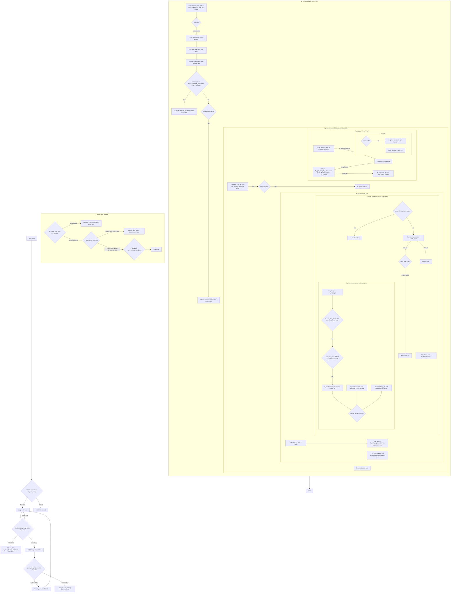
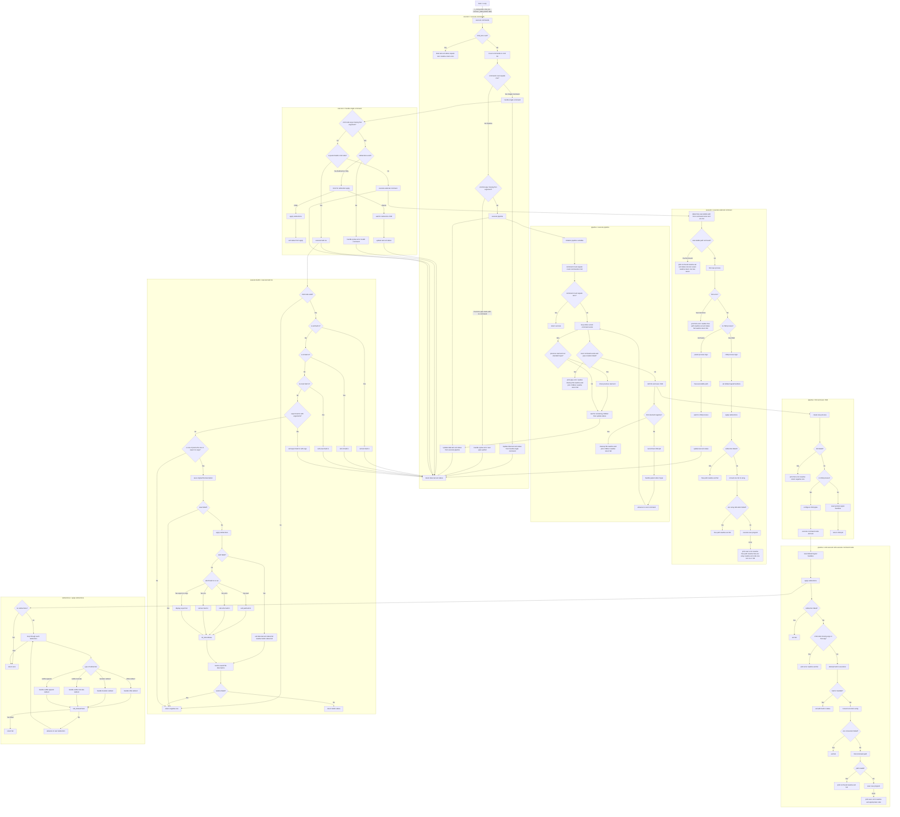

# Minishell - A Custom Shell Implementation


> *"As beautiful as a shell"* - Creating a fully functional Unix shell from scratch

## 👥 Project Team

### Executor
- **Youssef Mazini** - Execution Architecture & Implementation
  - 🎓 42 Intra: [ymazini](https://profile.intra.42.fr/users/ymazini)
  - 🐙 GitHub: [yomazini](https://github.com/yomazini)
  - 💼 LinkedIn: [Connect with me](https://www.linkedin.com/in/youssef-mazini/)
  
### Parser
- **El Mehdi El Garouaz** - Parsing Engine & Tokenization
  - 🎓 42 Intra: [eel-garo](https://profile.intra.42.fr/users/eel-garo)
  - 🐙 GitHub: [MEHDIJAD](https://github.com/MEHDIJAD/)
  - 💼 LinkedIn: [Connect with me](https://www.linkedin.com/in/el-mehdi-el-garouaz-a028aa287/)


---


## 🎯 Project Overview

Minishell is a comprehensive shell implementation that replicates core functionality of bash. This project demonstrates advanced system programming concepts including process management, signal handling, memory management, and complex parsing algorithms.

### 🎯 Key Objectives
- **Process Management**: Fork, exec, and wait operations for command execution
- **Advanced Parsing**: Complex tokenization with quote handling and variable expansion
- **Pipeline Implementation**: Multi-command pipe chains with proper file descriptor management
- **Signal Handling**: Proper Ctrl-C, Ctrl-D, and Ctrl-\ behavior
- **Memory Safety**: Zero memory leaks (excluding readline library)
- **Error Handling**: Comprehensive error management with proper exit codes

---

## 🏗️ Architecture Overview

## Linux Terminals TTY PTY & Shell


### System Architecture

```
┌─────────────────────────────────────────────────────────────┐
│                    MINISHELL ARCHITECTURE                  │
├─────────────────────────────────────────────────────────────┤
│  Input Layer    │  Parsing Layer   │  Execution Layer      │
│                 │                  │                       │
│  ┌─────────────┐│  ┌─────────────┐ │  ┌─────────────────┐  │
│  │ Readline    ││  │ Tokenizer   │ │  │ Command         │  │
│  │ History     ││  │ Syntax      │ │  │ Dispatcher      │  │
│  │ Signals     ││  │ Validator   │ │  │                 │  │
│  └─────────────┘│  └─────────────┘ │  └─────────────────┘  │
│                 │                  │                       │
│  ┌─────────────┐│  ┌─────────────┐ │  ┌─────────────────┐  │
│  │ Prompt      ││  │ Expander    │ │  │ Pipeline        │  │
│  │ Management  ││  │ Variable    │ │  │ Manager         │  │
│  │             ││  │ Resolution  │ │  │                 │  │
│  └─────────────┘│  └─────────────┘ │  └─────────────────┘  │
│                 │                  │                       │
│                 │  ┌─────────────┐ │  ┌─────────────────┐  │
│                 │  │ Command     │ │  │ Built-in        │  │
│                 │  │ Table       │ │  │ Commands        │  │
│                 │  │ Builder     │ │  │                 │  │
│                 │  └─────────────┘ │  └─────────────────┘  │
└─────────────────────────────────────────────────────────────┘

```

## 🔧 Core Components

### 📁 Project Structure

```
minishell/
├── 📁 execution/           # Execution engine implementation
│   ├── 📁 built_in/        # Built-in command implementations
│   │   ├── cd_built_in.c         # Directory navigation
│   │   ├── echo_built_in.c       # Echo command with -n option
│   │   ├── env_built_in.c        # Environment display
│   │   ├── exit_built_in.c       # Shell termination
│   │   ├── export_built_in.c     # Environment variable export
│   │   ├── pwd_built_in.c        # Working directory display
│   │   └── unset_built_in.c      # Environment variable removal
│   ├── 📁 execution_part/  # Core execution logic
│   │   ├── executor.c            # Main execution coordinator
│   │   ├── pipeline.c            # Pipeline execution manager
│   │   ├── redirections.c        # I/O redirection handler
│   │   ├── 📁 heredoc/           # Here-document implementation
│   │   └── find_path.c           # PATH resolution system
│   └── exec_header.h       # Execution module definitions
├── 📁 parser/              # Parsing engine implementation
│   ├── 📁 tokenize/        # Tokenization system
│   │   ├── tokenizer.c           # Main tokenization logic
│   │   ├── ft_split_tokens.c     # Token splitting algorithm
│   │   └── ft_synax_error_free.c # Syntax validation
│   ├── 📁 expander/        # Variable expansion system
│   │   ├── expander.c            # Main expansion coordinator
│   │   ├── ft_expand.c           # Variable expansion logic
│   │   └── ft_build_variable_name.c # Variable name construction
│   ├── 📁 cmd/             # Command table management
│   │   ├── ft_create_cmd_table.c # Command structure building
│   │   └── ft_cmd_utils.c        # Command utility functions
│   └── parser.h            # Parser module definitions
├── 📁 utils/               # Utility functions library
└── 📁 includes/            # Global header files
```

### 🏛️ Data Structures

#### Core Shell Data Structure
```c
typedef struct s_data
{
    t_env   *env_list;              // Environment variables linked list
    int     last_exit_status;       // Last command exit status ($?)
    bool    herdoc;                 // Heredoc processing flag
    int     peak;                   // Parsing lookahead position
    bool    field_splitting_needed; // IFS field splitting flag
    bool    echo_pipe_flag;         // Echo in pipeline context
    bool    print_flag;             // Output control flag
    bool    no_split;               // Disable field splitting
} t_data;
```

#### Token Structure
```c
typedef struct s_token
{
    t_token_type    type;           // Token classification
    char            *value;         // Token string value
    bool            exp_in_herdoc;  // Expand in heredoc flag
    bool            empty_tkn;      // Empty token marker
    struct s_token  *next;          // Linked list pointer
} t_token;
```

#### Command Structure
```c
typedef struct s_cmd
{
    char            **argv;         // Command arguments array
    struct s_redir  *redir;         // Redirection list
    struct s_cmd    *next;          // Pipeline next command
} t_cmd;
```

#### Environment Variable Structure
```c
typedef struct s_env
{
    char            *name;          // Variable name
    char            *value;         // Variable value
    int             flag_env;       // Environment visibility flag
    struct s_env    *next;          // Linked list pointer
} t_env;
```

---

## 🔍 Parsing Engine

### Tokenization Process

The parsing engine implements a sophisticated multi-stage tokenization system:

#### Stage 1: Lexical Analysis
- **Character Classification**: Identifies operators, quotes, whitespace, and word characters
- **Quote State Management**: Tracks single and double quote contexts
- **Operator Recognition**: Detects pipes, redirections, and compound operators

#### Stage 2: Syntax Validation
```c
int ft_synax_error_free(const char *line)
{
    // Validates:
    // - Unclosed quotes
    // - Invalid pipe placement
    // - Malformed redirections
    // - Empty command sequences
}
```

#### Stage 3: Token Creation
- **Dynamic Memory Allocation**: Efficient token buffer management
- **Type Classification**: Assigns appropriate token types
- **Metadata Preservation**: Maintains expansion and quote information

### Variable Expansion System

#### Expansion Types Supported:
1. **Environment Variables**: `$HOME`, `$PATH`, `$USER`
2. **Exit Status**: `$?` - Last command exit code
3. **Quoted Context**: Different behavior in single vs double quotes

#### Expansion Algorithm:
```c
char *ft_build_expanded_string(const char *origin, t_data *data)
{
    // 1. Scan for $ characters
    // 2. Determine expansion context (quoted/unquoted)
    // 3. Extract variable name
    // 4. Resolve variable value
    // 5. Substitute and continue
}
```

### Quote Handling

#### Single Quotes (`'`)
- **Literal Preservation**: All characters preserved exactly
- **No Expansion**: Variables not expanded
- **Nested Handling**: Proper nesting with double quotes

#### Double Quotes (`"`)
- **Variable Expansion**: `$` expansions processed
- **Escape Sequences**: Limited escape processing
- **Whitespace Preservation**: Spaces maintained within quotes

### Field Splitting (IFS)

The shell implements sophisticated field splitting based on Internal Field Separator rules:

```c
void ft_applay_ifs(t_token **curr_tkn_ptr)
{
    // 1. Check if splitting needed
    // 2. Split on whitespace boundaries
    // 3. Create new token nodes
    // 4. Update token list structure
}
```



[Online Chart Of Parsing part](https://mermaid.live/edit#pako:eNqdWHtv4kgS_yq11mpeSx5AmJkgZeYIODcoHHBAdNkNo5YDDVjj2F53OzPZKNJ9h_uG90muqrtt3MYko-OfhO56_urRVTw6i2jJnbazCqLvi42XSJj15iGI9HadePEGpn9n485k6jL3etwZ9m7mTuwlgjMvXDL-I8Y_c-crMuBn6Sd8If0ohMFEn9Bn7NYf585KMvEQSu8H40kSJWyVcA5iw-5R2GHgh3zuPBV5mDuZ1FHZ0pPeYeAJicp8lCE9mQo4g0brYw0SLtMkhJUXCJ5bofkbWqeMvvHQ_-tFVY1nVB0fvaSsqZVpOHgCrzJt8lvIAl_IGpDwst7RJWo1YmWSZlI5QloKwGTUdadTHYJpfzS8UfriJFpwIbReQbi_IqN5DaJkjfYnFZGZnRdMILHXY4J5kSYJo_Cz-wBdNvw373wWy-Sr7a7mYv-8Gs1c9gVzYuCi_30BlhAP_kwjyT-DG0qeHLkIqT4BZaONhRF5Ne51UKaSjEZdxYgah3dCHnz6U5IlgPiCHy4SfsdDCW_UlbLxbaWNvdFg0Jmw7he3e_m3Rwi8Wx60oezuGbz-9TWgI6Aj6N0GHBYR2v1Dfp47UGGpdtvI19HYIGfA2TIKApS7jQlFvxyPoih32GP9mTtBDCc6F5RX5O0vZzC8GgwqseqMx8Q5INbOAE3oxDFmDpBX3gIhh1US3WWawZOgcAIZ5fL35tv5VX_Qo2xj05nx7jb1g6zg-ZJE-uEapftrP8yy-9lkO3en9WIIQv5dGXYGNfCpymo6PVRY8PvrOX6OX9vwoxA2GI3GiNUgimKI7tFPbYQFEtFNL_sI7rSr0wk5uhu--Ab-Cn4FX0CUSuEvuVYqdrj7wy7ro-v-b7_VVC74YcohQKVWEImUIkJgvVyU2s4Ce1Vt28In7oxRDtzk2aEz4usO2ZbCQLs3vBezbTPP2xaoVrk3lMWOTj2DUdcgj7DRBYjMGRajkvD24JM6sUxUHNRjUVfO8GxWaaqSOQYyKz1LSpqo5ILeFo22F4BWRx56QvjrEDJ15gYLQhm-Fy6stMHvGiovjoOHF9BBcnrwQiZi1VuOP1vJhdcExJt3qgfRA0Hdy4CGqFDaWw4jQ1PFNg68Bde2wndfbgAVYFNVB-J561n_YlrwgPkr062N_hdcQu56lt2cabVFdnijm58ALwgORIx22v0YBdgpStyQhljr4Zovy7QEkNLCEi50puivOkHY7QP7vvGxbEkTVENZg1eh5tqV3yxgYTlSg1xtDarZM0h_4qXudc4HbkVXUA-MHk3gFan_qaobu9d1q2CrWI2FeYVb7Oxfo0lPP4bmyTfZhO2QrlSRaABCzqlC6EAnJo5EQorS3HPNhiM2HeMbpKVi2v-ipqgw0th9Lo081_vTUXlTiTRRV6OtfXQnN_b4pZxiG-4tf-pl0rgqOM7gXZEZs_0e9BusJR3yxSZisR9ztgq8NaXmzjiITponCnOUBgnl11ORoKEKQXCphW54sowWcOsJhByNI7UlkSZjF_SEaf1kCezJAPf6xNAXKIw7__33fwA1C7ACVfbgiztxe_isZWElMQef5EPMqaXNRpfuEAu6159klGp80lShHpuebIF6YDLU1sSE7nP0f_tiKmzFfucK1ZUbiOJ8URzfdlEvFuf_UZVV77WyYZub1K1R8lTSGnXnqcceDg4-QYdeBD_0pe_hOkDbCA8CeKPDYpaFGgq5f5vb3KkjJ0zTBVmohJzf6KmnDTqxCitDRn7h-UGacEX-B5rYp5arRu-p0mh2mnrOdq5Iu2idDgYO13EqMVOiu1iWDNza1iVdKHh0cdSVSXDQwyltqxKbwuQfaiSlBQydYouAewhnEuj_2AZ7SZQ81KBgGrUadZvbprS4aMcDDHBr0xgUrtThBAtV3dAw4y2XmezSwmdE9hQpDYPlJRYsV3NPcXlVYVCrK7i0uioRZkG1iIZRFV0jo2kQzUzvo55qQhQtcaQ93Aq1GeaOYkFnhYRuwnGSXEJ5vTTw4yKa8TYzgaNLfeSSMP34Ct20FMUF6w7czvBqjIvE0M1mpyJ2NDCXmr_NVIyLpYXyUyuh9kqmI9aLlEZ8jHOYxrv5ZRRgR9aB0q00O1RfchQpedAqQ9jIiBrmoJkdNM3BSXZwksm2mlyuxDolbb9zkXNYXWw_C6aC4Si3qpynfFHSVGgzGQsN3eaapmlTwDubTlFQvsk8R2yMLa4yJo3M7wM6lyrWfovMuinIrdrFbcbiTdH6ymXbZrWuLKZsrbbp7a35JxiKP0k8Q14Eb6dvm6W1mrLYsosL35Y6y3oXu1S0gqlekgr0WdEXBzwLx51Bbcthn5e5rPlL7wFE0leDPqjxWxyRtYrDTPk5bcNkgZowjrZNsZJuqraK0WVGYeqXtqlCMtEypC8K45-6CWmIc82vkTl49JOD2HgxbwONfk_7E29LuPS9uyhcIq1Tc9aJv3Ta1Mpqzh1P8FHHr84jyZk7csPv8HGhnzOWfOWlAXbiefiEbPik_BFFdxlnEqXrjdNWfbfmpOp3rZ7v4SC7JeE0u3ajNJRO--S4pWQ47Ufnh9M-qJ80Tw9PW6fN1nHrI_75gNcPeN5qHh_WG-9bjdbHDx9Pj983nmrOX0pv87BV_1B_f9I6rjdPT04_PP0PRgm9Mg)

---

## ⚡ Execution Engine

### Command Dispatch System

The execution engine implements a sophisticated command classification and dispatch system:

#### Command Type Classification:
1. **Built-in Commands**: Internal shell commands
2. **External Commands**: Programs in PATH or absolute paths
3. **Pipeline Commands**: Multi-command pipe sequences
4. **Redirection-only**: Pure I/O redirection without commands

#### Execution Flow:
```c
int execute_commands(t_cmd *cmd_list, t_data *data)
{
    if (!cmd_list)
        return (data->last_exit_status = 0);
    
    int cmd_count = count_commands(cmd_list, data);
    
    if (cmd_count == 1)
        return handle_single_command(cmd_list, data);
    else
        return execute_pipeline(cmd_list, data);
}
```

### Pipeline Implementation

#### Pipeline Architecture:
- **Process Chain**: Each command runs in separate process
- **Pipe Management**: Automatic pipe creation and cleanup
- **File Descriptor Handling**: Proper stdin/stdout redirection
- **Error Propagation**: Correct exit status handling

#### Pipeline Execution Algorithm:
```c
int execute_pipeline(t_cmd *cmd_list, t_data *data)
{
    t_pipeline_ctx ctx = {STDIN_FILENO, -1, {-1, -1}};
    
    // For each command in pipeline:
    // 1. Create pipe if not last command
    // 2. Fork child process
    // 3. Setup file descriptors
    // 4. Execute command
    // 5. Close unused file descriptors
    // 6. Wait for completion
}
```

### Process Management

#### Fork and Exec Pattern:
```c
void execute_child_process(t_cmd *cmd, t_data *data, char *path)
{
    // Child process setup:
    set_signal_handlers_default();     // Reset signal handlers
    apply_redirections(cmd);            // Setup I/O redirections
    
    char **env_array = convert_envlist_to_array(data->env_list);
    execve(path, cmd->argv, env_array); // Replace process image
    
    // Error handling if execve fails
    handle_execve_error(path, cmd->argv[0], data);
}
```

### I/O Redirection System

#### Redirection Types:
1. **Input Redirection** (`<`): Redirect stdin from file
2. **Output Redirection** (`>`): Redirect stdout to file (truncate)
3. **Append Redirection** (`>>`): Redirect stdout to file (append)
4. **Here Document** (`<<`): Redirect stdin from inline text


### Here Document Implementation

#### Features:
- **Delimiter Recognition**: Configurable end-of-input markers
- **Variable Expansion**: Optional expansion based on delimiter quoting
- **Multiple Heredocs**: Support for multiple heredocs per command
- **Signal Handling**: Proper Ctrl-C handling during input

#### Heredoc Processing:
```c
int process_heredocs(t_cmd *cmd_list, t_data *data)
{
    // 1. Count total heredocs
    // 2. Process each heredoc sequentially
    // 3. Create temporary file descriptors
    // 4. Handle variable expansion
    // 5. Store file descriptors for execution
}
```




[Online Chart Of Execution part](https://mermaid.live/edit#pako:eNqtWltv2zgW_iuEn9sikmXHzcMOUsdBA8ymRrKDxaxiGKpE28TIlJaSnKSa_vc9vJO6xJnB9qGQqO9ceW6k007SIsOTq8meJeUB_evmiSJ0vf1nQuivRVHGR3hAKeLPG_Tx4z_-rLfpMUNlQWiNGYLnbU6qGqXF8ZigepsldWK-8pc_0Zft6gWny2NWxRgemhpLNM2qzRPl8qrmuxTf_Y4URQGS0AAxgn-WPdcPfQlaoxSpEG3y_JefChkAAv2OFXD7gOuLWCicJ4DGL6RGVZ3UTYXwf5skr9APzApE8XNOKEYM1w2jYm3jMrwvJL8wXhYNra3y3HPgK66KJggldNoqEIA5iRJXUGx0nWpdHwnd5xgtFYGgj-IDPMNqJT8qblpKpAz8rQTr8KMw6ZYVR8kqlsto2PId4NCb3EfYWqfKL7Hy16CYjWslOHBNSiycLJjMWu03lLD9CR1JxVVBO8LkUnPEtDaummlXrRiDSCmBFxfD6go9k_qAaKFNUDo-vtI6eQE0F2tcKRYRFjwoTjSj1-P3Ije2e6Rdk119dFTMTdCXykbNaz6yS0Kp83s0xnaQ35CmmGad9Bvcdi8H3xF2Xx9FBoLXM_ye7QO8m5ZfH8OW4YwwnNakoBU3vHLAoQY_WBD6RvNXRb29Ldgf4htfjPkb2oHuDk-UlGX-utEcfQrOfnkgeab5XXOw-CyWY0Hssqs2GrqCPZKg3m6dE7lOGPhEM_p3QmrxOX6Gp57-KZdhpLr7LYkaGTy9pBuOV-VTFbDA0MT4YGoQekpykpnNH2MaeEynLRTjUhr5vSF5rYojjxK7uVM_EkRl_yLRtnkIclBj3J6pbw_nsnqBhkST3HDBauFNO_opMkY-2Kl6Msz-uyoJwatVEGcYFo68CkoGyXfwfZlABRMhpCXR5AiJBQ-YntzmAiwUq7DtMqAFj6KGZtrXANK-vodvt_ybot7CgniPSwZ93NKaTlhhvx5B30L1cwHrJ0y7_dL7uPGkqy1arabxjucpUKKSFSmuKgOcKkjUCoiIQWtEpI0QeS7rv7KCr_AYlkZYYqPfjmHtnRG7dgnJu-bwtY0n3lgxa4nKTW2FVdT0KFtbQEfx8shbVezRobzYk9SIcXCa8hHClOxv8C5p8jrmimfyGWrzngeVTF1mHemTaD62ug0VNkNrYZpQvNyCM9xqLbyDnSCzMDeztUW8XvJvQdzfC7EPnrN9Xsbr22VBT5jVK3qKU_loMgPVBfQblrw6rjRoTQ-Pwg5OJMAoyfMiTYYNUui3zAnfZ47DyRrDC8MJmyqlMgJqz9EhFBhO5wW8XLYhz3mcDXmxYi331OUnA5u-5AUBJ88EPeg4zQv0kG8yqlXFHwlrB2myFvRZg4Lyk3Rkp5hZeh-sWfDmqchN9_SyyzKwUE3sNlPF5K900_GGocc0FJunFL09Gq6DmFBSE2i3PxwGp4QR7gxtx1qW_XUYDx4q0t6hxOkZa3kgWY8cSPhZR8f-2mvOa2F3k3J_6km_kq8bF68ie73lJ0gZEzk8oWfYEPBAw4TztXAx6xkGlkbyiFoKHbUDFp1QTOopw0M5u458vfk4bJNEUPpJkuY4oU2JduAtvSYCCSh0KLF-n3MyY-32hfUsTqGgyA4k9Ya8lCOcgs8kcC5bnOSHebvdg0EnMx-t574lqsOJc_r_Qem5q_QlbGpasEyGvUofYjS-lKiFnhBVnleEV4yd8KqGLiT0c5xkp4SmmNdkdx833QAZ2n20UuPJOrhoS4ZPpID-DBvOp6BMjCiQlTRLQGNCy8YcGADvO22ZFxX-FYx6AGJwG7yhHkOlUxB4TLRv7HLgzuf8qoQfc4yv6wP8p6qHXzOGjmjD5WMgarwKcjaqbuUkFIvswAMjlgK4YAgqGYp-JtmvrktveWOuz05bKuB0TPO-shliq5x8q3rq8oDTP0bnKg_VUQrGnabkjq3kkQxmgx3ZNwybaC6x44MOXHPhTfUe-qA-1nlXUOqMK2tRvRnRyVokJzDVVhjmUxsYdCz7Q5vj2fXdjS6wfhqO9xpPPTdadKCIc0pTk7wapLGWeObLHrm8D5TuZyZOAGqK8I3hEr5q2PuGShfnjWHwwU6UvYGrS6ZnruX91N5X6KsKcW_Bxx19ZeFIn3aF3skTMfeTHr280B9QZeprEMVJXWMeCPpwq_YFzLdEkYbPWgOTTnedMxvyiTpES6-ISzHDwbuQ0_RWtfn5oRpAVpgzTEvCangLh-ZoZwPDwQ0cGJmX95fxjlBzH-GNiPDRcBb5yKfFVgzA6hrDVckgxpSajp6Ih5T12Fl1F6KKDE328K0z1AvZZ6d6IRwSjBUASUQuqxweLxHmEgX59yritr9_0-JdXOgbGdnM7i5s-nguhS_uReidaBPgoni8FSgSc0V_F_BrI2Gf1sVy92_z78QuyVHLIxi5JVL0RruQS0qzATlhR87yRkpxwKMyQk-GuARrKK-dfTHTjpjfOE5K8klGhU09YVGLX8qCOSVF5L2-fq2s5KjnSE53zfaVducwn2pUk8jTZMbN5udIPhk-QwdKD4WoJhDDijctBEOr06yj02Nywrc3cZXweGFkT3jH2fEzRIarlJESOpr5VUHDNfHtjcipoBXkfi1yPndEqnAdhNmgfs8Figez7OFFcJTNrq-XRXSdITVTv7OIVjz8O4F7f6XT2_m2sbpU4D_uYCafEPdU9oaDfd2sO25IBeU1Pdx9a-GIlzp9BroGa6i1ziK1dTw2FJv1cyZjj691Ah_s5yr6ETfAToSZDml4VsHMV_8uR3VpxBny2ybBD9b-Ljsv9v3suy9E_mVAlCevGipO7m8JcdZ6e9vJBv4zi9zrsYQI35cQYa_Kqwbh_w7ox9_GS_RejxhuXv0EQ7H3lqLzc-b1Q9CCy12INh0-uSZfPwxccjg__yq4Uh7QnTuO-sCKZg89N4E8cOQZ8s4Fx_VD2NavpaiTDtwoJxxNqEhK_V2LvqP6KN4BbDRC7oYYSjyGBwzQIu1x_HqjOXYRZ1kWTS10qCHhUz6QKPy3ptY8e5C_zBx2GqtLAUBDfe2yVoD3MHbXdATIrHACwZ1dnFGvT20D4h6_1L17DzcSepEzGBrm9sOLSJMjkw-TPSPZ5AqciT9MjpgdE_46aTnkaVIf8BE_Ta7gUR3ZniZP9CeQlQn9T1EcNaUI18nVLskreJM3Fzck4TOqgYBEzMQfOkyuLgPBYnLVTl4mVx9nl_NP4eco-hzNw8Xni3n4YfI6uQoup58uFjN4_7wIozBYLH5-mPwQUsNP8yCaR1G4iIJZMJ8uop__AysSfdE)

---

## 🔨 Built-in Commands

### 🔧 Built-in Commands Portfolio

| Command | Description | Options/Args | Special Features |
|---------|-------------|--------------|------------------|
| `echo` | Display text | `-n` flag | Variable expansion support |
| `cd` | Change directory | Relative/absolute paths | HOME directory handling |
| `pwd` | Print working directory | None | Always shows absolute path |
| `export` | Export variables | Variable assignments | Environment modification |
| `unset` | Remove variables | Variable names | Safe environment cleanup |
| `env` | Display environment | None | Complete environment listing |
| `exit` | Terminate shell | Optional exit code | Cleanup and graceful exit |

---


### Command Implementation Details

### Built-in Command Features

#### Advanced `export` Features:
- **Append Mode**: `export VAR+=value` appends to existing variable
- **Identifier Validation**: Ensures valid variable names
- **Display Mode**: Shows all exported variables in sorted order

#### `cd` Special Cases:
- **Home Directory**: `cd` or `cd ~` goes to $HOME
- **Previous Directory**: `cd -` goes to $OLDPWD
- **Tilde Expansion**: `cd ~/Documents` expands tilde
- **Environment Updates**: Automatically updates PWD and OLDPWD

---

## 📡 Signal Handling

### Signal Architecture

The shell implements context-aware signal handling with different behaviors for different execution contexts:

#### Signal Contexts:
1. **Prompt Context**: Waiting for user input
2. **Execution Context**: Running commands
3. **Heredoc Context**: Processing here documents
4. **Pipeline Context**: Executing command pipelines

### Signal Handler Implementation

#### Prompt Signal Handler:
```c
void sigint_handler_prompt(int signum)
{
    (void)signum;
    
    // Display new prompt on new line
    printf("\n");
    rl_on_new_line();           // Notify readline of new line
    rl_replace_line("", 0);     // Clear current line
    rl_redisplay();             // Redisplay prompt
}
```

#### Heredoc Signal Handler:
```c
void sigint_handler_heredoc(int signum)
{
    (void)signum;
    
    // Set global flag for heredoc interruption
    g_signal_received = SIGINT;
    
    // Close heredoc input
    close(STDIN_FILENO);
}
```

### Signal Management System

#### Signal Handler Setup:
```c
void set_signal_handlers_prompt(void)
{
    struct sigaction sa_int, sa_quit;
    
    // SIGINT (Ctrl-C) handler
    sa_int.sa_handler = sigint_handler_prompt;
    sigemptyset(&sa_int.sa_mask);
    sa_int.sa_flags = SA_RESTART;
    sigaction(SIGINT, &sa_int, NULL);
    
    // SIGQUIT (Ctrl-\) - ignore in interactive mode
    sa_quit.sa_handler = SIG_IGN;
    sigemptyset(&sa_quit.sa_mask);
    sa_quit.sa_flags = 0;
    sigaction(SIGQUIT, &sa_quit, NULL);
}
```

#### Context-Aware Signal Switching:
- **Prompt → Execution**: Switch to default handlers before fork
- **Execution → Prompt**: Restore custom handlers after wait
- **Heredoc Entry**: Install heredoc-specific handlers
- **Heredoc Exit**: Restore previous handlers

---

#### Exit Code Standards:
- **0**: Success
- **1**: General error
- **2** or **258** : Misuse of shell built-ins
- **126**: Command found but not executable
- **127**: Command not found
- **128+n**: Fatal error signal "n"

---

*Developed with ❤️ at 42 School - Where code meets creativity*
