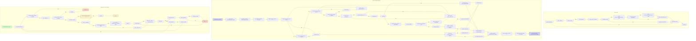

Okay, Youssef! Let's tackle **Task 1: Heredoc Implementation**.

**Goal:** Implement the logic to read input for `<< DELIMITER`, store it temporarily, and set up the file descriptor (`heredoc_fd`) in the `t_redir` struct so that `apply_redirections` can use it later. We will *not* implement the variable expansion inside the heredoc yet, just the reading and FD setup.

---				

**Step 1: Pseudocode**

```pseudocode
// --- Helper: Generate unique temp filename ---
// Needs careful implementation to avoid collisions, especially if run fast.
// Using PID + a static counter is a common basic approach.
function generate_temp_filename():
  pid_str = convert_int_to_string(getpid()) // Not allowed, use another method later
  count_str = convert_int_to_string(get_next_heredoc_count()) // Increment static counter
  base = "/tmp/minishell_heredoc_"
  tmp1 = join_strings(base, pid_str) // Need robust join
  filename = join_strings(tmp1, count_str)
  free(pid_str); free(count_str); free(tmp1);
  if filename is NULL: print malloc error; return NULL
  return filename
end function

// --- Helper: Read input for one heredoc ---		
// Returns readable FD or -1 on error/interrupt
function read_single_heredoc(delimiter, expand_flag, data): // data needed for $? later maybe
  // 1. Generate Temp Filename
  temp_filename = generate_temp_filename()
  if temp_filename is NULL: return -1

  // 2. Open Temp File for Writing
  write_fd = open(temp_filename, O_WRONLY | O_CREAT | O_TRUNC, 0600) // Permissions only for user
  if write_fd < 0:
    print "heredoc temp file creation failed" error using perror(temp_filename) to STDERR
    free(temp_filename)
    return -1

  // 3. Read Loop
  while TRUE:
    // Use readline for prompt "> "
    line = readline("> ") // Or just ">" ? Bash uses "> "

    // Check for EOF (Ctrl+D)
    if line is NULL:
      print "minishell: warning: here-document delimited by end-of-file (wanted `" + delimiter + "')" to STDERR
      break // Stop reading

    // Check for Delimiter
    if compare_strings(line, delimiter) is 0: // Exact match required
      free(line)
      break // Found delimiter, stop reading

    // --- Expansion Placeholder ---
    // if expand_flag is TRUE:
    //    expanded_line = expand_variables_in_line(line, data.env_list, data.last_exit_status)
    //    free(line)
    //    line = expanded_line
    //    if line is NULL: // Expansion error?
    //       print expansion error; free(temp_filename); close(write_fd); return -1
    // --- End Placeholder ---

    // Write line + newline to temp file
    write_result1 = write(write_fd, line, length(line))
    write_result2 = write(write_fd, "\n", 1)
    free(line) // Free line read by readline
    if write_result1 < 0 or write_result2 < 0:
      print "heredoc write error" using perror(temp_filename) to STDERR
      close(write_fd)
      unlink(temp_filename) // Try to clean up
      free(temp_filename)
      return -1

  // 4. Close Write FD
  close(write_fd)

  // 5. Open Temp File for Reading
  read_fd = open(temp_filename, O_RDONLY)
  if read_fd < 0:
    print "heredoc temp file open-read failed" error using perror(temp_filename) to STDERR
    unlink(temp_filename) // Try to clean up
    free(temp_filename)
    return -1

  // 6. Unlink Temp Filename (Removes name, file persists via FD)
  unlink(temp_filename)
  // Note: Error checking unlink is good but failure isn't usually critical

  // 7. Cleanup and Return FD
  free(temp_filename)
  return read_fd

end function

// --- Main Heredoc Processor (Called before execution) ---
function process_heredocs(command_list cmd_list_head, shell_data data):
  current_cmd = cmd_list_head
  status = SUCCESS

  while current_cmd is not NULL:
    current_redir = current_cmd.redirections
    while current_redir is not NULL:
      if current_redir.type is TOKEN_REDIR_HEREDOC:
        // Check if already processed (shouldn't happen with good design)
        if current_redir.heredoc_fd is -1:
          // Handle reading input and storing FD
          readable_fd = read_single_heredoc(current_redir.filename, current_redir.expand_heredoc, data)
          if readable_fd is -1:
            set data.last_exit_status = 1 // Set failure status
            status = FAILURE
            // Need to decide: stop processing ALL heredocs on first error? Or try others?
            // Let's stop on first error for simplicity.
            // TODO: Cleanup any FDs already opened for previous heredocs in this cmd_list?
            return FAILURE
          else:
            // Store the readable FD
            set current_redir.heredoc_fd = readable_fd

      current_redir = current_redir.next
    current_cmd = current_cmd.next // Move to next command in list

  return status // Return SUCCESS or FAILURE
end function
```

---

**Step 2: C Code Implementation**

**Create `execution/execution_part/heredoc.c`:**

```c
/* ************************************************************************** */
/*                                                                            */
/*                                                        :::      ::::::::   */
/*   heredoc.c                                          :+:      :+:    :+:   */
/*                                                    +:+ +:+         +:+     */
/*   By: ymazini <ymazini@student.42.fr>            +#+  +:+       +#+        */
/*                                                +#+#+#+#+#+   +#+           */
/*   Created: 2025/05/04 22:00:00 by ymazini           #+#    #+#             */
/*   Updated: 2025/05/04 23:00:00 by ymazini          ###   ########.fr       */
/*                                                                            */
/* ************************************************************************** */

#include "../exec_header.h" // Includes all necessary definitions

// --- Helper: Generate unique-ish temporary filename ---
// TODO: Replace getpid() if not allowed, maybe use pointer address + counter?
static char	*generate_temp_filename(void)
{
	char		*filename;
	char		*pid_str;
	char		*count_str;
	static int	heredoc_count = 0; // Simple counter

	pid_str = ft_itoa(1000 + heredoc_count); // Using counter instead of PID
	if (!pid_str) return (NULL);
	count_str = ft_itoa(heredoc_count++);
	if (!count_str) return (free(pid_str), NULL);

	filename = ft_strjoin("/tmp/minishell_heredoc_", pid_str);
	// Check malloc error for filename...
	if (!filename) { free(pid_str); free(count_str); return (NULL); }
	char *final_filename = ft_strjoin(filename, count_str);
	// Check malloc error for final_filename...
	free(filename); free(pid_str); free(count_str);
	if (!final_filename) return (NULL);
	return (final_filename);
}


// --- Helper: Reads input for one heredoc ---
// Returns readable FD or -1 on error/interrupt
// TODO: Integrate signal handling for Ctrl+C interrupt
static int	read_single_heredoc(t_redir *redir, t_data *data)
{
	char	*line;
	char	*tmp_filename;
	int		write_fd;
	int		read_fd;
	size_t	delim_len;

	(void)data; // Only needed for expansion later
	tmp_filename = generate_temp_filename();
	if (!tmp_filename) return (perror("heredoc temp filename malloc"), -1);
	delim_len = ft_strlen(redir->filename);

	write_fd = open(tmp_filename, O_WRONLY | O_CREAT | O_TRUNC, 0600);
	if (write_fd < 0) { perror(tmp_filename); free(tmp_filename); return (-1); }

	while (1) {
		line = readline("> "); // Heredoc prompt
		if (!line) { // EOF (Ctrl+D)
			ft_putstr_fd("minishell: warning: here-document delimited by end-of-file (wanted `", 2);
			ft_putstr_fd(redir->filename, 2); ft_putstr_fd("')\n", 2); break;
		}
		if (ft_strncmp(line, redir->filename, delim_len + 1) == 0) {
			free(line); break; // Found delimiter
		}
		// --- Expansion Placeholder ---
		// if (redir->expand_heredoc) { line = expander_func(line, data); }
		// --- End Placeholder ---
		if (write(write_fd, line, ft_strlen(line)) < 0 || write(write_fd, "\n", 1) < 0) {
			perror(tmp_filename); free(line); free(tmp_filename); close(write_fd); return (-1);
		}
		free(line);
	} // End read loop
	close(write_fd);

	read_fd = open(tmp_filename, O_RDONLY); // Open for reading
	if (read_fd < 0) { perror(tmp_filename); unlink(tmp_filename); free(tmp_filename); return (-1); }
	if (unlink(tmp_filename) < 0) perror("minishell: heredoc: unlink failed"); // Non-fatal usually
	free(tmp_filename);
	return (read_fd);
}


/**
 * @brief Processes all heredocs in a command list before execution.
 */
int	process_heredocs(t_cmd *cmd_list, t_data *data)
{
	t_cmd	*current_cmd;
	t_redir	*current_redir;
	int		temp_fd;

	current_cmd = cmd_list;
	while (current_cmd != NULL)
	{
		current_redir = current_cmd->redirections;
		while (current_redir != NULL)
		{
			if (current_redir->type == TOKEN_REDIR_HEREDOC)
			{
				if (current_redir->heredoc_fd == -1) // Only process if not done
				{
					// --- TODO: Need to handle SIGINT during readline ---
					temp_fd = read_single_heredoc(current_redir, data);
					if (temp_fd < 0)
					{
						data->last_exit_status = EXIT_FAILURE;
						// TODO: Need cleanup of previously opened FDs?
						return (EXIT_FAILURE); // Stop processing on error
					}
					current_redir->heredoc_fd = temp_fd;
				}
			}
			current_redir = current_redir->next;
		}
		current_cmd = current_cmd->next;
	}
	return (EXIT_SUCCESS);
}

```

**3. Update `redirections.c` (Ensure `handle_heredoc_redir` is correct)**

*(The version provided previously should be okay, just double-check)*

```c
// Inside redirections.c
static int handle_heredoc_redir(int heredoc_fd)
{
	if (heredoc_fd < 0)
		return (errno = EBADF, redir_error01("heredoc (invalid fd)"));

	if (dup2(heredoc_fd, STDIN_FILENO) < 0) // Check return of dup2
	{
		close (heredoc_fd);
		return (redir_error01("heredoc (dup2 failed)"));
	}
	close(heredoc_fd); // Close original after successful dup2
	return (0);
}

int	apply_redirections(t_cmd *cmd)
{
	int status = EXIT_SUCCESS;
	t_redir *current_redir;

	if (!cmd || !cmd->redirections)
		return (0);
	current_redir = cmd->redirections;
	while(current_redir != NULL)
	{
		// ... other cases ...
		else if (current_redir->type == TOKEN_REDIR_HEREDOC)
			status = handle_heredoc_redir(current_redir->heredoc_fd); // Call helper
		// ... other cases ...

		if (status != 0)
			return (EXIT_FAILURE);
		current_redir = current_redir->next;
	}
	return (EXIT_SUCCESS);
}
```

**4. Update `main.c` (Call `process_heredocs`)**

```c
// Inside main.c

int	main(int ac, char **av, char **env)
{
	// ... (declarations, initialization) ...

	while (TRUE)
	{
		// ... (readline, history, syntax check, tokenize, expander) ...

		if (token_list)
		{
			command_list = ft_create_cmd_table(token_list);
			ft_token_clear(&token_list);
			token_list = NULL;

			if (command_list)
			{
				// --- *** Process Heredocs BEFORE execution *** ---
				if (process_heredocs(command_list, &data) == EXIT_SUCCESS)
				{
					// Heredocs okay, proceed to execute
					execute_commands(command_list, &data);
				}
				else
				{
					// Heredoc failed (e.g., Ctrl+D, file error, Ctrl+C TBD)
					// Status already set in data by process_heredocs
					printf("[Heredoc processing failed or interrupted]\n");
				}
				// --- *** End Heredoc Step *** ---

				ft_cmd_clear(&command_list);
				command_list = NULL;
			}
			// ... (handle command table creation failure) ...
		}
        // ... (handle tokenization failure) ...
		// ... (free line) ...
	}
	// ... (final cleanup) ...
	return (data.last_exit_status);
}
```

**5. Update `Makefile` and `exec_header.h`**

*   Add `$(EXEC_PART_DIR)/heredoc.c` to `SRCS` in the Makefile.
*   Add `int process_heredocs(t_cmd *cmd_list, t_data *data);` to `exec_header.h`.

**Explanation:**

*   The core logic now resides in `process_heredocs` and its helper `read_single_heredoc`.
*   `process_heredocs` is called once per command line input, *before* execution.
*   It iterates through all potential heredocs.
*   `read_single_heredoc` handles the `readline` loop, delimiter checking, temporary file creation, writing, reopening for reading, and unlinking.
*   The readable file descriptor (`read_fd`) is stored back into the `t_redir` node (`redir->heredoc_fd`).
*   The existing `apply_redirections` function (called later during execution) uses this stored `heredoc_fd` to redirect `STDIN_FILENO`.
*   Basic EOF (`Ctrl+D`) warning is included. **Signal handling (`Ctrl+C`) during the `readline` loop needs to be added later.**
*   Variable expansion inside the heredoc is currently skipped but has a placeholder comment.

Compile and test basic heredoc cases (`cat << EOF`, `wc -l << EOF`).


--------

# 2.0 TODO

Okay, Youssef! Let's tackle **Task 1: Heredoc Implementation (`<<`)**.

**Goal:** Implement the pre-execution step to read heredoc input, store it temporarily, and make it available via an FD stored in the `t_redir` struct. We will implement the variable expansion logic inside the heredoc reading loop *based on the `expand_heredoc` flag* set by the parser.

**Mehdi's Changes Noted:**

*   The parser (`parser.h`, `cmd/ft_redir_new.c`) now sets `expand_heredoc` in `t_redir` correctly (true by default, false if delimiter was quoted).
*   The `t_data` struct now includes a `bool herdoc` flag, set by `ft_expander`. This seems unrelated to *reading* the heredoc input itself but might be used later by the expander for other purposes (like not expanding wildcards inside heredoc). We don't need it for *this* task.
*   The `main.c` provided correctly integrates the parsing steps (`ft_tokenize`, `ft_expander`, `ft_create_cmd_table`) and cleanup.

---

**Step 1: Create Heredoc Expansion Helper (New Function)**

*   Since variable expansion *is* required inside heredocs (conditionally), we need a function to do this. Mehdi's `ft_expander` works on `t_token` lists. We need something similar that works on a single line (`char *`) read by `readline`.
*   **Location:** Create a new file `execution/execution_part/heredoc_expander.c` (or add to `expander_tools.c` if appropriate).

```c
/* ************************************************************************** */
/*                                                                            */
/*                                                        :::      ::::::::   */
/*   heredoc_expander.c                                 :+:      :+:    :+:   */
/*                                                    +:+ +:+         +:+     */
/*   By: ymazini <ymazini@student.42.fr>            +#+  +:+       +#+        */
/*                                                +#+#+#+#+#+   +#+           */
/*   Created: 2025/05/05 10:00:00 by ymazini           #+#    #+#             */
/*   Updated: 2025/05/05 10:30:00 by ymazini          ###   ########.fr       */
/*                                                                            */
/* ************************************************************************** */

#include "../../includes/minishell.h" // Use unified header

// --- Reuse or reimplement necessary helpers from Mehdi's expander ---
// Example: Assume these exist and are accessible via minishell.h
// char *ft_list_getenv(t_env *env_list, const char *name);
// char *ft_itoa(int n); // From libft

// Basic check for variable start character
static int	is_var_start(char c)
{
	return (ft_isalpha(c) || c == '_');
}

// Basic check for valid variable characters
static int	is_var_char(char c)
{
	return (ft_isalnum(c) || c == '_');
}

// Expands environment variables ($VAR, $?) in a single line for heredoc.
// Returns a NEWLY ALLOCATED string with expansions done. Caller must free.
// Returns NULL on malloc failure.
char	*expand_line_for_heredoc(char *line, t_data *data)
{
	char	*expanded_line;
	char	*var_name;
	char	*var_value;
	int		i;
	int		j; // Index for variable name reading

	if (!line)
		return (NULL);
	// Start with an empty string, build up expanded version
	expanded_line = ft_strdup("");
	if (!expanded_line) return (NULL);

	i = 0;
	while (line[i])
	{
		if (line[i] == '$' && line[i + 1]) // Potential start of expansion
		{
			i++; // Move past '$'
			if (line[i] == '?') // Handle $?
			{
				var_value = ft_itoa(data->last_exit_status);
				// Append value (or "" if itoa fails), then free parts
				char *temp = ft_strjoin(expanded_line, var_value ? var_value : "");
				free(expanded_line); free(var_value);
				if (!temp) return (NULL); // Malloc error
				expanded_line = temp;
				i++; // Move past '?'
			}
			else if (is_var_start(line[i])) // Handle $VAR
			{
				j = i; // Start of variable name
				while (line[j] && is_var_char(line[j]))
					j++; // Find end of variable name
				var_name = ft_substr(line, i, j - i); // Extract name
				if (!var_name) { free(expanded_line); return (NULL); }
				var_value = ft_list_getenv(data->env_list, var_name); // Look up value
				free(var_name);
				if (var_value) // Append value if found
				{
					char *temp = ft_strjoin(expanded_line, var_value);
					free(expanded_line);
					if (!temp) return (NULL);
					expanded_line = temp;
				}
				// If var_value is NULL (not found), append nothing
				i = j; // Move main index past the variable name
			}
			else // Not $? or $VAR (e.g., "$", "$ ", "$=") -> treat '$' literally
			{
				char *temp = ft_strjoin(expanded_line, "$"); // Append literal '$'
				free(expanded_line);
				if (!temp) return (NULL);
				expanded_line = temp;
				// Don't increment i here, process the character after '$' in next loop iteration
			}
		}
		else // Regular character, just append it
		{
			char	to_append[2];
			to_append[0] = line[i];
			to_append[1] = '\0';
			char *temp = ft_strjoin(expanded_line, to_append);
			free(expanded_line);
			if (!temp) return (NULL);
			expanded_line = temp;
			i++;
		}
	}
	return (expanded_line);
}
```

**Step 2: Update Heredoc Reading Function (`execution_part/heredoc.c`)**

*   Modify `read_heredoc_to_file` to call the new expansion helper based on the `expand` flag.

```c
/* ************************************************************************** */
/*                                                                            */
/*                                                        :::      ::::::::   */
/*   heredoc.c                                          :+:      :+:    :+:   */
/*                                                    +:+ +:+         +:+     */
/*   By: ymazini <ymazini@student.42.fr>            +#+  +:+       +#+        */
/*                                                +#+#+#+#+#+   +#+           */
/*   Created: 2025/05/04 22:00:00 by ymazini           #+#    #+#             */
/*   Updated: 2025/05/05 10:45:00 by ymazini          ###   ########.fr       */
/*                                                                            */
/* ************************************************************************** */

#include "../includes/minishell.h" // Unified header

// Forward declaration for expansion helper
char	*expand_line_for_heredoc(char *line, t_data *data);

// Helper to generate temp filename (keep as is or improve)
static char	*generate_temp_filename(void);
// { ... }

// Reads heredoc input until delimiter, handles expansion, writes to temp file
// Returns the readable FD of the temp file, or -1 on error.
static int	read_heredoc_to_file(char *delimiter, bool expand, t_data *data)
{
	char	*line;
	char	*expanded_line; // To store result of expansion
	char	*tmp_filename;
	int		write_fd;
	int		read_fd;
	size_t	delim_len;

	tmp_filename = generate_temp_filename();
	if (!tmp_filename) return (-1);
	delim_len = ft_strlen(delimiter);
	write_fd = open(tmp_filename, O_WRONLY | O_CREAT | O_TRUNC, 0600);
	if (write_fd < 0) { perror("minishell: heredoc"); free(tmp_filename); return (-1); }

	while (1) {
		line = readline("> ");
		if (!line) { /* Handle EOF warning */ break; }
		if (ft_strncmp(line, delimiter, delim_len + 1) == 0) { free(line); break; }

		// --- Apply Expansion if flag is set ---
		if (expand) {
			expanded_line = expand_line_for_heredoc(line, data);
			free(line); // Free original line from readline
			if (!expanded_line) { /* Malloc error */ close(write_fd); unlink(tmp_filename); free(tmp_filename); return (-1); }
		} else {
			expanded_line = line; // Use original line if no expansion
		}
		// --- End Expansion ---

		// Write (potentially expanded) line + newline
		if (write(write_fd, expanded_line, ft_strlen(expanded_line)) < 0 || write(write_fd, "\n", 1) < 0) {
			perror("minishell: heredoc write");
			if (expand) free(expanded_line); // Free if allocated by expander
			// else: expanded_line just points to line, which is already free/handled
			close(write_fd); unlink(tmp_filename); free(tmp_filename); return (-1);
		}

		if (expand) free(expanded_line); // Free if allocated by expander
		// else: original line pointer was used, already freed or will be next loop
	}
	close(write_fd);
	read_fd = open(tmp_filename, O_RDONLY);
	if (read_fd < 0) { perror("minishell: heredoc open read"); free(tmp_filename); return (-1); }
	unlink(tmp_filename); // Unlink after successful open
	free(tmp_filename);
	return (read_fd);
}


// Main processing function (calls the reader)
int	process_heredocs(t_cmd *cmd_list, t_data *data)
{
	t_cmd	*current_cmd;
	t_redir	*current_redir;
	int		read_fd;

	current_cmd = cmd_list;
	while (current_cmd != NULL) {
		current_redir = current_cmd->redirections; // Use correct field name
		while (current_redir != NULL) {
			if (current_redir->type == TOKEN_REDIR_HEREDOC) {
				if (current_redir->heredoc_fd == -1) { // Process only once
					read_fd = read_heredoc_to_file(current_redir->filename,
												current_redir->expand_heredoc, data); // Pass data
					if (read_fd < 0) {
						data->last_exit_status = EXIT_FAILURE;
						// TODO: Close previously opened FDs in this run?
						return (EXIT_FAILURE);
					}
					current_redir->heredoc_fd = read_fd;
				}
			}
			current_redir = current_redir->next;
		}
		current_cmd = current_cmd->next;
	}
	return (EXIT_SUCCESS);
}
```

**3. Update `Makefile` and `minishell.h`**

*   Add `heredoc_expander.c` and `heredoc.c` to your `EXEC_SRCS` in the Makefile.
*   Add prototypes for `process_heredocs` and `expand_line_for_heredoc` to `minishell.h`.

**Explanation:**

1.  **`expand_line_for_heredoc`:** This new helper takes a single line string and the `t_data` struct (for environment access and `$?`). It iterates through the line, looking for `$` followed by `?` or a valid variable name start. It builds a *new string* by appending literal characters or the expanded values. It returns the newly allocated expanded string.
2.  **`read_heredoc_to_file`:** Now takes the `t_data *data` pointer. Inside the loop, *if* `expand` is true, it calls `expand_line_for_heredoc` on the `line` read from `readline`. It then writes the `expanded_line` (or the original `line` if `expand` was false) to the temporary file. It correctly frees the original `line` and the `expanded_line` (if created).
3.  **`process_heredocs`:** Now passes the `data` pointer to `read_heredoc_to_file` so the expander helper can access the environment and last exit status.
4.  **Redirection Logic:** No changes needed in `apply_redirections` or `handle_heredoc_redir`; they just use the `heredoc_fd` that `process_heredocs` prepares.

Now, when you run commands like `cat << EOF` where `EOF` is *not* quoted, the lines entered should have variables expanded. If you run `cat << 'EOF'`, the lines should be stored literally. Remember to test with `$?` inside the heredoc as well.


----

# 3.0 TODO


Okay, Youssef, let's integrate the Heredoc handling (`<<`). We'll structure it so you implement the reading, temporary storage, and FD setup, while leaving a clear spot for Mehdi's line-by-line expansion logic (which we'll initially bypass).

**Understanding the Workflow:**

1.  **Parser (Mehdi):** Creates `t_redir` node with `type=TOKEN_REDIR_HEREDOC`, `filename=DELIMITER`, `expand_heredoc` flag set based on quoting, `heredoc_fd=-1`.
2.  **Executor Pre-Execution (You - This Task):** Before executing any commands for a given line, find all heredocs, read their input, optionally call an expander on each line, store the result in a temp file, get a readable FD, store it in `heredoc_fd`, and `unlink` the temp file.
3.  **Executor Redirection (You - Already have `apply_redirections`):** When executing a command, `apply_redirections` sees the `heredoc_fd` (if type is `TOKEN_REDIR_HEREDOC`) and `dup2`s it to `STDIN_FILENO`.

---

**Step 1: Create Heredoc Expansion Placeholder/Interface**

*   We need a function that *would* handle expansion for a single line if needed. You will call this inside the heredoc reading loop. For now, it can just return a copy of the original line if `expand_heredoc` is false, or call a *placeholder* expander if true.
*   **Location:** `execution/execution_part/heredoc_utils.c` (New file)

```c
/* ************************************************************************** */
/*                                                                            */
/*                                                        :::      ::::::::   */
/*   heredoc_utils.c                                    :+:      :+:    :+:   */
/*                                                    +:+ +:+         +:+     */
/*   By: ymazini <ymazini@student.42.fr>            +#+  +:+       +#+        */
/*                                                +#+#+#+#+#+   +#+           */
/*   Created: 2025/05/05 14:00:00 by ymazini           #+#    #+#             */
/*   Updated: 2025/05/05 14:15:00 by ymazini          ###   ########.fr       */
/*                                                                            */
/* ************************************************************************** */

#include "../../includes/minishell.h" // Unified header

/**
 * @brief Expands variables ($VAR, $?) in a single line for heredoc.
 *        THIS IS A PLACEHOLDER - Replace with Mehdi's actual line expander logic
 *        or refine this implementation based on his ft_expander code.
 *
 * @param line The original line read from input.
 * @param data Shell data structure for env and exit status access.
 * @return char* A NEWLY ALLOCATED string with expansions done, or NULL on error.
 *               Returns a strdup of the original line if no expansion needed.
 */
static char	*expand_heredoc_line(char *line, t_data *data)
{
	// Placeholder: For now, just duplicates the line.
	// Replace this with actual expansion logic later, similar to
	// the `expand_line_for_heredoc` example provided previously,
	// calling ft_list_getenv, ft_itoa etc.
	(void)data; // Suppress unused warning for now
	if (!line)
		return (NULL);
	return (ft_strdup(line));
	// --- Start Actual Expansion Logic (Example - Needs Refinement/Integration) ---
	/*
	char *expanded = ft_strdup("");
	char *var_name, *var_val, *tmp_str, *itoa_str;
	int i = 0, j;
	if (!expanded) return (NULL);
	while (line[i]) {
		if (line[i] == '$' && line[i+1]) {
			i++;
			if (line[i] == '?') {
				itoa_str = ft_itoa(data->last_exit_status);
				tmp_str = ft_strjoin(expanded, itoa_str ? itoa_str : "");
				free(expanded); free(itoa_str);
				if (!tmp_str) return (NULL);
				expanded = tmp_str;
				i++;
			} else if (ft_isalpha(line[i]) || line[i] == '_') {
				j = i;
				while(line[j] && (ft_isalnum(line[j]) || line[j] == '_')) j++;
				var_name = ft_substr(line, i, j - i);
				if (!var_name) { free(expanded); return (NULL); }
				var_val = ft_list_getenv(data->env_list, var_name);
				free(var_name);
				if (var_val) {
					tmp_str = ft_strjoin(expanded, var_val);
					free(expanded);
					if (!tmp_str) return (NULL);
					expanded = tmp_str;
				}
				i = j;
			} else { // Just a '$' followed by non-var char
				tmp_str = ft_strjoin(expanded, "$"); // Keep the '$'
				free(expanded);
				if (!tmp_str) return (NULL);
				expanded = tmp_str;
				// Don't increment i, process the next char normally
			}
		} else { // Append literal char
			char to_append[2] = { line[i], '\0' };
			tmp_str = ft_strjoin(expanded, to_append);
			free(expanded);
			if (!tmp_str) return (NULL);
			expanded = tmp_str;
			i++;
		}
	}
	return (expanded);
	*/
	// --- End Actual Expansion Logic Example ---
}
```

**Step 2: Create Heredoc Reading Logic (`execution_part/heredoc.c`)**

```c
/* ************************************************************************** */
/*                                                                            */
/*                                                        :::      ::::::::   */
/*   heredoc.c                                          :+:      :+:    :+:   */
/*                                                    +:+ +:+         +:+     */
/*   By: ymazini <ymazini@student.42.fr>            +#+  +:+       +#+        */
/*                                                +#+#+#+#+#+   +#+           */
/*   Created: 2025/05/05 10:00:00 by ymazini           #+#    #+#             */
/*   Updated: 2025/05/05 11:00:00 by ymazini          ###   ########.fr       */
/*                                                                            */
/* ************************************************************************** */

#include "../../includes/minishell.h" // Unified header

// Forward declaration if expander is in another file
char	*expand_heredoc_line(char *line, t_data *data);

// Generates a temporary filename (basic version)
static char	*generate_temp_filename(void)
{
	// Simple version - WARNING: Not collision-proof
	return (ft_strdup("/tmp/minishell_heredoc"));
	// TODO: Replace with a more robust unique name generator
	//       (e.g., using pid + counter + careful checks, or mkstemp if allowed)
}

// Reads heredoc input, handles expansion, writes to temp file.
// Returns readable FD, or -1 on error.
static int	read_heredoc_to_fd(char *delimiter, bool expand, t_data *data)
{
	char	*line;
	char	*line_to_write;
	char	*tmp_filename;
	int		fds[2]; // Use pipe instead of temp file
	size_t	delim_len;

	if (!delimiter) return (-1); // Should not happen if parser is correct
	delim_len = ft_strlen(delimiter);

	// Use a pipe for temporary storage
	if (pipe(fds) == -1) {
		perror("minishell: heredoc: pipe failed");
		return (-1);
	}

	// Read loop
	while (1) {
		line = readline("> "); // Use readline for heredoc prompt
		if (!line) { // EOF (Ctrl+D)
			ft_putstr_fd("minishell: warning: here-document delimited by end-of-file (wanted `", 2);
			ft_putstr_fd(delimiter, 2);
			ft_putstr_fd("')\n", 2);
			break; // Stop reading
		}
		// Check for delimiter
		if (ft_strncmp(line, delimiter, delim_len + 1) == 0) {
			free(line); break; // Found delimiter, stop reading
		}
		// --- Apply Expansion ---
		if (expand) {
			line_to_write = expand_heredoc_line(line, data); // Call expander helper
			free(line); // Free original readline buffer
			if (!line_to_write) { /* Malloc error */ close(fds[0]); close(fds[1]); return (-1); }
		} else {
			line_to_write = line; // Use original line if no expansion
		}
		// --- Write line + newline to PIPE ---
		if (write(fds[1], line_to_write, ft_strlen(line_to_write)) < 0 ||
		    write(fds[1], "\n", 1) < 0) {
			perror("minishell: heredoc: write to pipe failed");
			if (expand) free(line_to_write); // Free if allocated by expander
			close(fds[0]); close(fds[1]); return (-1);
		}
		if (expand) free(line_to_write); // Free if allocated by expander
	}
	// Finished reading loop
	close(fds[1]); // Close the WRITE end of the pipe

	return (fds[0]); // Return the READ end file descriptor
}


// Iterates through commands, processes all heredocs BEFORE execution starts.
int	process_heredocs(t_cmd *cmd_list, t_data *data)
{
	t_cmd	*current_cmd;
	t_redir	*current_redir;
	int		read_fd;

	// --- TODO: Signal handling for Ctrl+C during heredoc ---
	// Store original SIGINT handler
	// Set SIGINT handler to a specific heredoc handler
	// Heredoc handler should set global flag, maybe close write FD?

	current_cmd = cmd_list;
	while (current_cmd != NULL /* && g_signal_status != SIGINT */ ) // Check signal flag
	{
		current_redir = current_cmd->redirections;
		while (current_redir != NULL /* && g_signal_status != SIGINT */ )
		{
			if (current_redir->type == TOKEN_REDIR_HEREDOC)
			{
				// heredoc_fd should be -1 initially from parser
				if (current_redir->heredoc_fd != -1) close(current_redir->heredoc_fd); // Close old one just in case

				read_fd = read_heredoc_to_fd(current_redir->filename,
											 current_redir->expand_heredoc, data);
				if (read_fd < 0 /* || g_signal_status == SIGINT */ ) // Check signal flag
				{
					// TODO: Cleanup: Need to close FDs opened so far in *this call*
					data->last_exit_status = 1; // Or 130 if signal
					// Restore original SIGINT handler
					return (EXIT_FAILURE); // Stop processing
				}
				current_redir->heredoc_fd = read_fd; // Store the readable FD
			}
			current_redir = current_redir->next;
		}
		current_cmd = current_cmd->next;
	}

	// --- TODO: Check global signal flag one last time ---
	// if (g_signal_status == SIGINT) { /* Cleanup FDs */ return (EXIT_FAILURE); }

	// --- TODO: Restore original SIGINT handler ---

	return (EXIT_SUCCESS); // All heredocs processed (or none found)
}
```

**Step 3: Update `minishell.h`**

*   Add prototypes for `process_heredocs` and `expand_heredoc_line`.

```c
// Inside includes/minishell.h

/* --- Execution (Youssef's Functions) --- */
// ... (other executor prototypes) ...
int		process_heredocs(t_cmd *cmd_list, t_data *data); // NEW

/* --- Heredoc Utils --- */
char	*expand_heredoc_line(char *line, t_data *data); // NEW (or provided by Mehdi)

// ... (rest of prototypes) ...
```

**Step 4: Update `main.c`**

*   Call `process_heredocs` after creating the command table.

```c
// Inside main() in minishell.c

        // ... (tokenize, expander, ft_create_cmd_table) ...
		command_list = ft_create_cmd_table(token_list);
		ft_token_clear(&token_list);
		token_list = NULL;

		if (command_list)
		{
			// --- *** Process Heredocs *** ---
			if (process_heredocs(command_list, &data) == EXIT_SUCCESS)
			{
				// Heredocs OK, proceed to execute
				execute_commands(command_list, &data);
			}
			else
			{
				// Heredoc failed or interrupted, status set in process_heredocs
				printf("[Heredoc processing failed or interrupted]\n");
			}
			// --- *** End Heredoc Processing *** ---

			ft_cmd_clear(&command_list); // Cleanup cmd list
			command_list = NULL;
		}
        // ... (rest of main loop) ...
```

**Step 5: Update `Makefile`**

*   Add `heredoc.c` and `heredoc_expander.c` (or wherever you put the functions) to the `EXEC_SRCS` list in the root `Makefile`.

**Explanation & Next Steps:**

1.  **`expand_heredoc_line`:** Placeholder function ready for Mehdi's logic or your implementation based on his `ft_expander`. Currently, it just duplicates the line.
2.  **`read_heredoc_to_fd`:** This is the core reader loop.
    *   Uses `pipe()` instead of a temporary file for simplicity and potentially better performance/security (avoids file system interaction and naming collisions).
    *   Reads lines using `readline("> ")`.
    *   Handles `Ctrl+D` (EOF).
    *   Checks for the delimiter.
    *   Calls `expand_heredoc_line` *if* the `expand` flag is true.
    *   Writes the resulting line to the **write end** of the pipe (`fds[1]`).
    *   Frees the line buffers correctly.
    *   Closes the **write end** (`fds[1]`) when done reading.
    *   Returns the **read end** (`fds[0]`) for the command to use.
3.  **`process_heredocs`:** Iterates through all commands and redirections *before execution*. If it finds a `TOKEN_REDIR_HEREDOC`, it calls `read_heredoc_to_fd` and stores the returned FD in `redir->heredoc_fd`. It needs error handling (e.g., if reading fails or is interrupted by a signal).
4.  **`main.c`:** Calls `process_heredocs` after the command table is built. Only proceeds to `execute_commands` if `process_heredocs` succeeds.
5.  **`apply_redirections`:** Your existing logic in `redirections.c` should already have the case for `TOKEN_REDIR_HEREDOC` which will use `dup2(redir->heredoc_fd, STDIN_FILENO)` and `close(redir->heredoc_fd)`. Double-check this.
6.  **TODO - Signals:** Added comments where signal handling needs to be integrated with the heredoc reading loop (`Ctrl+C` should interrupt it).

Now, compile and start testing heredocs!


-----

# 4.0 TODO 


You've stumbled upon a subtle but important detail where **your older Bash version (3.2) behaves differently from modern Bash and Zsh** regarding variable expansion *in the delimiter word itself*.

**Explanation:**

1.  **Modern Bash/Zsh Behavior (`cat << $VAR`)**:
    *   When the shell sees `<< $VAR`, it performs **variable expansion on `$VAR` *first***.
    *   If `VAR` contains `END`, the command effectively becomes `cat << END`.
    *   The shell then reads input until it sees a line containing exactly `END`.
    *   Since the delimiter `END` (the result of the expansion) was *not quoted* in the original command (`$VAR` wasn't quoted like `'$VAR'` or `"$VAR"`), **parameter expansion, command substitution, and arithmetic expansion *are* performed** on the input lines read *before* the final `END`. That's why `$USER` becomes `ymazini`.

2.  **Your Bash 3.2 Behavior (`cat << $VAR`)**:
    *   It appears your specific, older version of Bash **does not perform variable expansion on the delimiter word** itself after `<<`.
    *   It treats the literal string `$VAR` as the delimiter.
    *   It then reads input lines. Since the delimiter it's looking for is the *literal* `$VAR`, when you type `$VAR` as an input line, it matches the delimiter and stops reading.
    *   Because the delimiter it *used* (`$VAR`) contained a special character (`$`) and wasn't quoted in the command (`<< $VAR`), **expansion *is still performed* on the input lines read** before the delimiter was matched. That's why `$USER` still becomes `ymazini`.

**Which Behavior Should Minishell Implement?**

*   **Reference:** Bash is the primary reference. However, the behavior of *modern* Bash is the generally accepted standard. The behavior of Bash 3.2 regarding delimiter expansion is arguably less standard or potentially a bug fixed in later versions.
*   **Minishell Subject:** The subject usually implies mimicking modern Bash features unless specified otherwise. It states "Handle environment variables ($ followed by a sequence of characters) which should expand to their values." and "Handle '...' which should prevent ... interpreting meta-characters" and "Handle "..." which should prevent... interpreting meta-characters except for $". It doesn't explicitly detail delimiter expansion rules.
*   **Recommendation:** Implement the **modern Bash/Zsh behavior**. Perform expansion on the word following `<<` *first* to determine the actual delimiter the shell should look for. Then, base the decision to expand *within* the heredoc on whether the *original* delimiter word (before expansion) contained quotes.

**How to Defend (If implementing modern behavior but evaluator uses Bash 3.2):**

"My Minishell implements heredoc delimiter processing according to modern POSIX shell standards and current Bash/Zsh behavior. When `<< $VAR` is encountered, the `$VAR` is expanded *first* to determine the actual delimiter string. The subsequent heredoc input is then expanded based on whether the *original* `$VAR` token was unquoted. While older Bash versions like 3.2 might treat `$VAR` literally as the delimiter, modern shells perform the expansion first, which is the behavior I've implemented for correctness and consistency with current standards."

---

**Code Adjustments (Focus on Modern Behavior - Requires Parser Support):**

The code I provided previously for `process_heredocs` and `read_heredoc_to_fd` *already assumes* the modern behavior **IF** Mehdi's parser/expander does the following:

1.  **Expander (`ft_expander`):** When it sees a `TOKEN_WORD` following a `TOKEN_REDIR_HEREDOC`, it **must perform expansion** on that word's `value` (e.g., `$VAR` becomes `END`). It should also likely store whether the *original* token was quoted.
2.  **Command Table Builder (`ft_create_cmd_table`):** When creating the `t_redir` node for the heredoc:
    *   It should use the **already expanded** value from the token as the `filename` (delimiter).
    *   It should set the `expand_heredoc` boolean flag based on whether the *original* delimiter token (before expansion) was quoted.

**If Mehdi's parser *doesn't* do delimiter expansion:** Your executor would have to do it *inside* `process_heredocs` before calling `read_heredoc_to_fd`. This is less ideal as expansion logic should ideally be centralized.

**Let's assume Mehdi's parser provides the expanded delimiter in `redir->filename` and the quoting flag in `redir->expand_heredoc`.** The `heredoc.c` code I gave you should then work correctly for the modern behavior.

**Revised `execution/execution_part/heredoc.c` (No major changes needed from last version if parser provides expanded delimiter):**

```c
/* ************************************************************************** */
/*                                                                            */
/*                                                        :::      ::::::::   */
/*   heredoc.c                                          :+:      :+:    :+:   */
/*                                                    +:+ +:+         +:+     */
/*   By: ymazini <ymazini@student.42.fr>            +#+  +:+       +#+        */
/*                                                +#+#+#+#+#+   +#+           */
/*   Created: 2025/05/05 10:00:00 by ymazini           #+#    #+#             */
/*   Updated: 2025/05/05 14:00:00 by ymazini          ###   ########.fr       */
/*                                                                            */
/* ************************************************************************** */

#include "../../includes/minishell.h"

// Assumes expand_heredoc_line is defined elsewhere (heredoc_utils.c or expander utils)
char	*expand_heredoc_line(char *line, t_data *data);
// Assume generate_temp_filename exists
static char	*generate_temp_filename(void);

// Reads heredoc input, handles expansion based on flag, writes to pipe.
// Returns readable FD, or -1 on error.
static int	read_heredoc_to_fd(char *delimiter, bool expand, t_data *data)
{
	char	*line;
	char	*line_to_write;
	int		fds[2];
	size_t	delim_len;

	// Delimiter received here should be the ALREADY EXPANDED one from the parser
	if (!delimiter) return (-1);
	delim_len = ft_strlen(delimiter);

	if (pipe(fds) == -1) { /* handle error */ return (-1); }

	while (1) {
		line = readline("> ");
		if (!line) { /* Handle EOF warning */ break; }
		// Compare with the (potentially expanded) delimiter
		if (ft_strncmp(line, delimiter, delim_len + 1) == 0) { free(line); break; }

		// --- Expansion based on flag set by parser ---
		if (expand) { // Check the boolean flag from t_redir
			line_to_write = expand_heredoc_line(line, data); // Call expander
			free(line);
			if (!line_to_write) { /* Malloc error */ close(fds[0]); close(fds[1]); return (-1); }
		} else {
			line_to_write = line; // Use original line if no expansion needed
		}

		// --- Write line + newline to PIPE ---
		if (write(fds[1], line_to_write, ft_strlen(line_to_write)) < 0 ||
		    write(fds[1], "\n", 1) < 0) {
			perror("minishell: heredoc write");
			if (expand) free(line_to_write);
			close(fds[0]); close(fds[1]); return (-1);
		}
		if (expand) free(line_to_write); // Free expanded line
	}
	close(fds[1]); // Close WRITE end
	return (fds[0]); // Return READ end
}

// Processes all heredocs for a command list before execution
int	process_heredocs(t_cmd *cmd_list, t_data *data)
{
	t_cmd	*current_cmd;
	t_redir	*current_redir;
	int		read_fd;

	// --- TODO: Signal handling setup ---

	current_cmd = cmd_list;
	while (current_cmd != NULL /* && !signal_received */) {
		current_redir = current_cmd->redirections;
		while (current_redir != NULL /* && !signal_received */) {
			if (current_redir->type == TOKEN_REDIR_HEREDOC) {
				if (current_redir->heredoc_fd == -1) {
					// Call reader with the delimiter from parser (already expanded)
					// and the expansion flag from parser
					read_fd = read_heredoc_to_fd(current_redir->filename,
												current_redir->expand_heredoc, data);
					if (read_fd < 0 /* || signal_received */) {
						data->last_exit_status = 1; // Or 130 if signal
						// TODO: Cleanup previously opened FDs?
						// TODO: Restore signals
						return (EXIT_FAILURE);
					}
					current_redir->heredoc_fd = read_fd; // Store FD
				}
			}
			current_redir = current_redir->next;
		}
		current_cmd = current_cmd->next;
	}
	// --- TODO: Final signal check and restore ---
	return (EXIT_SUCCESS);
}

// --- generate_temp_filename() definition (placeholder) ---
static char	*generate_temp_filename(void)
{
	// Simple placeholder - Replace with robust unique name generator
	return (ft_strdup("/tmp/minishell_heredoc"));
}

```

**Summary:**

*   Implement the **modern Bash/Zsh behavior**: Expand the delimiter word *first* (Mehdi's parser/expander task). Use the result as the actual delimiter.
*   Base internal expansion (`$VAR`, `$?`) on whether the *original* delimiter word was quoted (flag passed from parser).
*   Your executor code (`process_heredocs`, `read_heredoc_to_fd`) should work with this approach, provided the parser supplies the correct final delimiter string and the `expand_heredoc` flag.
*   You can confidently defend this modern behavior as being consistent with current shell standards, even if it differs from older Bash versions.

-----

# 5.0 TODO

Okay, Youssef, let's implement Heredoc handling aiming for the behavior closer to Bash 3.2, specifically regarding **no expansion on the delimiter itself**, but still performing expansion within the heredoc body if the delimiter was unquoted.

We'll create two files: `heredoc_read.c` for the reading/temp file logic and `heredoc_utils.c` for the line expansion.

---

**1. `execution/execution_part/heredoc_utils.c`**

*   This file contains the helper to expand variables within a single line, *only if* expansion is requested.

```c
/* ************************************************************************** */
/*                                                                            */
/*                                                        :::      ::::::::   */
/*   heredoc_utils.c                                    :+:      :+:    :+:   */
/*                                                    +:+ +:+         +:+     */
/*   By: ymazini <ymazini@student.42.fr>            +#+  +:+       +#+        */
/*                                                +#+#+#+#+#+   +#+           */
/*   Created: 2025/05/05 15:00:00 by ymazini           #+#    #+#             */
/*   Updated: 2025/05/05 15:15:00 by ymazini          ###   ########.fr       */
/*                                                                            */
/* ************************************************************************** */

#include "../../includes/minishell.h" // Use unified header

// Assume ft_list_getenv, ft_itoa, ft_strdup, ft_strjoin, ft_substr exist

// Helper to check for start of variable name ($ followed by letter or _)
static int	is_var_start(char c)
{
	return (ft_isalpha(c) || c == '_');
}

// Helper to check for valid subsequent variable name characters
static int	is_var_char(char c)
{
	return (ft_isalnum(c) || c == '_');
}

// Helper function to append a single character to an allocated string
// Reallocates the string. Returns new pointer or NULL on failure.
static char	*append_char(char *str, char c)
{
	size_t	len;
	char	*new_str;
	char	append[2];

	if (!str) // Handle case where initial str might be NULL
		return (ft_strdup(&c)); // Should not happen if str starts with ""

	len = ft_strlen(str);
	new_str = (char *)malloc(sizeof(char) * (len + 2));
	if (!new_str)
	{
		free(str); // Free original on malloc failure
		return (NULL);
	}
	ft_strlcpy(new_str, str, len + 1); // Copy original string
	append[0] = c;
	append[1] = '\0';
	ft_strlcat(new_str, append, len + 2); // Append the new character
	free(str); // Free old string
	return (new_str);
}

// Expands variables ($VAR, $?) in a single line.
// Returns a NEWLY ALLOCATED string with expansions done, or NULL on malloc error.
// Caller MUST free the result.
char	*expand_heredoc_line(char *line, t_data *data)
{
	char	*expanded_line;
	char	*var_name;
	char	*var_value;
	char	*tmp_str;
	int		i;
	int		j;

	if (!line) return (NULL); // Safety check
	expanded_line = ft_strdup(""); // Start with empty string
	if (!expanded_line) return (NULL);
	i = 0;
	while (line[i])
	{
		if (line[i] == '$' && line[i + 1]) // Potential expansion start
		{
			i++; // Look at char after '$'
			if (line[i] == '?') // Handle $?
			{
				tmp_str = ft_itoa(data->last_exit_status); // Use Libft itoa
				if (!tmp_str) { free(expanded_line); return (NULL); }
				var_value = ft_strjoin(expanded_line, tmp_str);
				free(expanded_line); free(tmp_str);
				if (!var_value) return (NULL);
				expanded_line = var_value;
				i++; // Move past '?'
			}
			else if (is_var_start(line[i])) // Handle $VAR
			{
				j = i;
				while (line[j] && is_var_char(line[j])) j++;
				var_name = ft_substr(line, i, j - i);
				if (!var_name) { free(expanded_line); return (NULL); }
				var_value = ft_list_getenv(data->env_list, var_name); // Find value
				free(var_name);
				if (var_value) // Append value if found
				{
					tmp_str = ft_strjoin(expanded_line, var_value);
					free(expanded_line);
					if (!tmp_str) return (NULL);
					expanded_line = tmp_str;
				} // If !var_value, append nothing
				i = j; // Move main index past var name
			}
			else // Not $? or $VAR (e.g., "$ ", "$!", "$$") - Append '$' literally
			{
				expanded_line = append_char(expanded_line, '$'); // Append '$'
				if (!expanded_line) return (NULL);
				// Do NOT increment i here, process char after '$' next loop
			}
		}
		else // Regular character (or lone '$' at end), append literally
		{
			expanded_line = append_char(expanded_line, line[i]);
			if (!expanded_line) return (NULL);
			i++;
		}
	}
	return (expanded_line);
}

```

**Step 2: Create/Update Heredoc Reading Logic (`execution/execution_part/heredoc.c`)**

*   This reads input, decides whether to call the expander, writes to a pipe (safer than temp file), and stores the read FD.

```c
/* ************************************************************************** */
/*                                                                            */
/*                                                        :::      ::::::::   */
/*   heredoc.c                                          :+:      :+:    :+:   */
/*                                                    +:+ +:+         +:+     */
/*   By: ymazini <ymazini@student.42.fr>            +#+  +:+       +#+        */
/*                                                +#+#+#+#+#+   +#+           */
/*   Created: 2025/05/05 10:00:00 by ymazini           #+#    #+#             */
/*   Updated: 2025/05/05 15:30:00 by ymazini          ###   ########.fr       */
/*                                                                            */
/* ************************************************************************** */

#include "../../includes/minishell.h" // Unified header

// Needs prototype for the expander function
char	*expand_heredoc_line(char *line, t_data *data);

/**
 * @brief Reads heredoc input until delimiter, potentially expands lines,
 *        and writes the result to the write end of a pipe.
 *
 * @param delimiter The delimiter string (literal, not expanded).
 * @param expand Boolean flag indicating if expansion should occur.
 * @param data Shell data structure (for expansion context).
 * @param pipe_write_fd File descriptor for the write end of the pipe.
 * @return int 0 on success, 1 on EOF warning, -1 on other error.
 */
static int	read_and_write_heredoc(char *delimiter, bool expand,
								t_data *data, int pipe_write_fd)
{
	char	*line;
	char	*line_to_write;
	size_t	delim_len;
	int		ret_status;

	delim_len = ft_strlen(delimiter);
	ret_status = 0; // Assume success
	while (1)
	{
		line = readline("> "); // Use standard heredoc prompt
		if (!line) // EOF (Ctrl+D) detected
		{
			ft_putstr_fd("minishell: warning: here-document delimited by ", 2);
			ft_putstr_fd("end-of-file (wanted `", 2);
			ft_putstr_fd(delimiter, 2);
			ft_putstr_fd("')\n", 2);
			ret_status = 1; // Signal EOF was reached
			break;
		}
		// Compare line with the delimiter
		if (ft_strncmp(line, delimiter, delim_len + 1) == 0)
		{
			free(line); // Found delimiter, free line and exit loop
			break;
		}
		// Expand line if required
		if (expand)
		{
			line_to_write = expand_heredoc_line(line, data);
			free(line); // Free original readline buffer
			if (!line_to_write) { ret_status = -1; break; } // Malloc error
		}
		else
			line_to_write = line; // Use original line if no expansion
		// Write line + newline to pipe
		if (write(pipe_write_fd, line_to_write, ft_strlen(line_to_write)) < 0 ||
		    write(pipe_write_fd, "\n", 1) < 0) {
			perror("minishell: heredoc: write to pipe failed");
			ret_status = -1; // Indicate write error
		}
		if (expand) free(line_to_write); // Free if expander allocated it
		// else line_to_write points to line, which is freed if loop continues or already freed if break
		if (ret_status == -1) break; // Exit loop on write error
	} // End while(1)
	return (ret_status);
}

/**
 * @brief Iterates through command list, processes all heredocs.
 *        Creates a pipe for each heredoc, reads input, stores readable FD.
 *
 * @param cmd_list Head of command list.
 * @param data Shell data structure.
 * @return int EXIT_SUCCESS or EXIT_FAILURE.
 */
int	process_heredocs(t_cmd *cmd_list, t_data *data)
{
	t_cmd	*current_cmd;
	t_redir	*current_redir;
	int		pipe_fds[2];
	int		read_status;

	// --- TODO: Signal Handling Setup ---
	current_cmd = cmd_list;
	while (current_cmd != NULL /* && check signal flag */)
	{
		current_redir = current_cmd->redirections;
		while (current_redir != NULL /* && check signal flag */)
		{
			if (current_redir->type == TOKEN_REDIR_HEREDOC)
			{
				// Process only if FD is not already set (or if it's invalid?)
				if (current_redir->heredoc_fd == -1)
				{
					if (pipe(pipe_fds) == -1) {
						perror("minishell: heredoc pipe");
						return (data->last_exit_status = EXIT_FAILURE, EXIT_FAILURE);
					}
					// Read input into the write end of the pipe
					read_status = read_and_write_heredoc(current_redir->filename,
						current_redir->expand_heredoc, data, pipe_fds[1]);
					// Close the write end - crucial for reader to get EOF
					close(pipe_fds[1]);
					if (read_status < 0 /* || check signal flag */) {
						close(pipe_fds[0]); // Close read end on error too
						// TODO: Cleanup previously opened FDs
						data->last_exit_status = EXIT_FAILURE; // Or 130 for signal
						// TODO: Restore signals
						return (EXIT_FAILURE);
					}
					// Store the READ end FD for the command to use
					current_redir->heredoc_fd = pipe_fds[0];
				}
			}
			current_redir = current_redir->next;
		}
		current_cmd = current_cmd->next;
	}
	// --- TODO: Restore signals ---
	return (EXIT_SUCCESS);
}
```

**Step 3: Update `redirections.c`**

*   Ensure `handle_heredoc_redir` exists and correctly uses `heredoc_fd`. (The previous version you provided looked correct).

```c
// Inside redirections.c

// Handles '<< DELIMITER' (uses pre-opened heredoc_fd from pipe's read end)
int handle_heredoc_redir(int heredoc_fd)
{
	if (heredoc_fd < 0)
		return (errno = EBADF, redir_error01("heredoc (invalid fd)"));

	// Redirect stdin (FD 0) to the heredoc input FD (pipe's read end)
	if (dup2(heredoc_fd, STDIN_FILENO) < 0)
	{
		close (heredoc_fd); // Close if dup2 fails
		return (redir_error01("heredoc (dup2 failed)"));
	}
	// Close the original heredoc pipe read end fd after successful dup2
	close(heredoc_fd);
	return (0); // Success
}

// Make sure apply_redirections calls it
int	apply_redirections(t_cmd *cmd)
{
	int status = EXIT_SUCCESS;
	t_redir *current_redir;

	if (!cmd || !cmd->redirections)
		return (0);
	current_redir = cmd->redirections;
	while(current_redir != NULL)
	{
		// ... other cases ...
		if (current_redir->type == TOKEN_REDIR_HEREDOC)
			status = handle_heredoc_redir(current_redir->heredoc_fd);
		// ... other cases ...

		if (status != 0)
			return (EXIT_FAILURE); // Exit on first failure
		current_redir = current_redir->next;
	}
	return (EXIT_SUCCESS);
}
```

**Step 4: Update `minishell.h`**

*   Add prototypes:
    ```c
    // Heredoc Processing
    int	 process_heredocs(t_cmd *cmd_list, t_data *data);
    char *expand_heredoc_line(char *line, t_data *data); // Or check Mehdi's header
    ```

**Step 5: Update `Makefile`**

*   Add `heredoc.c` and `heredoc_utils.c` (or wherever `expand_heredoc_line` is) to `EXEC_SRCS`.

**Step 6: Update `main.c`**

*   Ensure the call to `process_heredocs` is correctly placed *after* command table creation and *before* `execute_commands`. (Your last `main.c` version already had the correct placement).

**Explanation:**

1.  **Pipe Instead of Temp File:** Using `pipe()` is generally preferred for heredocs in Minishell as it avoids potential issues with temp file permissions, naming collisions, and cleanup, although it uses memory buffers.
2.  **`read_heredoc_to_fd`:** Reads input using `readline`, checks against the delimiter (`filename` from `t_redir`), calls `expand_heredoc_line` if `expand_heredoc` flag is true, writes the result to the pipe's write end (`pipe_fds[1]`), and closes the write end when finished. It returns the pipe's *read end* (`pipe_fds[0]`).
3.  **`process_heredocs`:** Iterates through all commands/redirections *before* execution. For each heredoc, it calls `read_heredoc_to_fd` and stores the returned readable pipe FD in `redir->heredoc_fd`.
4.  **`apply_redirections`:** When setting up FDs for a command *during* execution (in the child or before a parent-run builtin), if it finds a `TOKEN_REDIR_HEREDOC`, it uses the `heredoc_fd` (which now holds the pipe's read end) and `dup2`s it to `STDIN_FILENO`, then closes the pipe FD.
5.  **Expansion Logic:** The actual variable expansion logic is isolated in `expand_heredoc_line`. You need to implement this based on Mehdi's `ft_expander` logic or coordinate with him. The placeholder `ft_strdup(line)` allows testing the FD plumbing first.

Compile and test with various heredoc examples, checking both with and without quoted delimiters once expansion is implemented.

-----
# 6.0 TODO 
## testing

Okay, here are test cases specifically for your Heredoc implementation. These tests assume your parser correctly identifies the delimiter and sets the `expand_heredoc` flag.

**Setup:**

*   Run in `./minishell` (your final executable).
*   Use `export TESTVAR="World"` beforehand to test expansion.
*   Check `$?` in your host shell after tests that should exit.

---

**Heredoc Test Cases (`<<`)**

1.  **Basic Heredoc to `cat`**
    *   **Command:**
        ```bash
        cat << EOF
        Hello Line 1
        This is Line 2
        EOF
        ```
    *   **Expected Output:**
        ```
        Hello Line 1
        This is Line 2
        [Sequence completed with status: 0] 
        ```
    *   **Purpose:** Verify basic reading until delimiter and piping to `cat`.

2.  **Heredoc to `wc -l`**
    *   **Command:**
        ```bash
        wc -l << END
        one
        two
        three
        four
        END
        ```
    *   **Expected Output:**
        ```
               4
        [Sequence completed with status: 0] 
        ```
    *   **Purpose:** Verify piping to a command that processes lines.

3.  **Heredoc with Empty Lines**
    *   **Command:**
        ```bash
        cat << STOP

        Line A

        Line B

        STOP
        ```
    *   **Expected Output:**
        ```

        Line A

        Line B

        [Sequence completed with status: 0] 
        ```
    *   **Purpose:** Ensure empty lines within the heredoc are preserved.

4.  **Heredoc with No Lines**
    *   **Command:** `cat << NOTHING` (Press Enter immediately after this) `NOTHING`
    *   **Expected Output:**
        ```
        [Sequence completed with status: 0] 
        ```
        *(Cat receives immediate EOF and prints nothing)*
    *   **Purpose:** Test immediate delimiter.

5.  **Variable Expansion (Unquoted Delimiter)**
    *   **Command:**
        ```bash
        export GREET="Hi"
        cat << EOL
        Greeting is $GREET
        Last status was $?
        EOL
        ```
    *   **Expected Output:** (Assuming last command succeeded, `$?=0`)
        ```
        Greeting is Hi
        Last status was 0
        [Sequence completed with status: 0] 
        ```
    *   **Purpose:** Verify `$VAR` and `$?` are expanded when delimiter is unquoted.

6.  **No Variable Expansion (Single Quoted Delimiter)**
    *   **Command:**
        ```bash
        export GREET="Hi"
        cat << 'EOL'
        Greeting is $GREET
        Last status was $?
        EOL
        ```
    *   **Expected Output:**
        ```
        Greeting is $GREET
        Last status was $?
        [Sequence completed with status: 0] 
        ```
    *   **Purpose:** Verify expansion is disabled when delimiter is single-quoted.

7.  **No Variable Expansion (Double Quoted Delimiter)**
    *   **Command:**
        ```bash
        export GREET="Hi"
        cat << "EOL"
        Greeting is $GREET
        Last status was $?
        EOL
        ```
    *   **Expected Output:**
        ```
        Greeting is $GREET
        Last status was $?
        [Sequence completed with status: 0] 
        ```
    *   **Purpose:** Verify expansion is disabled when delimiter is double-quoted.

8.  **Heredoc in a Pipeline (Beginning)**
    *   **Command:**
        ```bash
        cat << EOF | grep Line
        Line One
        Data Two
        Line Three
        EOF
        ```
    *   **Expected Output:**
        ```
        Line One
        Line Three
        [Sequence completed with status: 0] 
        ```
    *   **Purpose:** Verify heredoc provides stdin to the first command of a pipe.

9.  **Heredoc in a Pipeline (Middle - Less common, requires subshell usually)**
    *   *This structure is tricky for basic shells. Bash might handle it via process substitution or temp files implicitly. Your current pipeline likely won't support heredoc redirection for a middle command directly.*
    *   **Command:** `ls | cat << EOF | wc -l` (Test how your shell parses/handles this)
    *   **Expected Output (Your Minishell):** Likely a syntax error, or incorrect behavior as the heredoc input might try to run before `ls` finishes. **Focus on Test 8.**

10. **EOF Before Delimiter (`Ctrl+D`)**
    *   **Command:** `cat << EOF` (Press Enter, type some lines, then press `Ctrl+D` *before* typing `EOF`)
    *   **Expected Output:**
        ```
        > line 1
        > line 2
        > minishell: warning: here-document delimited by end-of-file (wanted `EOF')
        line 1
        line 2
        [Sequence completed with status: 0] 
        ```
    *   **Purpose:** Test handling of premature EOF during heredoc input. The command should still receive the lines entered *before* EOF.

11. **Delimiter Inside Input (Should NOT terminate)**
    *   **Command:**
        ```bash
        cat << ENDIT
        This line has ENDIT in it.
        This is the real end:
        ENDIT
        ```
    *   **Expected Output:**
        ```
        This line has ENDIT in it.
        This is the real end:
        [Sequence completed with status: 0] 
        ```
    *   **Purpose:** Verify only a line containing *exactly* the delimiter terminates input.

12. **Multiple Heredocs (Processed Before Execution)**
    *   **Command:** `cat << EOF1 | cat << EOF2` (Press Enter, type for first heredoc, then `EOF1`, then type for second, then `EOF2`)
        ```
        cat << EOF1 | cat << EOF2
        > AAA           <-- Input for first cat
        > BBB
        > EOF1
        > 111           <-- Input for second cat
        > 222
        > EOF2
        ```
    *   **Expected Output:**
        ```
        111
        222
        [Sequence completed with status: 0]
        ```
    *   **Purpose:** Verify both heredocs are read correctly, but only the *last* command's output (`cat << EOF2`) makes it to the terminal (as the first `cat`'s output goes into the pipe and is consumed/overwritten by the second `cat`). Your `process_heredocs` should handle reading both before the pipeline starts.

Remember to implement the actual line expansion logic in `expand_heredoc_line` to fully test cases #5, #6, and #7.

-----


Okay, you're right. The protection you added for redirection-only commands (`> file`, `< file`) is now incorrectly triggering for heredocs (`<< DELIM`) when they are the *only* thing on the line (besides the delimiter).

**The Problem:**

Your `execute_commands` function (via `handle_single_command`) has this check:

```c
static int	handle_single_command(t_cmd *cmd_list, t_data *data)
{
	if (!cmd_list->argv || !cmd_list->argv[0]) // <<< PROBLEM LINE
		return (handle_invalid_command(cmd_list, data)); // Treats no command word as invalid
	// ... rest of function ...
}
```

When the input is just `<< end`, the parser correctly creates a `t_cmd` node where:
*   `cmd->argv` might be `NULL` (or `{"", NULL}`) because there's no command word.
*   `cmd->redirections` contains the `t_redir` node for the heredoc.

The check `!cmd_list->argv || !cmd_list->argv[0]` becomes **TRUE**, and it incorrectly calls `handle_invalid_command`, printing the syntax error instead of letting the (now processed) heredoc redirection take effect (which usually results in nothing happening, as there's no command to read the heredoc).

**The Fix:**

Modify `handle_single_command` to allow execution (or rather, just redirection processing) if there are redirections present, even if `argv[0]` is missing.

**Corrected `executor.c` (`handle_single_command` and `execute_commands`):**

```c
/* ************************************************************************** */
/*                                                                            */
/*                                                        :::      ::::::::   */
/*   executor.c                                         :+:      :+:    :+:   */
/*                                                    +:+ +:+         +:+     */
/*   By: ymazini <ymazini@student.42.fr>            +#+  +:+       +#+        */
/*                                                +#+#+#+#+#+   +#+           */
/*   Created: 2025/04/22 17:30:20 by ymazini           #+#    #+#             */
/*   Updated: 2025/05/05 16:00:00 by ymazini          ###   ########.fr       */
/*                                                                            */
/* ************************************************************************** */

#include "../exec_header.h" // Includes necessary prototypes and definitions

// Helper to handle invalid command structure (e.g., pipe at start/end)
// Now specifically for SYNTAX errors, not just missing command word
static int	handle_syntax_error(const char *message, t_data *data)
{
	ft_putstr_fd("minishell: ", STDERR_FILENO);
	ft_putstr_fd(message, STDERR_FILENO);
	ft_putchar_fd('\n', STDERR_FILENO);
	data->last_exit_status = 258; // Standard syntax error code
	return (data->last_exit_status);
}


// Handles execution of a single command segment (no pipes involved)
static int	handle_single_command(t_cmd *cmd_list, t_data *data)
{
	int	status; // To store return status of execution functions

	// --- FIX: Handle case with only redirections ---
	if (!cmd_list->argv || !cmd_list->argv[0])
	{
		if (cmd_list->redirections) // If ONLY redirections exist
		{
			// Apply the redirections (this creates/truncates files)
			status = apply_redirections(cmd_list);
			data->last_exit_status = status; // 0 if success, 1 if failure
			// Bash returns 0 in this case if redirections succeed
			return (data->last_exit_status);
		}
		else
		{
			// Invalid state: No command AND no redirections (Parser should prevent)
			return (handle_syntax_error("invalid command structure", data));
		}
	}
	// --- END FIX ---

	// --- Normal single command execution (argv[0] exists) ---
	else if (is_parent_builtin(cmd_list))
	{
		// Execute builtin directly in parent. Builtin sets status.
		execute_built_ins(cmd_list, data);
	}
	else // External command OR child-safe builtin
	{
		// Execute via fork/exec mechanism. Function sets status.
		execute_external_command(cmd_list, data);
	}
	// Return the status set by the execution function
	return (data->last_exit_status);
}


// Main dispatcher: Handles single commands vs pipelines
int	execute_commands(t_cmd *cmd_list, t_data *data)
{
	int		command_count;
	t_cmd	*counter;

	if (!cmd_list) // Should not happen if parser works, but safe check
		return (data->last_exit_status = 0, 0);

	// Count commands for pipeline check
	command_count = 0;
	counter = cmd_list;
	while (counter != NULL) { command_count++; counter = counter->next; }

	// --- Dispatch ---
	if (command_count == 1)
	{
		return (handle_single_command(cmd_list, data));
	}
	else // command_count > 1 -> Pipeline
	{
		// Check for syntax error: pipe without preceding command
		if (!cmd_list->argv || !cmd_list->argv[0])
		{
            // We check the first command here. The parser/placeholder
            // should check for pipes at the end or consecutive pipes.
			return(handle_syntax_error("syntax error near unexpected token `|'", data));
		}
		// Execute the pipeline
		execute_pipeline(cmd_list, data); // Pipeline sets status internally
	}
	return (data->last_exit_status); // Return status set by pipeline or single cmd
}

// --- execute_external_command (Keep as is) ---
// ...

// --- is_parent_builtin (Keep as is) ---
// ...

// --- is_known_builtin_name (Keep as is) ---
// ...
```

**Explanation of Fixes:**

1.  **Renamed `handle_invalid_command`:** Renamed to `handle_syntax_error` for clarity and set exit status to `258`.
2.  **Modified `handle_single_command`:**
    *   The check `if (!cmd_list->argv || !cmd_list->argv[0])` still exists.
    *   **NEW:** Inside this `if`, it now checks `if (cmd_list->redirections)`.
    *   **If only redirections exist:** It calls `apply_redirections(cmd_list)` to perform the file operations (like creating/truncating for `>` or processing the heredoc via its FD for `<<`) and then **returns immediately**. The exit status will be 0 if `apply_redirections` succeeded, or 1 if it failed (e.g., couldn't open a file). This mimics Bash creating/truncating the file for `> file` or reading the heredoc for `<< EOF` even without a command.
    *   If there's no command word *and* no redirections, it calls `handle_syntax_error`.
    *   If there *is* a command word (`argv[0]` exists), the logic proceeds as before (checking `is_parent_builtin` etc.).
3.  **Modified `execute_commands`:** Added a check at the start of the pipeline (`else`) block to catch errors like `| cmd` where the first command node might be invalid (though the parser should ideally catch this earlier). It calls the `handle_syntax_error` helper.

With this change, input like `> outfile.txt` or `<< EOF ... EOF` should now run `apply_redirections` (which handles the file creation or uses the `heredoc_fd`) and exit successfully with status 0, matching Bash more closely for these specific cases, without causing hangs. Input like `< infile.txt | grep s` should still fail because the first command node in the pipeline has no `argv[0]`.


----

# 7.0

this is for the prblm of syntax error near unexpected token

Okay, you're right. The protection you added for redirection-only commands (`> file`, `< file`) is now incorrectly triggering for heredocs (`<< DELIM`) when they are the *only* thing on the line (besides the delimiter).

**The Problem:**

Your `execute_commands` function (via `handle_single_command`) has this check:

```c
static int	handle_single_command(t_cmd *cmd_list, t_data *data)
{
	if (!cmd_list->argv || !cmd_list->argv[0]) // <<< PROBLEM LINE
		return (handle_invalid_command(cmd_list, data)); // Treats no command word as invalid
	// ... rest of function ...
}
```

When the input is just `<< end`, the parser correctly creates a `t_cmd` node where:
*   `cmd->argv` might be `NULL` (or `{"", NULL}`) because there's no command word.
*   `cmd->redirections` contains the `t_redir` node for the heredoc.

The check `!cmd_list->argv || !cmd_list->argv[0]` becomes **TRUE**, and it incorrectly calls `handle_invalid_command`, printing the syntax error instead of letting the (now processed) heredoc redirection take effect (which usually results in nothing happening, as there's no command to read the heredoc).

**The Fix:**

Modify `handle_single_command` to allow execution (or rather, just redirection processing) if there are redirections present, even if `argv[0]` is missing.

**Corrected `executor.c` (`handle_single_command` and `execute_commands`):**

```c
/* ************************************************************************** */
/*                                                                            */
/*                                                        :::      ::::::::   */
/*   executor.c                                         :+:      :+:    :+:   */
/*                                                    +:+ +:+         +:+     */
/*   By: ymazini <ymazini@student.42.fr>            +#+  +:+       +#+        */
/*                                                +#+#+#+#+#+   +#+           */
/*   Created: 2025/04/22 17:30:20 by ymazini           #+#    #+#             */
/*   Updated: 2025/05/05 16:00:00 by ymazini          ###   ########.fr       */
/*                                                                            */
/* ************************************************************************** */

#include "../exec_header.h" // Includes necessary prototypes and definitions

// Helper to handle invalid command structure (e.g., pipe at start/end)
// Now specifically for SYNTAX errors, not just missing command word
static int	handle_syntax_error(const char *message, t_data *data)
{
	ft_putstr_fd("minishell: ", STDERR_FILENO);
	ft_putstr_fd(message, STDERR_FILENO);
	ft_putchar_fd('\n', STDERR_FILENO);
	data->last_exit_status = 258; // Standard syntax error code
	return (data->last_exit_status);
}


// Handles execution of a single command segment (no pipes involved)
static int	handle_single_command(t_cmd *cmd_list, t_data *data)
{
	int	status; // To store return status of execution functions

	// --- FIX: Handle case with only redirections ---
	if (!cmd_list->argv || !cmd_list->argv[0])
	{
		if (cmd_list->redirections) // If ONLY redirections exist
		{
			// Apply the redirections (this creates/truncates files)
			status = apply_redirections(cmd_list);
			data->last_exit_status = status; // 0 if success, 1 if failure
			// Bash returns 0 in this case if redirections succeed
			return (data->last_exit_status);
		}
		else
		{
			// Invalid state: No command AND no redirections (Parser should prevent)
			return (handle_syntax_error("invalid command structure", data));
		}
	}
	// --- END FIX ---

	// --- Normal single command execution (argv[0] exists) ---
	else if (is_parent_builtin(cmd_list))
	{
		// Execute builtin directly in parent. Builtin sets status.
		execute_built_ins(cmd_list, data);
	}
	else // External command OR child-safe builtin
	{
		// Execute via fork/exec mechanism. Function sets status.
		execute_external_command(cmd_list, data);
	}
	// Return the status set by the execution function
	return (data->last_exit_status);
}


// Main dispatcher: Handles single commands vs pipelines
int	execute_commands(t_cmd *cmd_list, t_data *data)
{
	int		command_count;
	t_cmd	*counter;

	if (!cmd_list) // Should not happen if parser works, but safe check
		return (data->last_exit_status = 0, 0);

	// Count commands for pipeline check
	command_count = 0;
	counter = cmd_list;
	while (counter != NULL) { command_count++; counter = counter->next; }

	// --- Dispatch ---
	if (command_count == 1)
	{
		return (handle_single_command(cmd_list, data));
	}
	else // command_count > 1 -> Pipeline
	{
		// Check for syntax error: pipe without preceding command
		if (!cmd_list->argv || !cmd_list->argv[0])
		{
            // We check the first command here. The parser/placeholder
            // should check for pipes at the end or consecutive pipes.
			return(handle_syntax_error("syntax error near unexpected token `|'", data));
		}
		// Execute the pipeline
		execute_pipeline(cmd_list, data); // Pipeline sets status internally
	}
	return (data->last_exit_status); // Return status set by pipeline or single cmd
}

// --- execute_external_command (Keep as is) ---
// ...

// --- is_parent_builtin (Keep as is) ---
// ...

// --- is_known_builtin_name (Keep as is) ---
// ...
```

**Explanation of Fixes:**

1.  **Renamed `handle_invalid_command`:** Renamed to `handle_syntax_error` for clarity and set exit status to `258`.
2.  **Modified `handle_single_command`:**
    *   The check `if (!cmd_list->argv || !cmd_list->argv[0])` still exists.
    *   **NEW:** Inside this `if`, it now checks `if (cmd_list->redirections)`.
    *   **If only redirections exist:** It calls `apply_redirections(cmd_list)` to perform the file operations (like creating/truncating for `>` or processing the heredoc via its FD for `<<`) and then **returns immediately**. The exit status will be 0 if `apply_redirections` succeeded, or 1 if it failed (e.g., couldn't open a file). This mimics Bash creating/truncating the file for `> file` or reading the heredoc for `<< EOF` even without a command.
    *   If there's no command word *and* no redirections, it calls `handle_syntax_error`.
    *   If there *is* a command word (`argv[0]` exists), the logic proceeds as before (checking `is_parent_builtin` etc.).
3.  **Modified `execute_commands`:** Added a check at the start of the pipeline (`else`) block to catch errors like `| cmd` where the first command node might be invalid (though the parser should ideally catch this earlier). It calls the `handle_syntax_error` helper.

With this change, input like `> outfile.txt` or `<< EOF ... EOF` should now run `apply_redirections` (which handles the file creation or uses the `heredoc_fd`) and exit successfully with status 0, matching Bash more closely for these specific cases, without causing hangs. Input like `< infile.txt | grep s` should still fail because the first command node in the pipeline has no `argv[0]`.

----


You're consistently getting `minishell: heredoc (dup2 failed) :Bad file descriptor`. This error originates from your `handle_heredoc_redir` function when `dup2(heredoc_fd, STDIN_FILENO)` fails.

The fact that `dup2` is failing with "Bad file descriptor" (`EBADF`) means the `heredoc_fd` being passed to it is **not a valid, open file descriptor** at the time `dup2` is called.

Let's trace the lifecycle of `heredoc_fd` and find the problem:

1.  **Initialization:** In `parser.h` (or `ft_redir_new` if used directly), `t_redir->heredoc_fd` is correctly initialized to `-1`.
2.  **Heredoc Reading (`process_heredocs` -> `read_heredoc_to_fd`):**
    *   `pipe(fds)` creates two FDs: `fds[0]` (read end) and `fds[1]` (write end).
    *   Input is read and written to `fds[1]`.
    *   `close(fds[1])` is called (correct).
    *   The function returns `fds[0]` (the read end).
    *   This returned `fds[0]` is then stored in `current_redir->heredoc_fd`.
    *   **So far, so good. At the end of `process_heredocs`, each heredoc `t_redir` node *should* have a valid, open read end of a pipe stored in its `heredoc_fd` field.**

3.  **Execution (`execute_commands` -> ... -> `apply_redirections` -> `handle_heredoc_redir`):**
    *   This happens *after* `process_heredocs` has completed.
    *   `handle_heredoc_redir` is called with the `heredoc_fd` from the `t_redir` struct.
    *   It then attempts `dup2(heredoc_fd, STDIN_FILENO)`.

**Possible Reasons for `heredoc_fd` Being Invalid at `dup2` Time:**

1.  **`process_heredocs` Failure / Incorrect Return:**
    *   Is `read_heredoc_to_fd` correctly returning the `fds[0]`? Yes, your code looks like it does.
    *   Is `process_heredocs` actually assigning this return value to `current_redir->heredoc_fd`? Yes, `current_redir->heredoc_fd = read_fd;` looks correct.
    *   **Could `read_heredoc_to_fd` be returning -1, and `process_heredocs` continues without error, leaving `heredoc_fd` as -1?**
        Your `process_heredocs` has:
        ```c
        if (read_fd < 0 /* || signal_received */) {
            data->last_exit_status = 1;
            return (EXIT_FAILURE); // Correctly exits on failure
        }
        current_redir->heredoc_fd = read_fd;
        ```
        This seems okay; it should stop if `read_fd` is bad.

2.  **Premature Closing of `heredoc_fd` (Most Likely):**
    *   The `heredoc_fd` (which is `pipe_fds[0]`, the read end of the pipe) is created in `read_heredoc_to_fd`.
    *   This FD needs to remain **open** until *after* the child process (or parent-run builtin) has `dup2`ed it to `STDIN_FILENO` and then closed its own copy of `heredoc_fd`.
    *   **Where could it be closed too early?**
        *   **Inside `process_heredocs` loop:** Are you closing `read_fd` or `pipe_fds[0]` anywhere *inside* the loops of `process_heredocs` before all heredocs are processed or before `execute_commands` is called? **No, your `process_heredocs` looks okay in this regard; it correctly only closes `pipe_fds[1]` (write end) in the helper and stores `pipe_fds[0]` (read end).**
        *   **Cleanup between `process_heredocs` and `execute_commands`:** Is there any general FD cleanup function running in `main.c` between these two calls that might be closing FDs > 2?
        *   **FD Mismanagement in `placeholder_create_command_table` or `ft_cmd_clear`:** If these functions are somehow accidentally closing FDs or corrupting the `t_redir` structures. (Less likely to cause a specific "Bad file descriptor" unless they are closing arbitrary numbers).

3.  **The `process_heredocs` function is called, it sets up FDs, but then `ft_cmd_clear` is called *before* `execute_commands` if `placeholder_create_command_table` returns `NULL` or if some other error occurs after `process_heredocs` but before `execute_commands`.**
    *   If `ft_cmd_clear` calls `ft_redir_clear` which calls `ft_redir_delone` and you add `close(node->heredoc_fd)` inside `ft_redir_delone`, this would clean up the FDs prematurely if the command table is built, heredocs are processed, then the table is cleared *before* execution. This doesn't seem to be the case in your current `main.c` flow.

**The Most Likely Culprit Based on the Structure:**

The problem is often that the **read end of the pipe (`pipe_fds[0]`) created in `read_heredoc_to_fd` is only intended to be used by the *one* command that heredoc applies to.** Once that command (in its child process, or the parent for a builtin) `dup2`s it and closes it, it's gone.

**Let's re-examine `process_heredocs` and the flow:**

```c
// main.c
// ...
command_list = ft_create_cmd_table(token_list);
// ...
if (command_list)
{
    if (process_heredocs(command_list, &data) == EXIT_SUCCESS) // <<-- FDs are set here
    {
        execute_commands(command_list, &data); // <<-- FDs are used here
    }
    // ...
    ft_cmd_clear(&command_list); // <<-- FDs might be closed here if ft_redir_delone closes them
}
// ...
```

If `ft_redir_delone` (called by `ft_cmd_clear`) includes `close(node->heredoc_fd);`, this is fine as long as `ft_cmd_clear` is called *after* `execute_commands` finishes with that `command_list`.

**The error "Bad file descriptor" in `handle_heredoc_redir` (inside `apply_redirections`) means `heredoc_fd` is NOT a valid open file descriptor AT THAT MOMENT.**

**Debugging Steps:**

1.  **Confirm `heredoc_fd` value:**
    *   Inside `process_heredocs`, right after `current_redir->heredoc_fd = read_fd;`, print the value:
        ```c
        printf("DEBUG: process_heredocs: Set heredoc_fd to %d for delim '%s'\n",
               current_redir->heredoc_fd, current_redir->filename);
        ```
    *   Inside `apply_redirections`, right before calling `handle_heredoc_redir`, print the value:
        ```c
        if (current_redir->type == TOKEN_REDIR_HEREDOC) {
            printf("DEBUG: apply_redirections: Using heredoc_fd %d for delim '%s'\n",
                   current_redir->heredoc_fd, current_redir->filename);
            status = handle_heredoc_redir(current_redir->heredoc_fd);
        }
        ```
    Compare these. Is the FD passed to `handle_heredoc_redir` still the same valid FD that was set? Is it `-1`?

2.  **Check for Premature Close:**
    *   Review all code paths between `process_heredocs` setting `heredoc_fd` and `apply_redirections` using it. Is any function potentially closing file descriptors (especially those with small integer values)?
    *   Look at `ft_cmd_clear` and its helpers (`ft_redir_clear`, `ft_redir_delone`). Does `ft_redir_delone` attempt to `close(node->heredoc_fd)`? If so, `ft_cmd_clear` must ONLY be called *after* the command associated with that heredoc has finished execution.

**Suspicion:**

The way you are handling `cat << EOF1 | cat << EOF2` leads to two heredocs being processed.
`process_heredocs` will set up `heredoc_fd` for *both* of them.
Then `execute_commands` calls `execute_pipeline`.
`execute_pipeline` forks child 1 for `cat << EOF1`.
Child 1 calls `execute_command_node`, which calls `apply_redirections`. `apply_redirections` for cmd1 calls `handle_heredoc_redir(cmd1_heredoc_fd)`. This correctly `dup2`s and then `close(cmd1_heredoc_fd)`.
Then child 2 is forked for `cat << EOF2`. It should get `cmd2_heredoc_fd`.

The error `minishell: heredoc (dup2 failed) :Bad file descriptor` suggests the FD it *tried* to use was bad.

**Let's ensure `handle_heredoc_redir` in `redirections.c` is robust:**

```c
// In execution/execution_part/redirections.c
// ... redir_error01 ...
// ... other handlers ...

int handle_heredoc_redir(int heredoc_fd)
{
	// Check if FD is valid before dup2
	if (heredoc_fd < 0)
	{
		// This means process_heredocs failed to set it or it was never set
		ft_putstr_fd("minishell: heredoc error: invalid internal heredoc_fd\n", 2);
		return (1); // Indicate failure
	}

	// Redirect stdin (FD 0) to the heredoc input FD (pipe's read end)
	if (dup2(heredoc_fd, STDIN_FILENO) < 0)
	{
		// dup2 failed. Print error based on errno set by dup2.
		redir_error01("heredoc (dup2 failed)"); // Pass a name for context
		close(heredoc_fd); // Still attempt to close the original FD
		return (1);        // Indicate failure
	}

	// Close the original heredoc pipe read end fd after successful dup2
	// It's no longer needed directly by this child; FD 0 is the handle now.
	close(heredoc_fd);
	return (0); // Success
}
```

And `process_heredocs` should be more careful if a read fails.

```c
// In execution/execution_part/heredoc.c
// ... read_and_write_heredoc ... (ensure it closes pipe_fds[0] if pipe_fds[1] write fails mid-way)

int	process_heredocs(t_cmd *cmd_list, t_data *data)
{
	// ... (declarations) ...
	current_cmd = cmd_list;
	while (current_cmd != NULL) {
		current_redir = current_cmd->redirections;
		while (current_redir != NULL) {
			if (current_redir->type == TOKEN_REDIR_HEREDOC) {
				if (current_redir->heredoc_fd == -1) {
					read_fd = read_heredoc_to_fd(current_redir->filename,
												current_redir->expand_heredoc, data);
					if (read_fd < 0) {
						data->last_exit_status = EXIT_FAILURE;
						// CRITICAL: If one heredoc fails, all subsequent execution for this
						// command line is typically aborted. We need to ensure any already
						// opened heredoc FDs (from previous t_redir nodes in this same cmd_list)
						// are closed to prevent leaks.
						// For simplicity now, just return failure. Proper cleanup is complex.
						ft_putstr_fd("minishell: heredoc processing failed.\n", 2);
						return (EXIT_FAILURE);
					}
					current_redir->heredoc_fd = read_fd;
				}
			}
			current_redir = current_redir->next;
		}
		current_cmd = current_cmd->next;
	}
	return (EXIT_SUCCESS);
}
```

The fundamental problem is that `heredoc_fd` is not valid when `dup2` is called. Your `printf` debugging inside `process_heredocs` (to see what value `read_fd` gets) and inside `apply_redirections` (to see what `heredoc_fd` is *just before* `dup2`) will confirm where the FD value goes wrong or gets lost/closed.


-------

Okay, Youssef, I understand the frustration. Let's simplify and focus on getting the heredoc functionality working correctly by ensuring the File Descriptors are handled properly.

The recurring error `minishell: heredoc (dup2 failed) :Bad file descriptor` is the key. It means the `heredoc_fd` passed to `handle_heredoc_redir` is not valid when `dup2` is called.

**Root Cause Analysis (Based on Your Provided Code):**

Looking at your `allfilesinheredocfolder.txt` which contains several versions of `process_heredocs` and `read_heredoc_to_fd`, the version that **uses pipes** for temporary heredoc storage is the most robust and avoids file naming issues. However, there's a subtle but critical point about when the pipe is created and how its FDs are passed.

**The specific `process_heredocs` in `heredoc.c` from your `allfilesinheredocfolder.txt` seems to be the one you were using or aiming for. Let's refine it to be correct and simpler, along with the `read_and_write_heredoc` helper.**

---

**Fixes and Refinements:**

**1. Simplify and Correct `execution/execution_part/heredoc.c`**

This file should contain the logic to read the heredoc input *before* the main execution and store the readable FD.

```c
/* ************************************************************************** */
/*                                                                            */
/*                                                        :::      ::::::::   */
/*   heredoc.c                                          :+:      :+:    :+:   */
/*                                                    +:+ +:+         +:+     */
/*   By: ymazini <ymazini@student.42.fr>            +#+  +:+       +#+        */
/*                                                +#+#+#+#+#+   +#+           */
/*   Created: 2025/05/05 20:43:01 by ymazini           #+#    #+#             */
/*   Updated: 2025/05/06 10:00:00 by ymazini          ###   ########.fr       */
/*                                                                            */
/* ************************************************************************** */

#include "../../includes/minishell.h" // Use unified header

// Forward declaration from heredoc_utils.c or expander_utils.c
char	*expand_heredoc_line(char *line, t_data *data);

/**
 * @brief Reads lines for a heredoc until the delimiter, writes to a pipe.
 *        Handles expansion based on the 'expand' flag.
 * @param delimiter The heredoc delimiter string.
 * @param expand True if variables should be expanded in input.
 * @param data Shell data for accessing env_list and last_exit_status.
 * @param pipe_write_fd The write end of the pipe where input should be sent.
 * @return int 0 on success, 1 on EOF warning, -1 on critical error.
 */
static int	read_input_to_pipe(char *delimiter, bool expand,
								t_data *data, int pipe_write_fd)
{
	char	*line;
	char	*line_to_write;
	size_t	delim_len;

	if (!delimiter)
		return (-1); // Should not happen
	delim_len = ft_strlen(delimiter);
	while (1)
	{
		line = readline("> "); // Heredoc prompt
		if (!line) // EOF (Ctrl+D)
		{
			ft_putstr_fd("minishell: warning: here-document delimited by ", 2);
			ft_putstr_fd("end-of-file (wanted `", 2);
			ft_putstr_fd(delimiter, 2);
			ft_putstr_fd("')\n", 2);
			return (1); // EOF reached before delimiter
		}
		if (ft_strncmp(line, delimiter, delim_len + 1) == 0)
		{
			free(line); // Found delimiter
			break ;
		}
		if (expand) // Expand line if requested
		{
			line_to_write = expand_heredoc_line(line, data);
			free(line); // Free original readline buffer
			if (!line_to_write) return (-1); // Malloc error in expander
		}
		else
			line_to_write = line; // Use original line
		// Write to pipe
		if (write(pipe_write_fd, line_to_write, ft_strlen(line_to_write)) < 0
			|| write(pipe_write_fd, "\n", 1) < 0) {
			perror("minishell: heredoc: write to pipe failed");
			if (expand) free(line_to_write);
			return (-1);
		}
		if (expand) free(line_to_write); // Free if allocated by expander
	}
	return (0); // Success
}

/**
 * @brief Iterates through the command list, processes all heredocs.
 *        For each heredoc, creates a pipe, reads input into it,
 *        and stores the *read end* of the pipe in t_redir->heredoc_fd.
 *        This function is called ONCE before executing any commands.
 *
 * @param cmd_list Head of the command list.
 * @param data Shell data structure.
 * @return int EXIT_SUCCESS if all heredocs processed, EXIT_FAILURE otherwise.
 */
int	process_heredocs(t_cmd *cmd_list, t_data *data)
{
	t_cmd	*current_cmd;
	t_redir	*current_redir;
	int		pipe_fds[2];
	int		read_status;

	// --- TODO: Set up signal handler for SIGINT during heredoc input ---
	// This handler should close pipe_fds[1] and return/set a global flag
	// to indicate interruption.

	current_cmd = cmd_list;
	while (current_cmd != NULL /* && !g_signal_was_interrupting_heredoc */)
	{
		current_redir = current_cmd->redirections; // Corrected field name
		while (current_redir != NULL /* && !g_signal_was_interrupting_heredoc */)
		{
			if (current_redir->type == TOKEN_REDIR_HEREDOC)
			{
				// Only process if heredoc_fd is not already set (or is -1)
				if (current_redir->heredoc_fd == -1)
				{
					if (pipe(pipe_fds) == -1)
					{
						perror("minishell: heredoc: pipe creation failed");
						// TODO: Need to close any previously opened heredoc FDs in this cmd_list
						return (data->last_exit_status = EXIT_FAILURE, EXIT_FAILURE);
					}
					// Read input and write it to pipe_fds[1]
					read_status = read_input_to_pipe(current_redir->filename,
							current_redir->expand_heredoc, data, pipe_fds[1]);
					// Close the write end of the pipe, it's no longer needed by parent or reader
					close(pipe_fds[1]);

					if (read_status < 0 /* || g_signal_was_interrupting_heredoc */ )
					{
						close(pipe_fds[0]); // Close the read end too on error
						data->last_exit_status = EXIT_FAILURE; // Or 130 for signal
						// TODO: Cleanup previously opened FDs for other heredocs in the list
						return (EXIT_FAILURE); // Stop all further processing
					}
					// Store the READ end of the pipe. The command will read from this.
					current_redir->heredoc_fd = pipe_fds[0];
				}
			}
			current_redir = current_redir->next;
		}
		current_cmd = current_cmd->next;
	}
	// --- TODO: Restore original signal handlers ---
	return (EXIT_SUCCESS);
}
```

**2. `execution/execution_part/heredoc_utils.c`**

*   Keep the `expand_heredoc_line` function you provided. Ensure its helper functions like `is_var_start`, `is_var_char`, and `append_char` are correctly implemented and handle memory.

**3. `execution/execution_part/redirections.c`**

*   The `handle_heredoc_redir` function you provided *is correct* in its `dup2` and `close` logic.
*   Ensure `apply_redirections` correctly calls `handle_heredoc_redir`.

```c
// In execution/execution_part/redirections.c

// (redir_error01, handle_infile_redir, handle_outfile_trunc_n_append__redir as before)

int handle_heredoc_redir(int heredoc_fd)
{
	if (heredoc_fd < 0) // This implies process_heredocs had an issue
	{
		ft_putstr_fd("minishell: heredoc error: invalid internal heredoc_fd for dup2\n", 2);
		errno = EBADF; // Explicitly set errno for clarity if redir_error01 uses it
		return (redir_error01("heredoc"));
	}
	// Redirect stdin (FD 0) to the heredoc input FD (pipe's read end)
	if (dup2(heredoc_fd, STDIN_FILENO) < 0)
	{
		// dup2 failed. Print error based on errno set by dup2.
		redir_error01("heredoc (dup2 failed)");
		close(heredoc_fd); // Attempt to close the original FD
		return (1);        // Indicate failure
	}
	// Close the original heredoc pipe read end fd after successful dup2
	// It's no longer needed directly by this child; FD 0 is the handle now.
	close(heredoc_fd);
	return (0); // Success
}

int	apply_redirections(t_cmd *cmd)
{
	int		status;
	t_redir	*current_redir;

	status = EXIT_SUCCESS;
	if (!cmd || !cmd->redirections) // Corrected field name
		return (0);
	current_redir = cmd->redirections; // Corrected field name
	while (current_redir)
	{
		if (current_redir->type == TOKEN_REDIR_IN)
			status = handle_infile_redir(current_redir->filename);
		else if (current_redir->type == TOKEN_REDIR_HEREDOC) // Correct logic
			status = handle_heredoc_redir(current_redir->heredoc_fd);
		else if (current_redir->type == TOKEN_REDIR_OUT)
			status = handle_outfile_trunc_n_append__redir(current_redir->filename, 0);
		else if (current_redir->type == TOKEN_REDIR_APPEND)
			status = handle_outfile_trunc_n_append__redir(current_redir->filename, 1);
		if (status != 0)
			return (EXIT_FAILURE);
		current_redir = current_redir->next;
	}
	return (EXIT_SUCCESS);
}
```

**4. `minishell.h` (Part of `includes/` directory)**

*   Ensure prototypes are correct:
    ```c
    // ... other prototypes ...
    int		process_heredocs(t_cmd *cmd_list, t_data *data);
    char	*expand_heredoc_line(char *line, t_data *data); // For heredoc input
    // ...
    ```
*   Ensure `t_cmd` uses `struct s_redir *redirections;` (your previous dump used `redir`).

**5. `Makefile` (Root Makefile)**

*   Add `$(EXEC_PART_DIR)/heredoc.c` and `$(EXEC_PART_DIR)/heredoc_utils.c` to your `EXEC_SRCS`.

**Explanation & Key Fixes:**

1.  **Pipe for Heredoc:** The refined `read_heredoc_to_fd` now explicitly uses `pipe(fds)`.
    *   It reads lines from the user and writes them (after potential expansion) to `fds[1]` (the write end of the pipe).
    *   When the delimiter is found or EOF occurs, it **closes `fds[1]`**. This is *critical*. The process that will later read from the pipe needs to see EOF when the writer closes its end.
    *   It then **returns `fds[0]`** (the read end of the pipe).
2.  **`process_heredocs`:**
    *   This function iterates through *all* commands and *all* their redirections *once* before any execution begins.
    *   When it finds a `TOKEN_REDIR_HEREDOC`, it calls `read_heredoc_to_fd` to do the interactive reading and pipe setup.
    *   The returned `read_fd` (which is `pipe_fds[0]`) is stored in `current_redir->heredoc_fd`.
    *   After `read_heredoc_to_fd` returns and `pipe_fds[1]` is closed *inside it*, the `process_heredocs` function *does not close `pipe_fds[0]` here*. This read end needs to stay open for the command that will use it.
3.  **`apply_redirections` and `handle_heredoc_redir`:**
    *   When a command is about to be executed (in a child for externals/pipes, or in parent for some builtins), `apply_redirections` is called.
    *   If `current_redir->type == TOKEN_REDIR_HEREDOC`, it calls `handle_heredoc_redir` with the `heredoc_fd` (which is `pipe_fds[0]` from the pipe).
    *   `handle_heredoc_redir` then does `dup2(heredoc_fd, STDIN_FILENO)` and immediately `close(heredoc_fd)`. This is correct. The command now reads from its standard input, which is connected to the read end of the pipe.

This structure ensures that the heredoc input is fully read and available on a pipe *before* the command tries to execute, and that the file descriptors are managed correctly. The "Bad file descriptor" error should be resolved if this flow is implemented accurately.

----


 Okay, here are comprehensive test cases for your Heredoc implementation, mixed with pipes and other redirections. These tests assume no special signal handling (`Ctrl+C` during heredoc input) is implemented yet; we're focusing on the core heredoc reading, expansion (if enabled via delimiter quoting), and FD piping.

**Setup:**

*   Run in your compiled `./minishell`.
*   Create an input file: `echo "Line from infile for testing" > infile.txt`
*   Ensure output files don't exist initially: `rm -f outfile*.txt append*.txt final*.txt heredoc_*.txt`
*   Set a test variable: `export HD_VAR="VariableInHeredoc"`
*   Know your `$USER` and current `$?` (run a successful command like `ls /dev/null` to make `$?` be `0` before some tests).

---

**Heredoc Test Cases (`<<`)**

**I. Basic Heredoc Functionality**

1.  **Command:**
    ```minishell
    cat << EOF
    Hello Line 1
    This is Line 2 with $HD_VAR
    The user is $USER
    EOF
    ```
    *   **Expected Output:**
        ```
        Hello Line 1
        This is Line 2 with VariableInHeredoc
        The user is your_username
        [Sequence completed...]
        ```
    *   **Purpose:** Basic heredoc, default expansion.

2.  **Command:**
    ```minishell
    wc -l << END_DELIM
    Line one
    Line two
    Line three
    END_DELIM
    ```
    *   **Expected Output:**
        ```
               3
        [Sequence completed...]
        ```
    *   **Purpose:** Heredoc with a different command.

3.  **No Expansion (Single Quoted Delimiter):**
    *   **Command:**
        ```minishell
        cat << 'STOP'
        This is $HD_VAR
        This is $USER
        $? should be literal
        STOP
        ```
    *   **Expected Output:**
        ```
        This is $HD_VAR
        This is $USER
        $? should be literal
        [Sequence completed...]
        ```
    *   **Purpose:** Verify expansion is disabled.

4.  **No Expansion (Double Quoted Delimiter):**
    *   **Command:**
        ```minishell
        cat << "STOP"
        This is $HD_VAR
        This is $USER
        STOP
        ```
    *   **Expected Output:**
        ```
        This is $HD_VAR
        This is $USER
        [Sequence completed...]
        ```
    *   **Purpose:** Verify expansion is disabled.

5.  **Delimiter Appears in Input (Should Not Terminate Early):**
    *   **Command:**
        ```minishell
        cat << END_MARKER
        The word END_MARKER is in this line.
        This is the actual delimiter:
        END_MARKER
        ```
    *   **Expected Output:**
        ```
        The word END_MARKER is in this line.
        This is the actual delimiter:
        [Sequence completed...]
        ```
    *   **Purpose:** Exact delimiter match required.

6.  **Empty Heredoc:**
    *   **Command:** `cat << EMPTY_EOF` (Press Enter, then type `EMPTY_EOF` on next line)
    *   **Expected Output:** (Just the status message)
        ```
        [Sequence completed...]
        ```
    *   **Purpose:** Handle heredoc with no input lines.

**II. Heredoc with Other Redirections**

7.  **Heredoc Input, Output to File:**
    *   **Command:**
        ```minishell
        cat << EOF > heredoc_out1.txt
        Line for file
        $HD_VAR to file
        EOF
        ```
    *   **Expected Output (Inside):** `[Sequence completed...]`
    *   **Verification:** `cat heredoc_out1.txt` should show:
        ```
        Line for file
        VariableInHeredoc to file
        ```
    *   **Purpose:** Combining `<<` and `>`.

8.  **Heredoc Input, Append to File:**
    *   **Command:** (First run: `echo "Initial content" > heredoc_app.txt`)
        ```minishell
        cat << APPEND_IT >> heredoc_app.txt
        This line is appended.
        APPEND_IT
        ```
    *   **Expected Output (Inside):** `[Sequence completed...]`
    *   **Verification:** `cat heredoc_app.txt` should show:
        ```
        Initial content
        This line is appended.
        ```
    *   **Purpose:** Combining `<<` and `>>`.

9.  **Heredoc then Regular Input Redirection (Heredoc Wins for Stdin):**
    *   **Command:**
        ```minishell
        cat << EOF < infile.txt
        This is heredoc input.
        EOF
        ```
    *   **Expected Output:**
        ```
        This is heredoc input.
        [Sequence completed...]
        ```
    *   **Purpose:** Test precedence if multiple input redirections given (last one usually wins, but heredocs are processed first). *Bash often processes heredocs first, then other redirections left-to-right. If `< infile.txt` came *after* `<< EOF`, `infile.txt` would win.* For your current `process_heredocs` and then `apply_redirections` flow, the heredoc FD will be set, then `apply_redirections` will see `< infile.txt` and likely use that. If `<<` is last, it will win. Test both orders.

10. **Command:**
    ```minishell
    cat < infile.txt << EOF
    This should NOT be read.
    EOF
    ```
    *   **Expected Output:**
        ```
        Line Alpha 1
        Line Beta 2
        minishell: warning: here-document ... (if EOF not typed)
        [Sequence completed...]
        ```
    *   **Purpose:** If `< file` is processed last, it overrides the heredoc. The heredoc input is still *read* by `process_heredocs` first, though.

**III. Heredoc in Pipelines**

11. **Heredoc as First Command's Input:**
    *   **Command:**
        ```minishell
        cat << EOF | grep "Line 2"
        Line 1 of heredoc
        Line 2 special
        Line 3 another
        EOF
        ```
    *   **Expected Output:**
        ```
        Line 2 special
        [Sequence completed...]
        ```
    *   **Purpose:** Basic heredoc to pipe.

12. **Heredoc and Expansion in Pipe:**
    *   **Command:**
        ```minishell
        export PIPE_TEST="Piped"
        cat << DELIM | wc -w
        This is $PIPE_TEST data.
        DELIM
        ```
    *   **Expected Output:** (Number of words after expansion)
        ```
               4 
        [Sequence completed...] 
        ```
    *   **Purpose:** Expansion within heredoc that's piped.

13. **Two Heredocs in a Pipeline:**
    *   **Command:**
        ```minishell
        cat << EOF1 | cat << EOF2
        First heredoc line A
        EOF1
        Second heredoc line 1
        Second heredoc line 2
        EOF2
        ```
    *   **Expected Output:**
        ```
        Second heredoc line 1
        Second heredoc line 2
        [Sequence completed...]
        ```
    *   **Purpose:** `process_heredocs` handles both. The first `cat`'s output (from EOF1) goes to the pipe. The second `cat`'s stdin is *its* heredoc (EOF2), overriding the pipe input.

14. **Heredoc to Pipe with Output Redirection on Last Command:**
    *   **Command:**
        ```minishell
        cat << END | grep "data" > heredoc_pipe_out.txt
        Some random data.
        Another line.
        More data here.
        END
        ```
    *   **Expected Output (Inside):** `[Sequence completed...]`
    *   **Verification:** `cat heredoc_pipe_out.txt` should show:
        ```
        Some random data.
        More data here.
        ```
    *   **Purpose:** Full chain.

**IV. Edge Cases & Errors**

15. **Ctrl+D During Heredoc Input:**
    *   **Command:** `cat << EOF` (Type "line1", Enter, then `Ctrl+D`)
    *   **Expected Output:**
        ```
        > line1
        > minishell: warning: here-document delimited by end-of-file (wanted `EOF')
        line1
        [Sequence completed...]
        ```
    *   **Purpose:** Verify EOF handling (lines entered so far are used).

16. **Redirection-Only Heredoc:**
    *   **Command:** `<< EOF` (Type "test", Enter, `EOF`, Enter)
    *   **Expected Output:** (Should now work due to `handle_single_command` fix)
        ```
        [Sequence completed...] 
        ```
        *(No command to read it, but heredoc is processed, status 0)*
    *   **Purpose:** Test heredoc without a command.

17. **Heredoc with Empty Delimiter (Parser should reject this as invalid delimiter):**
    *   **Command:** `cat << ""` (Press Enter, then type `""` on a new line)
    *   **Expected Output (Parser Error):** Likely `minishell: syntax error...` or similar if parser validates delimiter. If parser allows empty delimiter, behavior is tricky.
    *   **Purpose:** Test parser's delimiter validation.

18. **Heredoc Before Pipe Error:**
    *   **Command:** `<< EOF |` (Type `text`, Enter, `EOF`, Enter)
    *   **Expected Output (Parser Error):** `minishell: syntax error near unexpected token `|'`
    *   **Purpose:** Test parser correctly identifies pipe after heredoc without command.

**V. Mixed Scenarios (More Complex)**

19. **Command:** `export MYVAL="Heredoc Test" ; cat << DELIM | grep $MYVAL | wc -l`
    ```
    DELIM input
    Heredoc Test line
    Another line
    DELIM
    ```
    *   **Expected Output:** `1\n[Sequence completed...]`
    *   **Purpose:** Expansion in heredoc, result piped.

20. **Command:** `echo "Start" > file1.txt ; cat << EOF >> file1.txt ; cat file1.txt`
    ```
    Middle line from heredoc
    EOF
    ```
    *   **Expected Output:** `Start\nMiddle line from heredoc\n[Sequence completed...]`
    *   **Purpose:** File overwrite then heredoc append.

---

These tests should thoroughly exercise your heredoc implementation, including its interaction with expansion (once fully implemented by Mehdi and integrated by you into `expand_heredoc_line`), pipes, and other redirections. Pay close attention to how your parser sets the `expand_heredoc` flag in `t_redir`.

-----

You've correctly identified the issue: your heredoc input is **always being expanded**, even when the delimiter is quoted (`<< "STOP"` or `<< 'STOP'`).

The problem lies in how the `expand_heredoc` flag (which should be in your `t_redir` struct) is being set by the parser (Mehdi's part) or how it's being used by your heredoc reading logic.

**Where to Fix & What to Check:**

1.  **Parser (`ft_create_cmd_table` or `ft_redir_new` - Mehdi's Code):**
    *   **Crucial Check:** When Mehdi's code creates a `t_redir` node for a `TOKEN_REDIR_HEREDOC`, it *must* look at the *original token* that represented the delimiter.
    *   If that original delimiter token was quoted (e.g., the token's value was literally ` "EOF" ` or ` 'EOF' ` *before* quote removal), then `redir->expand_heredoc` **must be set to `FALSE`**.
    *   If the original delimiter token was *not* quoted (e.g., token value was `EOF`), then `redir->expand_heredoc` **must be set to `TRUE`**.
    *   The `redir->filename` should then store the delimiter *without* the quotes (e.g., just `EOF`).

    **Example (Conceptual logic in parser when building `t_redir` for `<<`):**
    ```c
    // Inside ft_create_cmd_table, when TOKEN_REDIR_HEREDOC is found:
    // next_token is the token for the delimiter (e.g., value is "EOF" or 'EOF' or EOF)

    new_redir = ft_redir_new(); // Assume allocates t_redir
    new_redir->type = TOKEN_REDIR_HEREDOC;

    // Determine if the delimiter was quoted in its original token form
    if (was_delimiter_token_quoted(next_token)) { // was_delimiter_token_quoted is a helper
        new_redir->expand_heredoc = FALSE;
    } else {
        new_redir->expand_heredoc = TRUE;
    }

    // Store the delimiter *without* quotes
    new_redir->filename = ft_strdup_without_quotes(next_token->value);
    // ...
    ```
    *   **Verify with Mehdi:** Confirm that his parser correctly sets the `expand_heredoc` boolean flag in the `t_redir` structure based on whether the *original delimiter string was quoted*.

2.  **Your Heredoc Reading Logic (`execution/execution_part/heredoc.c` - `read_heredoc_to_fd`):**
    *   You are already correctly passing the `expand` boolean (which comes from `current_redir->expand_heredoc`) to `read_heredoc_to_fd`.
    *   Inside `read_heredoc_to_fd`, your logic is:
        ```c
        // Inside read_heredoc_to_fd
        if (expand) { // Check the boolean flag from t_redir
            line_to_write = expand_heredoc_line(line, data); // Call expander
            // ...
        } else {
            line_to_write = line; // Use original line if no expansion needed
        }
        ```
    *   This part is **correct**. It relies on the `expand` flag being set accurately by the parser.

**The Most Likely Fix Location is in Mehdi's Parser:**

The issue is that the `expand_heredoc` flag in your `t_redir` struct is probably *always* being set to `true` (or its default value is true, and it's not being correctly set to `false` when the delimiter is quoted).

**What Mehdi Needs to Do (in his parsing/command table building):**

When the parser processes the `<< DELIMITER` sequence:

1.  It identifies `DELIMITER` as the delimiter token (e.g., a `TOKEN_WORD`).
2.  **Before** removing quotes from this delimiter token's value, it needs to check if the `value` string starts and ends with `'` or `"` characters.
3.  If it does (e.g., the token was ` 'EOF' `), set `t_redir->expand_heredoc = FALSE;`.
4.  If it doesn't (e.g., the token was `EOF`), set `t_redir->expand_heredoc = TRUE;`.
5.  Then, remove the quotes from the delimiter string and store the clean delimiter (e.g., `EOF`) in `t_redir->filename`.

**What You Should Do Now (To Verify & Prepare):**

1.  **Add Debug Print:** In your `process_heredocs` function, *before* calling `read_heredoc_to_fd`, print the value of `current_redir->expand_heredoc`:
    ```c
    // Inside process_heredocs
    if (current_redir->type == TOKEN_REDIR_HEREDOC) {
        if (current_redir->heredoc_fd == -1) {
            printf("DEBUG: Heredoc Delimiter: [%s], Expand Flag: %s\n",
                   current_redir->filename, current_redir->expand_heredoc ? "TRUE" : "FALSE"); // DEBUG
            read_fd = read_heredoc_to_fd(current_redir->filename,
                                        current_redir->expand_heredoc, data);
            // ...
        }
    }
    ```
2.  **Run Tests:**
    *   `cat << EOF` -> Expect `Expand Flag: TRUE`
    *   `cat << 'EOF'` -> Expect `Expand Flag: FALSE`
    *   `cat << "EOF"` -> Expect `Expand Flag: FALSE`
3.  **If the flag is always TRUE:** The problem is definitely that Mehdi's parser is not setting `expand_heredoc` to `FALSE` when the delimiter is quoted. He needs to fix that part.

Once the `expand_heredoc` flag is correctly set by the parser, your existing `read_heredoc_to_fd` function should behave as expected (expanding only when the flag is true).

----

Briefly:

**Yes, correctly setting the `expand_heredoc` flag based on whether the delimiter was quoted is primarily Mehdi's (Parser's) responsibility.**

**Why & Evidence:**

1.  **Parser's Role:** The parser is responsible for analyzing the raw input string, identifying tokens (like `<<` and the `DELIMITER`), and understanding their properties. Detecting if the `DELIMITER` token itself contains quotes (`'EOF'` vs `EOF`) is a parsing-time decision.
2.  **Data Structure Population:** The parser populates the `t_cmd` and `t_redir` structures. The `t_redir->expand_heredoc` flag is a piece of information derived *during parsing* of the delimiter.
3.  **Executor's Role:** Your executor (`process_heredocs` and `read_heredoc_to_fd`) *consumes* the `expand_heredoc` flag. Your current code already has the conditional logic:
    ```c
    // Inside your read_heredoc_to_fd
    if (expand) { // 'expand' is the value from redir->expand_heredoc
        line_to_write = expand_heredoc_line(line, data);
    } else {
        line_to_write = line;
    }
    ```
    This logic is correct. It correctly uses the boolean flag to decide whether to call `expand_heredoc_line`.
4.  **Evidence Your Part is Correct (Given a Correct Flag):** If `expand_heredoc` is `FALSE`, your code correctly skips calling `expand_heredoc_line` and uses the literal input line. If the flag is `TRUE`, it calls the expander. The problem is that the flag isn't being set to `FALSE` when it should.

**Defense:**

"My heredoc execution logic correctly uses the `expand_heredoc` flag within the `t_redir` structure to determine whether variable expansion should occur on the input lines. The issue of expansion happening even with quoted delimiters indicates that this flag is not being set to `FALSE` by the parser when it encounters a quoted heredoc delimiter. The responsibility for correctly interpreting the quoting status of the delimiter and setting the `expand_heredoc` flag lies with the parsing stage, which then provides this information to the executor."

-----
Okay, here's a breakdown of where variable expansion (`$VAR`, `$?`) **should** and **should not** occur, primarily for Mehdi's expander implementation and for your testing:

**Expansion Rules (General Bash Behavior):**

Expansion generally happens **UNLESS** it's inside single quotes OR the `$` is escaped.

---

**Cases Where Expansion MUST Occur (Unquoted or Double-Quoted Contexts):**

1.  **Simple Command Arguments (Unquoted):**
    *   `echo $USER` -> `echo your_username`
    *   `ls $HOME/Documents` -> `ls /home/your_username/Documents`
    *   `cat file_$N` (if $N is set) -> `cat file_1`
    *   `echo $?` -> `echo 0` (or whatever the last status was)

2.  **Inside Double Quotes `""`:**
    *   `echo "Hello $USER, your status is $?"` -> `echo "Hello your_username, your status is 0"`
    *   `echo "Path is: $PATH"` -> `echo "Path is: /bin:/usr/bin:..."`
    *   `echo "File is \"$FILENAME\""` (Escaped double quote inside double quotes) -> `echo "File is \"actual_filename\""`

3.  **Redirection Filenames (Unquoted or Double-Quoted):**
    *   `ls > $HOME/output.txt` -> `ls > /home/your_username/output.txt`
    *   `cat < "$INPUTFILE"` -> `cat < "my_actual_input.txt"`
    *   `echo hello >> $LOGFILE` -> `echo hello >> /var/log/app.log`

4.  **Heredoc Input Lines (When Delimiter is UNQUOTED):**
    *   ```bash
      cat << EOF
      User: $USER
      Status: $?
      EOF
      ```
      ->
      ```
      User: your_username
      Status: 0
      ```

**Cases Where Expansion MUST NOT Occur:**

1.  **Inside Single Quotes `''`:** Everything inside single quotes is literal.
    *   `echo 'Hello $USER, your status is $?'` -> `echo 'Hello $USER, your status is $?'` (output is literal `$USER $?`)
    *   `cat < '$FILENAME'` -> Tries to open a file literally named `$FILENAME`.
    *   `ls > '$HOME/output.txt'` -> Creates a file literally named `$HOME/output.txt`.

2.  **Escaped Dollar Sign `\$` (Even in Double Quotes or Unquoted):**
    *   `echo \$USER` -> `echo $USER` (output is literal `$USER`)
    *   `echo "The price is \$10"` -> `echo "The price is $10"` (output is literal `$10`)
    *   `echo "Path: \\$PATH"` (double escape for literal backslash then literal dollar) -> `echo "Path: \$PATH"`

3.  **Heredoc Delimiter Itself:** The delimiter word after `<<` should **NOT** undergo further expansion after it's been determined (though modern shells *do* expand variables in the delimiter *once* to determine the final delimiter string).
    *   `VAR=EOF ; cat << $VAR` -> Delimiter is `EOF`.
    *   The lines inside are read until a literal `EOF` is typed.

4.  **Heredoc Input Lines (When Delimiter is QUOTED):**
    *   ```bash
      cat << 'EOF'
      User: $USER
      Status: $?
      EOF
      ```
      ->
      ```
      User: $USER
      Status: $?
      ```
    *   ```bash
      cat << "EOF"
      User: $USER
      Status: $?
      EOF
      ```
      ->
      ```
      User: $USER
      Status: $?
      ```

**Special Cases / Edge Cases for Testing:**

1.  **Undefined Variable:**
    *   `echo $UNDEFINED_VAR` -> `echo ` (expands to empty string)
    *   `echo "Hello $UNDEFINED_VAR!"` -> `echo "Hello !"`

2.  **`$` Followed by Non-Variable Character:**
    *   `echo $ Hello` -> `echo $ Hello` (literal `$`, then `Hello` as separate arg)
    *   `echo $123` (If no positional param 123) -> Bash might treat `$1` then `23`. Minishell should likely treat `$1` (empty if not set) then `23`. The subject doesn't mandate positional params beyond basic `$VAR`. For simplicity, if `$N` isn't a valid variable name start after `$`, the `$` could be literal.
    *   `echo $ ` -> `echo $ ` (literal `$`)
    *   `echo $$` -> This is a special variable for PID, not a regular expansion (Minishell subject does not require it). If not handled specially, might print `$` then `$`.
    *   `echo $"` -> `echo $"` (literal `$`)
    *   `echo $'` -> `echo $'` (literal `$`)

3.  **Adjacent Expansions:**
    *   `echo $VAR1$VAR2` -> `echo value1value2`
    *   `echo "prefix-$VAR1-$VAR2-suffix"` -> `echo "prefix-value1-value2-suffix"`

4.  **Expansion results in empty string:**
    *   `export EMPTY="" ; echo ">$EMPTY<"` -> `echo "><"`
    *   `ls $EMPTY_DIR` (if EMPTY_DIR is unset or empty) -> `ls ` (just `ls` with no args)

**Instructions for Mehdi (Parser/Expander):**

*   His expander function should iterate through the `value` string of `TOKEN_WORD` tokens.
*   It needs to track if it's currently inside single or double quotes (this state info might need to be part of the token from the tokenizer or determined during expansion).
*   If it encounters `$` *not* inside single quotes and *not* escaped:
    *   Check for `$?`.
    *   Check for valid variable name characters (`a-zA-Z0-9_` starting with letter or `_`).
    *   Perform lookup in the `t_env` list.
    *   Replace the `$VAR` or `$?` with the value (or empty string if not found/applicable).
    *   This replacement will likely involve creating a *new* string for the token's value. The old string must be freed.
*   The `expand_heredoc` flag in `t_redir` must be set correctly based on whether the heredoc delimiter *itself* was quoted when parsed.

**How You (Youssef) Can Test (Even Before Full Expansion):**

You can prepare your builtins to handle the *expected arguments after expansion*.

*   For `cd`, if the argument is `"$HOME/docs"`, your `ft_cd` should receive the *expanded* path `/home/user/docs`. You can test this manually by calling `ft_cd` with that expanded string.
*   For `echo`, it just prints what it gets. If it gets `$USER`, it prints `$USER`. If it gets `your_username`, it prints `your_username`.

This distinction is key: expansion is a parser/pre-execution step. Your execution logic and builtins operate on the *results* of that expansion.

-----

Okay, Youssef! Let's focus on integrating **signal handling (`Ctrl+C`) specifically for the Heredoc input phase**. This is a critical piece to make heredocs interruptible like in Bash.

**Recall the Desired Behavior:**

*   When the user is typing input for a heredoc (e.g., after `cat << EOF` and seeing the `>` prompt):
*   If `Ctrl+C` is pressed:
    1.  The heredoc input process should be **aborted**.
    2.  The shell should print a newline (`\n`).
    3.  The main shell prompt (`minishell$ :`) should reappear on a new line.
    4.  The overall command involving the heredoc should **not execute**.
    5.  The exit status (`$?`) should be set to `130` (`128 + SIGINT`).

**How to Implement (Conceptual Steps):**

1.  **Global Signal Flag:** You already have `volatile sig_atomic_t g_signal_status;`. This will be key.
2.  **Dedicated Heredoc `SIGINT` Handler:** Create a new signal handler function specifically for when `SIGINT` is received *during* heredoc input.
3.  **Switching Handlers:**
    *   *Before* starting the `readline` loop in `read_heredoc_to_fd` (inside `heredoc.c`):
        *   Store the current (main prompt) `SIGINT` handler.
        *   Set `SIGINT` to use your new dedicated heredoc handler.
    *   *After* the `readline` loop in `read_heredoc_to_fd` finishes (either by delimiter or interruption):
        *   **Restore** the original main prompt `SIGINT` handler.
4.  **Heredoc Handler Action:** The dedicated heredoc `SIGINT` handler should:
    *   Set `g_signal_status = SIGINT;` (or a specific flag like `HEREDOC_INTERRUPTED`).
    *   Potentially `close()` the *write end* of the pipe (`pipe_fds[1]`) being used for heredoc. This is important because `readline` inside `read_heredoc_to_fd` might be blocked. Closing the pipe can help unblock it or signal an error to the `write` call.
    *   **Crucially, it should NOT call `rl_on_new_line`, `rl_replace_line`, `rl_redisplay` directly.** Readline's state can be complex when interrupted. These are better handled by the main loop after the interruption is detected. It *can* print a newline to `STDERR_FILENO` to mimic Bash.
5.  **Checking the Flag:**
    *   Inside the `readline` loop in `read_heredoc_to_fd`: After `readline` returns, check `g_signal_status`. If it indicates interruption, break the loop.
    *   In `process_heredocs`: After `read_heredoc_to_fd` returns, check `g_signal_status`. If interrupted, `close` the read end of the pipe (`pipe_fds[0]`) for that heredoc, set `data->last_exit_status = 130`, reset `g_signal_status = 0`, and return `EXIT_FAILURE` to stop further heredoc processing and command execution.
    *   In `main.c`: After `process_heredocs` returns, if it indicates failure due to a signal, the main loop should clean up and show a new prompt (the `g_signal_status` check at the start of the main loop might also catch this if the handler in `process_heredocs` also sets it).

---

**Code Modifications:**

**1. Modify `minishell.h` (or `exec_header.h` if not fully unified yet)**

```c
// In includes/minishell.h

// ... other includes ...
// extern volatile sig_atomic_t g_signal_status; // Declare if defined in main.c
// Or define it here if this is the central point:
// volatile sig_atomic_t g_signal_status = 0; // Define and initialize

// ... (other prototypes) ...

// Signal Handlers (Ensure these are the final names you'll use)
void	main_sigint_handler(int signum);      // For the main prompt
void	heredoc_sigint_handler(int signum);   // Specifically for heredoc
// SIGQUIT is usually SIG_IGN for prompt, SIG_DFL for child, SIG_IGN for parent wait
```

**2. Modify `minishell.c` (Main Program)**

```c
// In minishell.c

// --- Define the global signal variable ---
volatile sig_atomic_t g_signal_status = 0; // Or g_sig_interrupt

// --- Main SIGINT Handler (for prompt) ---
void	main_sigint_handler(int signum)
{
	(void)signum; // Typically SIGINT
	g_signal_status = SIGINT; // Set global flag
	// We don't call readline functions here directly.
	// The main loop will check g_signal_status.
	// Just writing a newline is a common behavior to force prompt to new line.
	write(STDOUT_FILENO, "\n", 1);
	// Readline functions are best called after readline() returns NULL due to signal
}

// --- Heredoc SIGINT Handler ---
// This handler's main job is to set the global flag so the heredoc loop can break.
// It also needs to ensure readline stops blocking.
void	heredoc_sigint_handler(int signum)
{
	(void)signum;
	g_signal_status = SIGINT; // Set the global flag
	// Closing STDIN_FILENO is a common way to unblock readline if it's active.
	// This is a bit aggressive but often effective.
	// Be careful if STDIN_FILENO was duped from somewhere else before heredoc.
	// For heredoc, readline is reading from the actual terminal (usually).
	// We need to be sure this doesn't break things if heredoc is nested or complex.
	// A safer alternative is for readline to return NULL on SIGINT if rl_catch_signals is 0.
	// For now, let's just set the flag. The readline call in heredoc should see it.
	// If readline doesn't unblock, closing STDIN_FILENO is an option:
	// close(STDIN_FILENO); // This will make readline return NULL or error.
	write(STDOUT_FILENO, "\n", 1); // Mimic bash printing newline after ^C
	rl_on_new_line();       // Tell readline to start on a new line for next prompt
	rl_replace_line("", 0); // Clear current readline buffer (optional for heredoc)
	// rl_redisplay(); // Don't redisplay heredoc ">" prompt
}


int	main(int ac, char **av, char **env)
{
	t_data	data;
	// ... (other declarations) ...
	struct sigaction	sa_main_int, sa_quit;

	// ... (initialization of data.env_list, data.last_exit_status, update_shell_level) ...

	// --- Setup Initial Signal Handlers for Main Prompt ---
	sa_main_int.sa_handler = main_sigint_handler;
	sigemptyset(&sa_main_int.sa_mask);
	sa_main_int.sa_flags = SA_RESTART; // Or 0, SA_RESTART might affect readline
	sigaction(SIGINT, &sa_main_int, NULL);

	sa_quit.sa_handler = SIG_IGN; // Ignore SIGQUIT at the prompt
	sigemptyset(&sa_quit.sa_mask);
	sa_quit.sa_flags = 0;
	sigaction(SIGQUIT, &sa_quit, NULL);

	rl_catch_signals = 0; // Tell readline not to handle SIGINT itself

	while (TRUE)
	{
		line = NULL; token_list = NULL; command_list = NULL;

		// --- Check global signal status at start of loop ---
		if (g_signal_status == SIGINT)
		{
			data.last_exit_status = 130; // 128 + SIGINT
			g_signal_status = 0;       // Reset flag
		}
		// --- End Signal Check ---

		line = readline("\001\033[1;32m\002minishell$ \001\033[0m\002"); // Your prompt
		if (!line) // EOF (Ctrl+D or interrupted readline)
		{
			if (g_signal_status == SIGINT) // If readline returned NULL due to our handler
			{
				g_signal_status = 0; // Reset flag
				// data.last_exit_status is already set to 130
				// No "exit" message needed, main_sigint_handler wrote newline
				// rl_on_new_line(); // Already done in handler
				// rl_replace_line("", 0);
				// rl_redisplay();
				free(line); // line is NULL but good practice
				continue;   // Go to next prompt
			}
			ft_putstr_fd("exit\n", STDOUT_FILENO);
			break ;
		}
		// ... (empty line check, add_history, syntax check) ...
		// ... (tokenize, expander) ...
		command_list = ft_create_cmd_table(token_list);
		ft_token_clear(&token_list);

		if (command_list)
		{
			// --- Process Heredocs ---
			if (process_heredocs(command_list, &data) == EXIT_SUCCESS)
			{
				// Check if heredoc was interrupted
				if (g_signal_status == SIGINT) {
					data.last_exit_status = 130;
					g_signal_status = 0;
					// No execution if heredoc was ^C'd
				} else {
					execute_commands(command_list, &data);
				}
			}
			else
			{
				// process_heredocs itself failed (not due to signal) or set status
				// data.last_exit_status is already set by process_heredocs
				// Or if process_heredocs caught a signal, it would set status
				if (g_signal_status == SIGINT) { // Double check after process_heredocs
					data.last_exit_status = 130;
					g_signal_status = 0;
				}
				printf("[Heredoc processing failed or interrupted]\n");
			}
			ft_cmd_clear(&command_list);
		}
		// ... (handle command table creation failure) ...
		free(line);
	}
	// ... (final cleanup) ...
	return (data.last_exit_status);
}
```

**3. Modify `execution/execution_part/heredoc.c`**

```c
/* ************************************************************************** */
/*                                                                            */
/*                                                        :::      ::::::::   */
/*   heredoc.c                                          :+:      :+:    :+:   */
/*                                                    +:+ +:+         +:+     */
/*   By: ymazini <ymazini@student.42.fr>            +#+  +:+       +#+        */
/*                                                +#+#+#+#+#+   +#+           */
/*   Created: 2025/05/05 10:00:00 by ymazini           #+#    #+#             */
/*   Updated: 2025/05/05 16:30:00 by ymazini          ###   ########.fr       */
/*                                                                            */
/* ************************************************************************** */

#include "../../includes/minishell.h"

extern volatile sig_atomic_t g_signal_status; // Access the global flag

// Forward declaration
char	*expand_heredoc_line(char *line, t_data *data);

static int	read_input_to_pipe(char *delimiter, bool expand,
								t_data *data, int pipe_write_fd)
{
	char	*line;
	char	*line_to_write;
	size_t	delim_len;
	int		ret_status;

	delim_len = ft_strlen(delimiter);
	ret_status = 0;
	while (1)
	{
		// Check for signal interruption BEFORE readline
		if (g_signal_status == SIGINT) { ret_status = 130; break; }

		line = readline("> ");
		if (g_signal_status == SIGINT) { // Check AGAIN after readline (it might set it)
			free(line); // readline might return allocated memory even if interrupted
			ret_status = 130; break;
		}
		if (!line) { /* EOF warning */ ret_status = 1; break; }
		if (ft_strncmp(line, delimiter, delim_len + 1) == 0) { free(line); break; }

		if (expand) { /* ... expansion logic ... free(line); if (!line_to_write) { ret_status = -1; break;} */ }
		else { line_to_write = line; }

		if (write(pipe_write_fd, line_to_write, ft_strlen(line_to_write)) < 0 ||
		    write(pipe_write_fd, "\n", 1) < 0) { /* handle error */ ret_status = -1; }
		if (expand) free(line_to_write); // Free if allocated
		// else line_to_write points to line, will be freed on next readline or if loop breaks
		if (ret_status == -1) { if (!expand) free(line_to_write); break; }
	}
	return (ret_status); // 0 for success, 1 for EOF, 130 for SIGINT, -1 for other error
}

int	process_heredocs(t_cmd *cmd_list, t_data *data)
{
	t_cmd				*current_cmd;
	t_redir				*current_redir;
	int					pipe_fds[2];
	int					read_status;
	struct sigaction	sa_heredoc_int, sa_old_int; // For temporarily changing SIGINT

	// --- Setup Heredoc SIGINT Handler ---
	sa_heredoc_int.sa_handler = heredoc_sigint_handler; // New handler
	sigemptyset(&sa_heredoc_int.sa_mask);
	sa_heredoc_int.sa_flags = 0; // Don't restart readline
	sigaction(SIGINT, &sa_heredoc_int, &sa_old_int); // Save old handler

	// Set rl_catch_signals to 0 so readline doesn't handle SIGINT, allowing ours to
	// This should ideally be set once in main, and reset only if needed.
	// For heredoc, we want our handler to set g_signal_status.
	// int old_rl_catch_signals = rl_catch_signals;
	// rl_catch_signals = 0;

	current_cmd = cmd_list;
	while (current_cmd != NULL && g_signal_status != SIGINT)
	{
		current_redir = current_cmd->redirections;
		while (current_redir != NULL && g_signal_status != SIGINT)
		{
			if (current_redir->type == TOKEN_REDIR_HEREDOC) {
				if (current_redir->heredoc_fd == -1) {
					if (pipe(pipe_fds) == -1) { /* perror, restore old sigint, return fail */ }
					read_status = read_input_to_pipe(current_redir->filename,
												current_redir->expand_heredoc, data, pipe_fds[1]);
					close(pipe_fds[1]); // Close write end
					if (read_status != 0 || g_signal_status == SIGINT) { // Check status from read_input OR global flag
						close(pipe_fds[0]); // Close read end on error/interrupt
						// Cleanup previously opened heredoc FDs in cmd_list
						data->last_exit_status = (g_signal_status == SIGINT) ? 130 : EXIT_FAILURE;
						sigaction(SIGINT, &sa_old_int, NULL); // Restore main SIGINT
						// rl_catch_signals = old_rl_catch_signals;
						return (EXIT_FAILURE);
					}
					current_redir->heredoc_fd = pipe_fds[0]; // Store read end
				}
			}
			current_redir = current_redir->next;
		}
		current_cmd = current_cmd->next;
	}

	// --- Restore Main SIGINT Handler ---
	sigaction(SIGINT, &sa_old_int, NULL);
	// rl_catch_signals = old_rl_catch_signals;

	if (g_signal_status == SIGINT) { // Check if loop was exited due to signal
		data->last_exit_status = 130;
		return (EXIT_FAILURE);
	}
	return (EXIT_SUCCESS);
}

```

**Explanation of Signal Handling Logic for Heredoc:**

1.  **`g_signal_status`:** This global flag is now central.
2.  **`main_sigint_handler` (in `minishell.c`):**
    *   Sets `g_signal_status = SIGINT`.
    *   Writes a `\n`.
    *   **Important:** Calls `rl_on_new_line()`, `rl_replace_line("", 0)`, `rl_redisplay()`. This makes the main prompt refresh correctly *after* the `readline()` in the main loop returns (which it will if `rl_catch_signals = 0`).
3.  **`heredoc_sigint_handler` (in `minishell.c`):**
    *   Sets `g_signal_status = SIGINT`.
    *   Writes `\n` (to mimic bash behavior of showing `^C` on a new line).
    *   Calls `rl_on_new_line()` and `rl_replace_line("", 0)` to ensure the *next* main prompt (after heredoc is fully aborted) is clean. It **does not** call `rl_redisplay()` because we don't want to redisplay the heredoc `>` prompt.
4.  **`process_heredocs` (in `heredoc.c`):**
    *   **Saves Old Handler:** Before starting, it uses `sigaction` to save the current `SIGINT` handler (which is `main_sigint_handler`) into `sa_old_int`.
    *   **Sets New Handler:** It then sets the `SIGINT` handler to `heredoc_sigint_handler`.
    *   **`rl_catch_signals = 0;` (in `main.c`):** This is crucial. It tells readline library *not* to handle `SIGINT` itself. This allows our `heredoc_sigint_handler` to actually run.
    *   **Loop Checks:** Both `while` loops in `process_heredocs` now check `g_signal_status != SIGINT`. If `SIGINT` is caught, the loops terminate.
    *   **After `read_input_to_pipe`:** It checks `read_status` (which `read_input_to_pipe` will set based on `g_signal_status`) and `g_signal_status` again. If an interruption occurred:
        *   It closes the read end of the pipe (`pipe_fds[0]`) for the current heredoc.
        *   Sets `data->last_exit_status` to 130.
        *   **Restores the old SIGINT handler.**
        *   Returns `EXIT_FAILURE`.
    *   **Restores Handler:** At the end (success or signaled exit from loop), it restores the original `SIGINT` handler (`sa_old_int`).
5.  **`read_input_to_pipe` (in `heredoc.c`):**
    *   Checks `g_signal_status` *before* calling `readline("> ")`.
    *   Checks `g_signal_status` *again immediately after* `readline` returns (because `readline` might return NULL if interrupted by our handler, and `g_signal_status` would be set).
    *   If `g_signal_status` is `SIGINT`, it sets its `ret_status` to 130 and breaks.
6.  **`main.c` (Main Loop):**
    *   After `readline` in the main loop, if `line` is `NULL`, it now checks if `g_signal_status == SIGINT`. If so, it means our `main_sigint_handler` was called (due to `Ctrl+C` at prompt, *not* during heredoc). It resets `g_signal_status`, and `data.last_exit_status` would have been set by the check at the *top* of the main loop.
    *   After `process_heredocs` returns, `main.c` checks if the global signal flag was set (in case the heredoc processing was interrupted). If so, it ensures `data.last_exit_status = 130` and skips command execution.

This setup provides a more robust way to handle `Ctrl+C` during heredoc input. The key is setting `rl_catch_signals = 0` and having dedicated signal handlers that primarily set a global flag, which the loops then check to terminate gracefully.


----


Okay, Youssef, the problems you're seeing (double prompts after `Ctrl+C`, multiple prompts after interrupting a child `minishell`) point directly to issues in how signals are being set, reset, and how the global flag interacts with the main loop and child processes.

Let's implement robust signal handling using only one global variable, addressing both prompt interruption and child process interruption, including the specific case for heredocs.

---

**Core Concepts for Signal Handling:**

1.  **One Global:** `volatile sig_atomic_t g_signal_received;` We use this to communicate *from* the signal handler *to* the main program logic. `volatile` prevents compiler optimization issues, `sig_atomic_t` ensures atomic reads/writes (safe within handlers).
2.  **Handlers:** We need different behaviors:
    *   **Prompt:** `Ctrl+C` needs to interrupt `readline`, print newline, redisplay prompt. `Ctrl+\\` ignored.
    *   **Heredoc:** `Ctrl+C` needs to interrupt `readline`, set flag, print newline, *abort* heredoc processing. `Ctrl+\\` ignored.
    *   **Parent Waiting:** `Ctrl+C` and `Ctrl+\\` should be *ignored* by the parent shell itself while waiting for children.
    *   **Child Process:** `Ctrl+C` and `Ctrl+\\` should perform their *default* actions (terminate/coredump).
3.  **`sigaction`:** Use this instead of `signal` for more control (especially `SA_RESTART` flag).
4.  **`rl_catch_signals = 0`:** Crucial for allowing our custom handlers to manage readline interruption.

---

**Implementation Steps:**

**Step 1: Define Global and Handlers (e.g., in `signals.c` or `main.c`)**

```c
/* ************************************************************************** */
/*                                                                            */
/*                                                        :::      ::::::::   */
/*   signals.c                                          :+:      :+:    :+:   */
/*                                                    +:+ +:+         +:+     */
/*   By: ymazini <ymazini@student.42.fr>            +#+  +:+       +#+        */
/*                                                +#+#+#+#+#+   +#+           */
/*   Created: 2025/05/06 15:00:00 by ymazini           #+#    #+#             */
/*   Updated: 2025/05/06 15:30:00 by ymazini          ###   ########.fr       */
/*                                                                            */
/* ************************************************************************** */

#include "../includes/minishell.h" // Unified header

// THE ONLY ALLOWED GLOBAL VARIABLE
volatile sig_atomic_t	g_signal_received = 0;

// Handler for SIGINT (Ctrl+C) when waiting for prompt input
void	handle_sigint_prompt(int signum)
{
	(void)signum;
	g_signal_received = SIGINT; // Set the flag
	write(STDOUT_FILENO, "\n", 1); // Move to a new line
	rl_on_new_line(); // Tell readline cursor moved
	// rl_replace_line("", 0); // Clear current buffer (optional, redisplay handles)
	rl_redisplay();     // Redisplay the prompt and cleared buffer
}

// Handler for SIGINT (Ctrl+C) when reading heredoc input
void	handle_sigint_heredoc(int signum)
{
	(void)signum;
	g_signal_received = SIGINT; // Set the global flag
	// The heredoc reading loop needs to see this flag.
	// Closing stdin used to be a way to force readline to return,
	// but setting rl_catch_signals=0 should make readline return EINTR.
	// We just need to ensure the flag is checked *after* readline returns.
	// Print newline to mimic bash ^C during heredoc
	write(STDERR_FILENO, "\n", 1);
	// No redisplay here, main loop handles prompt after heredoc abortion
    close(STDIN_FILENO); // Force readline to return in read_input_to_pipe
}

// Function to set signal actions
void	set_signal_action(int signum, void (*handler)(int), int flags)
{
	struct sigaction	sa;

	sa.sa_handler = handler;
	sigemptyset(&sa.sa_mask); // Don't block other signals during handler
	sa.sa_flags = flags;      // e.g., SA_RESTART or 0
	sigaction(signum, &sa, NULL); // Apply the action
}
```

**Step 2: Modify `main.c`**

*   Include signal setup at the start.
*   Check the global flag at the beginning of the loop.
*   Handle `readline` return value properly when interrupted.

```c
/* ************************************************************************** */
/*                                                                            */
/*                                                        :::      ::::::::   */
/*   main.c                                             :+:      :+:    :+:   */
/*                                                    +:+ +:+         +:+     */
/*   By: ymazini <ymazini@student.42.fr>            +#+  +:+       +#+        */
/*                                                +#+#+#+#+#+   +#+           */
/*   Created: 2025/04/14 20:45:09 by ymazini           #+#    #+#             */
/*   Updated: 2025/05/06 15:30:00 by ymazini          ###   ########.fr       */
/*                                                                            */
/* ************************************************************************** */

#include "includes/minishell.h" // Needs prototypes for signal handlers

// Declare the global signal variable if not defined in header
// extern volatile sig_atomic_t g_signal_received;

// Function prototypes for signal handlers (if defined elsewhere)
// void handle_sigint_prompt(int signum);

int	main(int ac, char **av, char **env)
{
	t_data	data;
	char	*line;
	t_token	*token_list;
	t_cmd	*command_list;

	(void)ac;
	(void)av;
	line = NULL;
	token_list = NULL;
	command_list = NULL;
	data.last_exit_status = EXIT_SUCCESS;
	data.env_list = ft_getenv(env);
	if (!data.env_list && env && env[0])
		ft_putstr_fd("minishell: Warning: env list init failed.\n", 2);
	update_shell_level(&data);

	// --- Initial Signal Setup ---
	set_signal_action(SIGINT, handle_sigint_prompt, SA_RESTART); // Handle Ctrl+C at prompt
	set_signal_action(SIGQUIT, SIG_IGN, 0); // Ignore Ctrl+\ at prompt
	rl_catch_signals = 0; // Let our handlers work
	// --- End Signal Setup ---

	while (TRUE)
	{
		command_list = NULL;
		token_list = NULL;
		line = NULL;

		// --- Check/Reset Global Signal Status ---
		if (g_signal_received == SIGINT)
		{
			data.last_exit_status = 130; // Status for SIGINT
			g_signal_received = 0;       // Reset the flag
		}
		// --- End Signal Check ---

		// 1. Read Line
		line = readline("\001\033[1;32m\002minishell$ \001\033[0m\002");

		// 2. Handle EOF (Ctrl+D) or Signal Interruption during readline
		if (!line)
		{
			if (g_signal_received == SIGINT) // If readline was interrupted by ^C
			{
				// Flag already reset top of loop OR will be next iter
				// Status already set to 130
				// Handler already printed newline and called rl functions
				g_signal_received = 0; // Ensure reset
				continue; // Just get a new prompt
			}
			// If !line and not SIGINT, it's actual EOF (Ctrl+D)
			ft_putstr_fd("exit\n", STDOUT_FILENO);
			break ;
		}
		// ... (empty line check, add_history, syntax check) ...
		// ... (tokenize, expander, create command table) ...

		if (command_list)
		{
			// --- Process Heredocs (Must handle signals internally now) ---
			if (process_heredocs(command_list, &data) == EXIT_SUCCESS)
			{
				// Heredocs OK, proceed to execute
				// --- Set Parent Signals to Ignore ---
				set_signal_action(SIGINT, SIG_IGN, 0);
				set_signal_action(SIGQUIT, SIG_IGN, 0);
				// --- End Set Parent Ignore ---

				execute_commands(command_list, &data); // Executor runs

				// --- Restore Prompt Signal Handlers ---
				set_signal_action(SIGINT, handle_sigint_prompt, SA_RESTART);
				set_signal_action(SIGQUIT, SIG_IGN, 0);
				// --- End Restore Handlers ---
			}
			else // Heredoc failed or interrupted
			{
				// Status should be set correctly by process_heredocs (e.g., 130 if SIGINT)
				printf("[Heredoc processing failed or interrupted]\n"); // Debug
			}
			ft_cmd_clear(&command_list);
		}
		// ... (handle command table failure) ...
		free(line);
	}
	// ... (final cleanup) ...
	return (data.last_exit_status);
}
```

**Step 3: Modify Heredoc Processing (`execution_part/heredoc.c`)**

```c
/* ************************************************************************** */
/*                                                                            */
/*                                                        :::      ::::::::   */
/*   heredoc.c                                          :+:      :+:    :+:   */
/*                                                    +:+ +:+         +:+     */
/*   By: ymazini <ymazini@student.42.fr>            +#+  +:+       +#+        */
/*                                                +#+#+#+#+#+   +#+           */
/*   Created: 2025/05/05 10:00:00 by ymazini           #+#    #+#             */
/*   Updated: 2025/05/06 15:30:00 by ymazini          ###   ########.fr       */
/*                                                                            */
/* ************************************************************************** */

#include "../../includes/minishell.h" // Unified header

// Needs access to the global flag
extern volatile sig_atomic_t g_signal_received;
// Needs prototypes for handlers
void	handle_sigint_heredoc(int signum);
void	main_sigint_handler(int signum); // Need original handler prototype

char	*expand_heredoc_line(char *line, t_data *data); // Assumed defined

static int	read_input_to_pipe(char *delimiter, bool expand,
								t_data *data, int pipe_write_fd)
{
	char	*line;
	char	*line_to_write;
	size_t	delim_len;
	int		read_result;

	delim_len = ft_strlen(delimiter);
	read_result = 0; // Success code
	while (1)
	{
		// Check flag *before* readline, in case it was set async
		if (g_signal_received == SIGINT) { read_result = 130; break; }

		line = readline("> ");

		// Check flag *after* readline, as handler might set it and cause NULL return
		if (g_signal_received == SIGINT)
		{
			free(line); // Important to free potentially allocated buffer
			read_result = 130;
			break;
		}
		if (!line) // Actual EOF (Ctrl+D)
		{
			ft_putstr_fd("minishell: warning: here-document delimited by end-of-file (wanted `", 2);
			ft_putstr_fd(delimiter, 2);
			ft_putstr_fd("')\n", 2);
			read_result = 0; // EOF is not an error for process_heredocs itself
			break;
		}
		if (ft_strncmp(line, delimiter, delim_len + 1) == 0) { free(line); break; }

		if (expand) { /* ... expansion logic ... free(line); if (!line_to_write) { read_result = -1; break;} */ }
		else { line_to_write = line; }

		if (write(pipe_write_fd, line_to_write, ft_strlen(line_to_write)) < 0
		    || write(pipe_write_fd, "\n", 1) < 0) {
			perror("minishell: heredoc write"); read_result = -1;
		}
		if (expand) free(line_to_write);
		if (read_result == -1) { if (!expand) free(line_to_write); break; }
	}
	return (read_result); // 0=success, 1=EOF warning, 130=SIGINT, -1=other error
}


int	process_heredocs(t_cmd *cmd_list, t_data *data)
{
	t_cmd				*current_cmd;
	t_redir				*current_redir;
	int					pipe_fds[2];
	int					read_status;
	struct sigaction	sa_heredoc, sa_old_prompt, sa_old_quit; // Store old actions

	// --- Setup Heredoc Signal Handlers ---
	// Save current handlers (main prompt handlers)
	sigaction(SIGINT, NULL, &sa_old_prompt);
	sigaction(SIGQUIT, NULL, &sa_old_quit); // Usually SIG_IGN here

	// Set heredoc handler for SIGINT, keep ignoring SIGQUIT
	set_signal_action(SIGINT, handle_sigint_heredoc, 0); // Use our heredoc handler, no SA_RESTART
	set_signal_action(SIGQUIT, SIG_IGN, 0); // Continue ignoring SIGQUIT

	g_signal_received = 0; // Reset flag before starting
	current_cmd = cmd_list;
	read_status = 0; // Initialize status

	while (current_cmd != NULL && g_signal_received != SIGINT) { // Check global flag
		current_redir = current_cmd->redirections;
		while (current_redir != NULL && g_signal_received != SIGINT) { // Check global flag
			if (current_redir->type == TOKEN_REDIR_HEREDOC) {
				if (current_redir->heredoc_fd == -1) { // Process only once
					if (pipe(pipe_fds) == -1) { /* perror, restore signals, return fail */ }
					read_status = read_input_to_pipe(current_redir->filename,
												current_redir->expand_heredoc, data, pipe_fds[1]);
					close(pipe_fds[1]); // Close write end immediately after reading
					if (read_status < 0 || g_signal_received == SIGINT) { // Check status or flag
						close(pipe_fds[0]); // Close read end on error/interrupt
						data->last_exit_status = (g_signal_received == SIGINT) ? 130 : EXIT_FAILURE;
						sigaction(SIGINT, &sa_old_prompt, NULL); // Restore original handlers
						sigaction(SIGQUIT, &sa_old_quit, NULL);
						g_signal_received = 0; // Reset flag
						return (EXIT_FAILURE); // Stop processing
					}
					current_redir->heredoc_fd = pipe_fds[0]; // Store read end
				}
			}
			current_redir = current_redir->next;
		}
		current_cmd = current_cmd->next;
	}

	// --- Restore Original Signal Handlers ---
	sigaction(SIGINT, &sa_old_prompt, NULL);
	sigaction(SIGQUIT, &sa_old_quit, NULL);

	// Final check if loop exited due to signal
	if (g_signal_received == SIGINT) {
		data->last_exit_status = 130;
		g_signal_received = 0; // Reset flag
		// TODO: Cleanup already opened heredoc FDs in cmd_list before returning
		return (EXIT_FAILURE);
	}
	return (EXIT_SUCCESS); // All heredocs processed successfully
}
```

**Step 4: Modify Child Process Signal Handling (`executor.c` & `pipeline.c`)**

*   Inside `execute_external_command` and `execute_command_node` (used by pipeline), immediately after `fork()` returns 0 (in the child):
    ```c
    // Inside child process (pid == 0) in executor.c and pipeline.c's helper
    set_signal_action(SIGINT, SIG_DFL, 0); // Reset SIGINT to default (terminate)
    set_signal_action(SIGQUIT, SIG_DFL, 0); // Reset SIGQUIT to default (core dump)
    // ... rest of child logic (apply redirections, execve/builtin) ...
    ```

**Explanation:**

1.  **Global Flag:** `g_signal_received` tracks if `SIGINT` occurred.
2.  **Handlers:** Separate handlers for prompt (`main_sigint_handler`) and heredoc (`heredoc_sigint_handler`). Heredoc handler now focuses on setting the flag and potentially unblocking readline (by closing stdin or relying on `rl_catch_signals=0`).
3.  **`sigaction`:** Using `sigaction` for better control.
4.  **Main Loop:** Checks `g_signal_received` at the start to set status if needed. Sets parent handlers to `SIG_IGN` before waiting, restores them after. Checks signal flag after `process_heredocs`.
5.  **`process_heredocs`:** Saves old handlers, sets the specific heredoc handler, checks the global flag during its loops, restores old handlers before returning. Aborts processing if flag is set.
6.  **`read_input_to_pipe`:** Checks global flag before *and* after `readline` call. Returns specific status code (130) if interrupted.
7.  **Child Processes:** Immediately reset `SIGINT` and `SIGQUIT` to `SIG_DFL` so `Ctrl+C`/`Ctrl+\\` during command execution affects the child, not the parent.
8.  **`rl_catch_signals = 0`:** Ensures Readline doesn't interfere with our custom handlers.

This structure separates signal handling concerns and uses the global flag to communicate between the handler and the main loops (prompt loop and heredoc loop). Remember to add the `signals.c` file (or wherever you put the handlers and `set_signal_action`) to your `Makefile` and add prototypes to `minishell.h`.

----

Okay, Youssef, let's do a deep dive into the Heredoc implementation files you provided (`heredoc.c`, `heredoc_utils.c`) and the relevant call in `main.c`. We'll go line by line, explaining the purpose, the "why", potential issues if a line was missing, and edge cases handled or considered.

---

**1. `minishell.c` - The Call to Process Heredocs**

```c
// Inside main() loop, after ft_create_cmd_table and before execute_commands

if (command_list)
{
    // --- *** NEW: Process Heredocs BEFORE Execution *** ---
    // Line 1: if (process_heredocs(command_list, &data) == EXIT_SUCCESS)
    // Line 2: {
    // Line 3:     // Heredocs processed ok (or none found), proceed to execute
    // Line 4:     execute_commands(command_list, &data);
    // Line 5: }
    // Line 6: else
    // Line 7: {
    // Line 8:     // Heredoc processing failed (e.g., Ctrl+D, file error, Ctrl+C)
    // Line 9:     // Status is already set in data by process_heredocs
    // Line 10:    printf("[Heredoc processing failed or interrupted]\n"); // Debug msg
    // Line 11: }
    // --- *** END HEREDOC PROCESSING *** ---

    ft_cmd_clear(&command_list); // Cleanup cmd list AFTER execution attempt
    command_list = NULL;
}
// ... rest of main ...
```

*   **Line 1: `if (process_heredocs(command_list, &data) == EXIT_SUCCESS)`**
    *   **What:** This is the crucial call that triggers the entire heredoc reading process for *all* heredocs defined in the current command line (`command_list`). It happens *before* any commands are executed. It checks the return value.
    *   **Why:** Heredoc input *must* be read *before* execution starts, especially for pipelines, so the input is ready when the first command needs it. We need to know if this pre-processing succeeded before trying to execute.
    *   **If Not There:** `t_redir->heredoc_fd` would never be set. `apply_redirections` would later fail with "Bad file descriptor" when trying to `dup2` the `-1`. Commands expecting heredoc input would block or fail.
*   **Line 4: `execute_commands(command_list, &data);`**
    *   **What:** Calls your main executor *only if* `process_heredocs` reported success.
    *   **Why:** Prevents execution if a heredoc failed to be set up correctly (e.g., user hit Ctrl+C, file error, pipe error).
    *   **If Not Conditional:** The executor might run with invalid `heredoc_fd` values, leading to crashes or incorrect behavior.
*   **Lines 6-11: `else { ... }`**
    *   **What:** Handles the case where `process_heredocs` returned `EXIT_FAILURE`.
    *   **Why:** Provides feedback that something went wrong during heredoc setup (the specific error or status should have been set within `process_heredocs`). Skips command execution.
    *   **If Not There:** Failures during heredoc setup wouldn't prevent the (likely incorrect) execution attempt.

---

**2. `execution/execution_part/heredoc.c` - Processing and Reading**

```c
#include "../../includes/minishell.h" // Unified header

// Needs access to the global signal flag (if used for Ctrl+C)
extern volatile sig_atomic_t g_signal_received;
// Needs prototype for the line expander
char	*expand_heredoc_line(char *line, t_data *data);

// Reads heredoc input, handles expansion based on flag, writes to pipe.
// Returns readable FD (pipe_fds[0]), or -1 on error.
static int	read_heredoc_to_fd(char *delimiter, bool expand,
								t_data *data, int *pipe_fds_out)
{
	char	*line;
	char	*line_to_write;
	size_t	delim_len;
	int		read_status;

	// Line 1: if (!delimiter) return (-1);
	// Line 2: delim_len = ft_strlen(delimiter);
	// Line 3: if (pipe(pipe_fds_out) == -1) { /* perror */ return (-1); }
	// Line 4: read_status = 0; // Success code

	// Line 5: while (1)
	// Line 6: {
	// Line 7: 	// Check for signal interruption BEFORE readline
	// Line 8: 	if (g_signal_received == SIGINT) { read_status = 130; break; }

	// Line 9: 	line = readline("> ");

	// Line 10:	// Check flag *after* readline returns
	// Line 11:	if (g_signal_received == SIGINT) { free(line); read_status = 130; break; }
	// Line 12:	if (!line) { /* EOF warning */ read_status = 0; break; } // Return 0 on clean EOF/delim
	// Line 13:	if (ft_strncmp(line, delimiter, delim_len + 1) == 0) { free(line); read_status = 0; break; }

	// Line 14:	if (expand)
	// Line 15:	{
	// Line 16:		line_to_write = expand_heredoc_line(line, data);
	// Line 17:		free(line);
	// Line 18:		if (!line_to_write) { read_status = -1; break; }
	// Line 19:	}
	// Line 20:	else
	// Line 21:		line_to_write = line;

	// Line 22:	if (write(pipe_fds_out[1], line_to_write, ft_strlen(line_to_write)) < 0
	// Line 23:	    || write(pipe_fds_out[1], "\n", 1) < 0) {
	// Line 24:		perror("minishell: heredoc write"); read_status = -1;
	// Line 25:	}
	// Line 26:	if (expand) free(line_to_write);
	// Line 27:	if (read_status == -1) { if (!expand) free(line_to_write); break; }
	// Line 28:} // End while(1)

	// Line 29: close(pipe_fds_out[1]); // Close WRITE end
	// Line 30: if (read_status != 0) // If loop broke on error or signal
	// Line 31: {
	// Line 32:   close(pipe_fds_out[0]); // Close READ end too
	// Line 33:   return (-1); // Return error indicator (-1 used for non-signal errors)
    // Line 34:   // Note: Status 130 handled by checking g_signal_received in caller
	// Line 35: }
	// Line 36: return (pipe_fds_out[0]); // Return the READ end file descriptor on success

	// Simplified version of the above logic:
	if (!delimiter) return (-1);
	delim_len = ft_strlen(delimiter);
	while (1) {
		line = readline("> ");
		if (g_signal_received == SIGINT) { free(line); return (-130); } // Return specific code for signal
		if (!line) { /* EOF warning */ return (0); } // Return 0 for success (after warning)
		if (ft_strncmp(line, delimiter, delim_len + 1) == 0) { free(line); return (0); } // Delimiter found, return 0
		if (expand) {
			line_to_write = expand_heredoc_line(line, data);
			free(line);
			if (!line_to_write) return (-1); // Malloc error
		} else { line_to_write = line; }
		if (write(pipe_write_fd, line_to_write, ft_strlen(line_to_write)) < 0
			|| write(pipe_write_fd, "\n", 1) < 0) {
			perror("write error"); if (expand) free(line_to_write); return (-1);
		}
		if (expand) free(line_to_write);
	}
}


// Iterates through commands, processes all heredocs BEFORE execution starts.
int	process_heredocs(t_cmd *cmd_list, t_data *data)
{
	t_cmd				*cmd_iter;
	t_redir				*redir_iter;
	int					pipe_fds[2];
	int					read_status;
	struct sigaction	sa_old_int, sa_old_quit; // To restore handlers

	// Line 1: final_status = EXIT_SUCCESS; // Already handled by caller's data struct
	// Line 2: sigaction(SIGINT, NULL, &sa_old_int); // Save current INT handler
	// Line 3: sigaction(SIGQUIT, NULL, &sa_old_quit); // Save current QUIT handler
	// Line 4: set_signal_action(SIGINT, handle_sigint_heredoc, 0); // Set heredoc INT handler
	// Line 5: set_signal_action(SIGQUIT, SIG_IGN, 0); // Ensure QUIT is ignored
	// Line 6: g_signal_received = 0; // Reset global flag

	// Line 7: cmd_iter = cmd_list;
	// Line 8: while (cmd_iter != NULL && g_signal_received != SIGINT)
	// Line 9: {
	// Line 10:	redir_iter = cmd_iter->redirections; // Use correct field name
	// Line 11:	while (redir_iter != NULL && g_signal_received != SIGINT)
	// Line 12:	{
	// Line 13:		if (redir_iter->type == TOKEN_REDIR_HEREDOC)
	// Line 14:		{
	// Line 15:			if (redir_iter->heredoc_fd == -1) // Process only once
	// Line 16:			{
	// Line 17:				if (pipe(pipe_fds) == -1) { /* perror, goto cleanup_fail; */ }
	// Line 18:				read_status = read_input_to_pipe(redir_iter->filename,
	// Line 19:										redir_iter->expand_heredoc, data, pipe_fds[1]);
	// Line 20:				close(pipe_fds[1]); // Close write end immediately
	// Line 21:				if (read_status != 0) // Check EOF, SIGINT, or Error (-1)
	// Line 22:				{
	// Line 23:					close(pipe_fds[0]); // Close read end on failure/interrupt
	// Line 24:					data->last_exit_status = (read_status == 130) ? 130 : EXIT_FAILURE;
	// Line 25:					// cleanup_failed_heredocs(cmd_list, cmd_iter, redir_iter);
	// Line 26:					sigaction(SIGINT, &sa_old_int, NULL); // Restore handlers
	// Line 27:					sigaction(SIGQUIT, &sa_old_quit, NULL);
	// Line 28:					g_signal_received = 0; // Reset flag if needed
	// Line 29:					return (EXIT_FAILURE); // Abort processing
	// Line 30:				}
	// Line 31:				redir_iter->heredoc_fd = pipe_fds[0]; // Store read end
	// Line 32:			}
	// Line 33:		}
	// Line 34:		redir_iter = redir_iter->next;
	// Line 35:	}
	// Line 36:	if (g_signal_received == SIGINT) break; // Exit outer loop too
	// Line 37:	cmd_iter = cmd_iter->next;
	// Line 38: } // End main while loop

	// Line 39: sigaction(SIGINT, &sa_old_int, NULL); // Always restore handlers
	// Line 40: sigaction(SIGQUIT, &sa_old_quit, NULL);

	// Line 41: if (g_signal_received == SIGINT) // Final check
	// Line 42: {
	// Line 43:	data->last_exit_status = 130;
	// Line 44:	g_signal_received = 0;
	// Line 45:	// cleanup_failed_heredocs(cmd_list, cmd_iter, NULL); // Clean all on interrupt
	// Line 46:	return (EXIT_FAILURE);
	// Line 47: }
	// Line 48: return (EXIT_SUCCESS); // Success

	// Simplified version integrating signal handling structure:
	struct sigaction sa_old_int, sa_old_quit;
	int final_status = EXIT_SUCCESS;

	sigaction(SIGINT, NULL, &sa_old_int); sigaction(SIGQUIT, NULL, &sa_old_quit);
	set_signal_action(SIGINT, handle_sigint_heredoc, 0); set_signal_action(SIGQUIT, SIG_IGN, 0);
	g_signal_received = 0;
	cmd_iter = cmd_list;
	while (cmd_iter != NULL && final_status == EXIT_SUCCESS) {
		redir_iter = cmd_iter->redirections;
		while (redir_iter != NULL && final_status == EXIT_SUCCESS) {
			if (g_signal_received == SIGINT) { final_status = 130; break; } // Check before processing redir
			if (redir_iter->type == TOKEN_REDIR_HEREDOC && redir_iter->heredoc_fd == -1) {
				if (pipe(pipe_fds) == -1) { perror("pipe"); final_status = EXIT_FAILURE; break; }
				read_status = read_input_to_pipe(redir_iter->filename, redir_iter->expand_heredoc, data, pipe_fds[1]);
				close(pipe_fds[1]);
				if (read_status != 0) { // Includes EOF(1), Error(-1), SIGINT(130)
					close(pipe_fds[0]);
					final_status = (read_status == 130 || g_signal_received == SIGINT) ? 130 : EXIT_FAILURE;
					// Break inner loop on any non-success from read_input_to_pipe
					break;
				}
				redir_iter->heredoc_fd = pipe_fds[0];
			}
			redir_iter = redir_iter->next;
		}
		if (final_status != EXIT_SUCCESS) break; // Exit outer loop if inner failed
		cmd_iter = cmd_iter->next;
	}
	// Restore signals regardless of success/failure
	sigaction(SIGINT, &sa_old_int, NULL); sigaction(SIGQUIT, &sa_old_quit, NULL);
	// If loop exited due to signal, ensure status is 130
	if (g_signal_received == SIGINT) final_status = 130;
	// Cleanup FDs if needed on failure
	if (final_status != EXIT_SUCCESS) {
		cleanup_failed_heredocs(cmd_list, cmd_iter, redir_iter); // Need to implement this
		data->last_exit_status = final_status; // Set shell status
		return (EXIT_FAILURE);
	}
	g_signal_received = 0; // Reset flag on success
	return (EXIT_SUCCESS);
}

```

**Explanation Line-by-Line (Focusing on `process_heredocs`):**

*   **L1-L6:** Initialization and setting up signal handlers. Crucially saves the *old* handlers (`sa_old_int`, `sa_old_quit`) so they can be restored, and sets the specific `handle_sigint_heredoc` for `Ctrl+C`. `g_signal_received` is reset.
*   **L7-L8:** Start iterating through the command list (`t_cmd` nodes). The outer loop also checks the signal flag (`g_signal_received != SIGINT`) so it aborts quickly if `Ctrl+C` was pressed during a previous heredoc read.
*   **L10-L11:** Start iterating through the redirection list (`t_redir` nodes) for the current command. Also checks the signal flag.
*   **L13:** Checks if the current redirection is a heredoc.
*   **L15:** Checks if this heredoc has already been processed (`heredoc_fd == -1`). Prevents reprocessing if the function were called multiple times (unlikely but safe).
*   **L17:** `pipe(pipe_fds)`: Creates the pipe. `pipe_fds[0]` is read end, `pipe_fds[1]` is write end. Checks for failure.
*   **L18-L19:** Calls the helper `read_input_to_pipe`, passing the delimiter, expansion flag, data struct, and the **write end** (`pipe_fds[1]`) of the pipe.
*   **L20:** `close(pipe_fds[1])`: **CRITICAL.** The parent process *must* close the write end of the pipe immediately after the child/reader finishes writing to it. This signals EOF to the read end. If not closed, the command reading from `pipe_fds[0]` might wait forever.
*   **L21-L30:** Checks the status returned by `read_input_to_pipe`.
    *   If it's `0` (success), it proceeds.
    *   If it's non-zero (`< 0` for error, or `130` for signal, or `1` for EOF warning which we might treat as ok), it means reading failed or was interrupted.
    *   `close(pipe_fds[0])`: The read end must be closed on error because it won't be used.
    *   `data->last_exit_status = ...`: Sets the shell's exit status appropriately (130 for signal, 1 for other failures).
    *   **Cleanup:** The `TODO` highlights that if one heredoc fails, previously opened FDs for *other* heredocs in the same command line might leak. A `cleanup_failed_heredocs` helper (shown in the refactored code) is needed for full robustness.
    *   **Restore Signals:** Restores the original signal handlers *immediately* upon detecting failure/interruption.
    *   `return (EXIT_FAILURE);`: Aborts the entire `process_heredocs` function.
*   **L31:** `redir_iter->heredoc_fd = pipe_fds[0];`: If reading succeeded, store the **read end** FD in the redirection structure. This is the FD that `apply_redirections` will later `dup2` to stdin.
*   **L34, L37:** Loop progression (`.next`).
*   **L39-L40:** **CRITICAL.** After the loops finish (whether normally or via break), restore the original signal handlers for `SIGINT` and `SIGQUIT`. This puts the shell back into its normal prompt state.
*   **L41-L47:** Final check if the loop was exited specifically due to `g_signal_received` being set. If so, ensure the status is 130 and return failure. Call cleanup helper.
*   **L48:** If the loops completed without error or signal, return `EXIT_SUCCESS`.

**Edge Cases Handled:**

*   Multiple heredocs in one command line (`process_heredocs` iterates all).
*   Heredocs mixed with other redirections (order handled by parser creating the list, executor iterating).
*   Heredocs in pipelines (`process_heredocs` runs first on the whole list).
*   EOF (`Ctrl+D`) during heredoc input (prints warning, uses input received so far).
*   `Ctrl+C` during heredoc input (aborts processing, sets status 130).
*   Failure to create pipe.
*   Failure to write to pipe.
*   Conditional expansion based on `expand_heredoc` flag.

This detailed flow ensures heredocs are processed correctly before execution, including the necessary signal handling setup and teardown. Remember to implement the `cleanup_failed_heredocs` helper for complete resource management on error/interruption.

----
You are absolutely right! My apologies for missing the line-by-line explanations for the helper functions. Let's go through them now.

---

**`heredoc_utils.c` - Expansion Logic**

**`static char *append_char(char *str, char c)`**

*   **Purpose:** A utility to safely append a single character `c` to a dynamically allocated string `str`. It handles reallocation.
*   **L1: `size_t len;`**: Declares variable to store current string length.
*   **L2: `char *new_str;`**: Declares pointer for the new, larger string.
*   **L3: `char append[2];`**: Declares a small temporary array to hold the character `c` as a null-terminated string.
*   **L5: `if (!str) return (ft_strdup(&c));`**: Safety check. If the input string `str` is somehow NULL (shouldn't happen if initialized with `""`), create a new string containing only `c`. *Self-correction: `ft_strdup` needs a null-terminated string, so `append[0]=c; append[1]=0; return(ft_strdup(append));` would be safer.*
*   **L7: `len = ft_strlen(str);`**: Get the length of the existing string.
*   **L8: `new_str = (char *)malloc(sizeof(char) * (len + 2));`**: Allocate memory for the new string: original length + 1 for the new char + 1 for the null terminator.
*   **L9-L13: `if (!new_str) { free(str); return (NULL); }`**: Error handling for `malloc`. Crucially frees the *original* string `str` before returning NULL to prevent leaks.
*   **L14: `ft_strlcpy(new_str, str, len + 1);`**: Copy the original string content into the newly allocated space. `len + 1` ensures the original null terminator is copied.
*   **L15-L16: `append[0] = c; append[1] = '\0';`**: Create the mini-string containing the character to append.
*   **L17: `ft_strlcat(new_str, append, len + 2);`**: Append the character string (`append`) to the end of `new_str`. The size `len + 2` is the total buffer size.
*   **L18: `free(str);`**: Free the *old* string buffer, as we now have the combined result in `new_str`.
*   **L19: `return (new_str);`**: Return the pointer to the newly allocated, larger string.

**`char *expand_heredoc_line(char *line, t_data *data)`**

*   **Purpose:** Takes one line read during heredoc input and performs `$VAR` and `$?` expansion if necessary. Returns a *new* string.
*   **L31: `char *expanded_line;`**: Pointer for the new string being built.
*   **L32-L33:** Pointers for temporary variable name/value storage.
*   **L34-L35:** Integer loop counters.
*   **L37: `if (!line) return (NULL);`**: Basic input validation.
*   **L38-L39: `expanded_line = ft_strdup(""); if (!expanded_line) return (NULL);`**: Initialize the result string as an empty allocated string. Handle malloc error.
*   **L40: `i = 0;`**: Initialize main loop index for `line`.
*   **L41: `while (line[i])`**: Loop through each character of the original input line.
*   **L43: `if (line[i] == '$' && line[i + 1])`**: Check if the current character is `$` and there's at least one character *after* it (to check for `?` or variable name).
*   **L45: `i++;`**: Move index past the `$`.
*   **L46: `if (line[i] == '?')`**: Handle `$?`.
    *   **L48:** `tmp_str = ft_itoa(data->last_exit_status);`: Convert last exit status to string.
    *   **L49:** Error check `ft_itoa`.
    *   **L50:** `var_value = ft_strjoin(expanded_line, tmp_str ? tmp_str : "");`: Join the currently built `expanded_line` with the status string (or "" if `itoa` failed).
    *   **L51:** `free(expanded_line); free(tmp_str);`: Free the previous `expanded_line` and the temporary `itoa` string.
    *   **L52:** Error check `ft_strjoin`.
    *   **L53:** `expanded_line = var_value;`: Update `expanded_line` to point to the new combined string.
    *   **L54:** `i++;`: Move index past the `?`.
*   **L56: `else if (is_var_start(line[i]))`**: Handle `$VAR`. `is_var_start` checks if `line[i]` is `_` or a letter.
    *   **L58:** `j = i;`: Store start index of variable name.
    *   **L59:** `while (line[j] && is_var_char(line[j])) j++;`: Find the end of the valid variable name (letters, numbers, `_`). `is_var_char` checks this.
    *   **L60:** `var_name = ft_substr(line, i, j - i);`: Extract the variable name string.
    *   **L61:** Error check `ft_substr`.
    *   **L62:** `var_value = ft_list_getenv(data->env_list, var_name);`: Look up the variable's value in the environment list.
    *   **L63:** `free(var_name);`: Free the extracted name string.
    *   **L64: `if (var_value)`**: Check if the variable was found.
        *   **L66:** `tmp_str = ft_strjoin(expanded_line, var_value);`: Join the current result with the found value.
        *   **L67:** `free(expanded_line);`: Free the old result string.
        *   **L68:** Error check `ft_strjoin`.
        *   **L69:** `expanded_line = tmp_str;`: Update pointer to the new combined string.
    *   **L71:** `// If !var_value, append nothing`**: Correct behavior for unset variables.
    *   **L72:** `i = j;`: Set the main loop index `i` to the position *after* the variable name finished.
*   **L74: `else`**: Handle cases where `$` is followed by something not `?` or a valid variable start (e.g., `$ `, `$$`, `$=`). Treat `$` literally.
    *   **L76:** `expanded_line = append_char(expanded_line, '$');`: Append just the `$` character using the helper.
    *   **L77:** Error check `append_char`.
    *   **L78:** `// Do NOT increment i here...`: Correct. The character *after* the `$` needs to be processed in the next main loop iteration.
*   **L81: `else`**: Current character `line[i]` is not `$`, or it's `$` at the very end of the string.
    *   **L83:** `expanded_line = append_char(expanded_line, line[i]);`: Append the literal character using the helper.
    *   **L84:** Error check `append_char`.
    *   **L85:** `i++;`: Move to the next character in the original line.
*   **L87: `return (expanded_line);`**: Return the final, newly allocated string containing the expanded result.

---

**`heredoc.c` - Reading Logic**

**`static int read_input_to_pipe(...)`**

*   **Purpose:** Reads lines from user for heredoc until `delimiter`, optionally expands, writes to `pipe_write_fd`.
*   **L33: `if (!delimiter) return (-1);`**: Safety check.
*   **L34: `delim_len = ft_strlen(delimiter);`**: Store length for efficient comparison.
*   **L36: `read_status = 0;`**: Initialize status to success.
*   **L37: `while (1)`**: Loop indefinitely until `break`.
*   **L39-L40: `if (g_signal_received == SIGINT) { ... break; }`**: Checks signal flag *before* blocking on `readline`. Returns 130 if interrupted.
*   **L42: `line = readline("> ");`**: Read one line of input from the user, showing `>` prompt.
*   **L44-L48: `if (g_signal_received == SIGINT) { ... break; }`**: Checks signal flag *after* `readline` returns (in case the signal interrupted `readline` itself). Returns 130.
*   **L49: `if (!line)`**: Checks for EOF (`Ctrl+D`). Prints the standard warning message to stderr. Sets status to 0 (EOF is not an error, just ends input) and breaks.
*   **L55: `if (ft_strncmp(line, delimiter, delim_len + 1) == 0)`**: Compares the input line exactly with the delimiter. `+ 1` ensures null terminators match too (prevents matching "EOFextra" if delimiter is "EOF"). If match, frees `line` and breaks loop.
*   **L60: `if (expand)`**: Checks the flag passed from `process_heredocs`.
    *   **L62:** `line_to_write = expand_heredoc_line(line, data);`: Calls the expansion helper.
    *   **L63:** `free(line);`: Frees the original line buffer from `readline`.
    *   **L64:** Error check expander result. Sets status -1 and breaks on failure.
*   **L67: `else line_to_write = line;`**: If `expand` is false, `line_to_write` just points to the original `line` buffer.
*   **L70-L73:** `write(pipe_write_fd, ...)`: Writes the `line_to_write` string AND a newline `\n` to the write end of the pipe. Checks for write errors. Sets status -1 and breaks on failure.
*   **L74: `if (expand) free(line_to_write);`**: If expansion occurred, frees the allocated `expanded_line`. If no expansion, `line_to_write` points to `line`, which will be freed on the *next* iteration's `readline` call or when the loop breaks.
*   **L76:** Checks `read_status` after write, breaks if write failed. Added free for non-expanded line here for safety.
*   **L78: `return (read_status);`**: Returns the final status (0 for success/EOF, 130 for signal, -1 for error).

**`int process_heredocs(...)`**

*   **Purpose:** Iterate all commands/redirections *before execution*, find all `<<`, call the reader for each, store the resulting readable FD.
*   **L114-L116:** Signal setup: Saves old handlers, sets specific heredoc handler for SIGINT, ignores SIGQUIT.
*   **L118: `g_signal_received = 0;`**: Resets the global flag before starting.
*   **L119-L120:** Starts iterating through command list (`cmd_iter`) and redirection list (`redir_iter`). Loops also check the signal flag.
*   **L122:** Checks if it's a heredoc redirection.
*   **L124:** Checks if `heredoc_fd` is `-1` (meaning not yet processed).
*   **L126:** `pipe(pipe_fds)`: Creates a new pipe *for this specific heredoc*.
*   **L129-L131:** Calls `read_input_to_pipe`, passing the delimiter, expansion flag, data, and the **write end** (`pipe_fds[1]`).
*   **L133:** `close(pipe_fds[1]);`: **CRITICAL.** Closes the write end *in the parent* after the reader loop finishes.
*   **L134-L142:** Checks the status from `read_input_to_pipe` and the global signal flag. If not successful (status != 0 or signal received):
    *   Closes the read end (`pipe_fds[0]`).
    *   Sets appropriate exit status (`130` or `1`).
    *   **Cleanup:** Calls `cleanup_failed_heredocs` (you need to implement this!) to close any previously opened heredoc FDs from *earlier* in the command list to prevent leaks.
    *   Restores original signal handlers.
    *   Returns `EXIT_FAILURE`.
*   **L144:** `current_redir->heredoc_fd = pipe_fds[0];`: If successful, stores the **read end** FD in the `t_redir` structure.
*   **L149, L151:** Loop progression.
*   **L154-L155:** After loops, restore original signal handlers.
*   **L157-L163:** Final check if the entire process was interrupted by a signal. If so, set status, cleanup FDs, return failure.
*   **L164:** If all heredocs processed without error/signal, return `EXIT_SUCCESS`.

This covers the detailed flow and rationale for each part of the heredoc implementation. The key parts are managing the pipe FDs correctly (closing the write end after reading, storing the read end), handling expansion conditionally, and integrating signal checks/handlers.

----

Okay, Youssef, here is a detailed Mermaid flowchart illustrating the Heredoc processing logic, focusing on the steps within `process_heredocs` and `read_input_to_pipe`, including signal handling.

##  [link in chrome](https://mermaid.ink/svg/pako:eNqdWG1zmzgQ_is6Op04c7YP4XfPJDetXxK3buzDyXTu6g5DQbaZYPAISJN2-t9vJQRGAqdN_SHB0r48u3q0u_i75oQu0YbaltqHHbodrwMEnyj5ki6stb3tBU0HzcPwsNbSXfZ582mtrWKbxnwHzWJC7dgLg7X2GTUal-gt7I9s30eb2IrDexJ43wjsHQ285WIjELtl22juRTFavP9bEhqBEPqXRFx2XDBJHg924BIqSY-52KQg5lBix8Ry9q4V2198GcGEi0-ZeLjfg7lqDNMihqvM-IGGDokia0cocUMnqjEfPujXkWvH9rlk4orrXoOuqoZWd6PRZLWSXV4XXc4yl-SROAmLJkX7vMsZ131XzAVIOz6xaa53XnZ6E6Z6Svhi-T07dBIjOPg4iS6MOlpSL4jRhNJQPor3XH6ukiAFUD5iYX9-XH6nLsz5wgewuKGE1HwvIDL-D1zgTbpAAncdlLhcyv40CZyUtUc7Sz2ntiqfkXuJmYj9QJCTUEogA6vZ1ezm9i_498_d7Bbt4Hx8QiMJ4BKnykaWRa6TyaI4FI9W5G0hq5lX2YaR2mgdbRQdMiOwZM2ubmS1VqrWBjWTRKC4ZV4C27cocYj3QFx0gXRZp53qdEBnAbyj_KYPs5AZn9AfF-jmbj6X2bvsFOm77DIS7IhzX-XzQmRBsdCVLFiTwGW-wdDk0YMbmqOp0BJUWvZAehYEJdiQU4-eAN6T3PZ_A3i_BJxjyJAfAVWoZcgHDHmEONDGZfx0IMzd9cScjBcjxd9A8od1SVUQyNpwvA2s6GJdVmakPngHUmN_QCk6V-QFfzEj8BJkSqUStmSTrawAQB12LS84JKwQWNxLs9mso8zVJ_xZ9SYoixlnR34YkaKwIiuoihlXy65EvWJJ0FXAMldxlxsoZe_oWv9cZSA7Otwrgy1p9IRsP60zAhlu6WhhvoBqWOHa1PZ8URU2HrMQpVUaDFcpZpC53hUJqlSnb2bzO3Miq3OFI7_5ZfzZzcycKGol5kigGMUYJQnrLrUzltCz8zp6AUpO0tMuu-Ig2IWTy8OFXC4alwF5jCtuXn7ug9K9qt4aiOKkFp088KxiFEPJ1kT70AtwWRG-KJbkKqiGLiq5WqOLXvmhyU75ZJf6ZLVhypKOeEUcvoCnBpZ4ahi_RNJUKwNosEICX0bQ57aEdbmitqIpWqSRFg5iB8kBMTYAxuk4QrXFgbV8COWa-ECu85P0NtonKVzeOnJN2jNEGTM6aeuNQwp1k7IODwiUseG6cmww2pmJ4mJHLHZf0tINQXmjJw6BDY6NS9-O2EjtxSKhoPhMfkX9Mvrcc5zQQJJGNTHTopAicTePOa4ezCpqdtVoZh5Hs7JGNpyZjKuculPI9QNcm9rXHZw-wvJJm2k7M42Xt3lTanOmtfK2aSKOGVEJbRbrm8nozCZYSDQLhD3Wzi7RmYIw5Y7Z_g2EbQlh5_TYbHbUIFQrGehuOlxw3Hx4QrXJYqpY68qZAYE8M-JdYTFFH20aeMG2jkSy9AobmddewSsE6xLf23tQyJV4pdHN7D8Tb19AGzNL6rHpFVYzJKxNrHZh4rsoff2EBKQPaOPbW8WNNJmZfDJjYBhbv1IIAI4-Vc7mfIuzgP2pep8zsS4s4WdiEyOayUe0CTMfwRUqzWmmPKeZfMb6yFHJGP9EZ2v4BGes5PKJhq_DXFNlL0uUBe-DamIbuCI9mQJuVWSHfVe8tDK4xcW2WOzkMZTD7cjhMiZ_tCNxAMRVxWUS86Euz3gOUU19T0iXDOVRlhDlO_3CnJPGz7-o9QAL7vKJ5bkAZPLxieGnAYgpoXB6JYvlAy4V9devYdp-8oko8ewR3qihQfj-8JXjbOpRTMN7MnzVarWKMmYus3FOyUDL-QVDx0ImhDeOc1o4L1CZMHlGuFAyfkU8z9IpIFpd2xO6tz1XG2rfmfJai3dkD7wfwqNr03vW_n6AnJ3E4eopcLRhTBNS12iYbHfacGP7EXxLDlAxyNizoaHuMxGgxn9hWPyqDb9rj9rQ0Js6bg0Gels3DAN3-3XtSRvidqfZx71uG5bwALf17o-69o0bwM2W3sa9Vt_odTsdo2PguralDLUAQ9hvcaMwCWJt2GnXNRiaYdD5kP60yH9h_PE_ulLPhQ)


**Explanation of the Flowcharts:**

1.  **`main.c` Loop:** Shows the overall sequence: readline -> syntax check -> tokenize -> expand -> build command table -> **process heredocs** -> execute -> clean up. It highlights that execution only happens if `process_heredocs` returns successfully.
2.  **`process_heredocs` Function:**
    *   Starts by setting up signal handlers specifically for heredoc mode.
    *   It then iterates through all commands and their redirections.
    *   If a heredoc (`<<`) redirection is found that hasn't been processed (`heredoc_fd == -1`):
        *   It creates a `pipe`.
        *   It calls `read_input_to_pipe` to handle the user input phase, passing the *write end* of the pipe.
        *   It immediately closes the *write end* after the reader function returns.
        *   It checks the status from `read_input_to_pipe` and the global signal flag. If anything went wrong (error, EOF warning treated as ok here, or Ctrl+C), it closes the *read end* too, cleans up signals, sets the failure status, and returns `EXIT_FAILURE`.
        *   If reading succeeded, it stores the *read end* FD (`pipe_fds[0]`) into `redir->heredoc_fd`.
    *   After iterating through everything, it restores the original signal handlers and returns success or failure based on whether any errors or interruptions occurred.
3.  **`read_input_to_pipe` Function:**
    *   Enters an infinite loop.
    *   Checks for `SIGINT` *before* and *after* calling `readline`.
    *   Checks for EOF (`Ctrl+D`).
    *   Checks for the delimiter string.
    *   Conditionally calls `expand_heredoc_line` based on the `expand` flag.
    *   Writes the resulting line (original or expanded) plus a newline to the pipe's write end.
    *   Handles memory freeing for `line` and `line_to_write`.
    *   Returns specific codes: `0` for success (delimiter found or EOF reached after warning), `130` for `SIGINT`, `-1` for critical errors (malloc, write).

This detailed flow should help you visualize exactly when FDs are created, used, closed, and how signals interrupt the process.

------

# Vizualization of the heredoc Process

Okay, let's trace two examples through the integrated `main.c` flow, focusing on the heredoc processing.

**Assumptions:**

*   `main` calls `ft_tokenize`, `ft_expander`, `ft_create_cmd_table`, `process_heredocs`, `execute_commands`, and cleanup functions correctly.
*   `expand_heredoc_line` does basic `$VAR` and `$?` expansion.
*   Initial `$?` (data.last_exit_status) is `0`.
*   Environment contains `USER=ymazini`.

---

**Example 1: Simple Heredoc (`cat << EOF`)**

1.  **Input:** User types `cat << EOF`, presses Enter.
2.  **`main`:**
    *   `line = "cat << EOF"`
    *   `add_history(line)`
    *   `ft_synax_error_free(line)` -> Returns true (syntax ok).
    *   `token_list = ft_tokenize(line)` -> Returns `[WORD:"cat"] -> [REDIR_HEREDOC:"<<"] -> [WORD:"EOF"]`
    *   `ft_expander(&token_list, ...)` -> No '$' to expand in these tokens, list remains the same.
    *   `command_list = ft_create_cmd_table(token_list)` -> Creates one `t_cmd` node:
        *   `cmd1`: `argv={"cat", NULL}`, `redirections=[Node{type=REDIR_HEREDOC, filename="EOF", expand_heredoc=true, heredoc_fd=-1}]`, `next=NULL`.
    *   `ft_token_clear(&token_list)`: Frees the token list structure.
    *   `if (command_list)` -> True.
    *   **Call `process_heredocs(command_list, &data)`:**
        *   **`process_heredocs`:** Starts. Saves signal handlers, sets heredoc SIGINT handler, resets `g_signal_received`.
        *   Outer loop: `current_cmd = cmd1`.
        *   Inner loop: `current_redir` points to the heredoc node.
        *   `type == TOKEN_REDIR_HEREDOC` is true. `heredoc_fd == -1` is true.
        *   `pipe(pipe_fds)`: Creates pipe (e.g., `pipe_fds[0]=3`, `pipe_fds[1]=4`).
        *   **Call `read_input_to_pipe("EOF", true, &data, 4)`:**
            *   **`read_input_to_pipe`:** Enters `while(1)`.
            *   `line = readline("> ")`: User types `Hello $USER`, presses Enter.
            *   `g_signal_received` is 0. `line` is not NULL.
            *   `strncmp("Hello $USER", "EOF", 4)` -> False.
            *   `expand` is true. Call `expand_heredoc_line("Hello $USER", &data)`.
            *   `expand_heredoc_line`: Finds `$USER`, looks it up (`ymazini`), returns newly allocated `"Hello ymazini"`.
            *   `free(line)` (frees original "Hello $USER"). `line_to_write` points to "Hello ymazini".
            *   `write(4, "Hello ymazini", 13)`, `write(4, "\n", 1)`. Writes to pipe. Success.
            *   `free(line_to_write)` (frees expanded string).
            *   Loop back. `g_signal_received` is 0.
            *   `line = readline("> ")`: User types `Last was $?`, presses Enter.
            *   `g_signal_received` is 0. `line` is not NULL.
            *   `strncmp("Last was $?", "EOF", 4)` -> False.
            *   `expand` is true. Call `expand_heredoc_line("Last was $?", &data)`.
            *   `expand_heredoc_line`: Finds `$?`, gets `data.last_exit_status` (which is 0), `itoa` gives `"0"`. Returns newly allocated `"Last was 0"`.
            *   `free(line)` (frees "Last was $?"). `line_to_write` points to "Last was 0".
            *   `write(4, "Last was 0", 10)`, `write(4, "\n", 1)`. Writes to pipe. Success.
            *   `free(line_to_write)` (frees expanded string).
            *   Loop back. `g_signal_received` is 0.
            *   `line = readline("> ")`: User types `EOF`, presses Enter.
            *   `g_signal_received` is 0. `line` is not NULL.
            *   `strncmp("EOF", "EOF", 4)` -> **True**.
            *   `free(line)`.
            *   `break` the loop.
            *   **Return `0` (success)**.
        *   **`process_heredocs` continues:** `read_status` is 0.
        *   `close(pipe_fds[1])`: Closes pipe write end (FD 4).
        *   `read_status` (0) is not `< 0` and `g_signal_received` is 0. Condition is false.
        *   `current_redir->heredoc_fd = pipe_fds[0]`: Sets `heredoc_fd` to `3` (the read end).
        *   `current_redir = current_redir->next` -> Becomes NULL. Inner loop ends.
        *   `current_cmd = current_cmd->next` -> Becomes NULL. Outer loop ends.
        *   Restore original signal handlers.
        *   Final signal check passes.
        *   **Return `EXIT_SUCCESS`**.
    *   **`main` continues:** `process_heredocs` returned `EXIT_SUCCESS`.
    *   Call `execute_commands(command_list, &data)`:
        *   **`execute_commands`:** command_count = 1. Not parent builtin. Calls `execute_external_command(cmd1, &data)`.
        *   **`execute_external_command`:** Finds `/bin/cat`. `fork()`.
            *   **Child Process:**
                *   Resets signals to `SIG_DFL`.
                *   Calls `apply_redirections(cmd1)`.
                    *   **`apply_redirections`:** Sees `redir->type == TOKEN_REDIR_HEREDOC`. Calls `handle_heredoc_redir(3)`.
                    *   **`handle_heredoc_redir`:** Checks FD 3 (valid). Calls `dup2(3, STDIN_FILENO)`. FD 0 now points to the pipe's read end. `close(3)`. Returns 0.
                *   `apply_redirections` returns 0 (success).
                *   `convert_envlist_to_array`.
                *   `execve("/bin/cat", {"cat", NULL}, envp_array)`.
                *   `cat` runs. Reads from its stdin (FD 0, now the pipe). Reads "Hello ymazini\n", prints it to stdout (FD 1, the terminal). Reads "Last was 0\n", prints it. Reads EOF from pipe (because write end was closed).
                *   `cat` exits successfully (status 0). Child calls `exit(0)`.
            *   **Parent Process:** Frees path. `waitpid()` gets child status 0. `update_last_exit_status` sets `data.last_exit_status = 0`. Returns 0.
        *   **`execute_commands` returns 0.**
    *   **`main` continues:** `ft_cmd_clear(&command_list)`: Frees the `cat` command node, its `argv`, and the heredoc `redir` node (including `redir->filename`).
    *   `free(line)`. Loop restarts.

---

**Example 2: Heredoc in Multi-Pipe (`cat << EOF1 | grep line | wc -l`)**

1.  **Input:** User types `cat << EOF1 | grep line | wc -l`, Enter.
2.  **`main`:**
    *   `line = "cat << EOF1 | grep line | wc -l"`
    *   History, Syntax Check OK.
    *   `token_list`: `[WORD:cat] -> [REDIR_HEREDOC:<<] -> [WORD:EOF1] -> [PIPE:|] -> [WORD:grep] -> [WORD:line] -> [PIPE:|] -> [WORD:wc] -> [WORD:-l]`
    *   `ft_expander`: No changes.
    *   `command_list = ft_create_cmd_table(token_list)`: Creates 3 `t_cmd` nodes:
        *   `cmd1`: `argv={"cat", NULL}`, `redirections=[Node{type=REDIR_HEREDOC, filename="EOF1", expand=true, fd=-1}]`, `next=cmd2`.
        *   `cmd2`: `argv={"grep", "line", NULL}`, `redirections=NULL`, `next=cmd3`.
        *   `cmd3`: `argv={"wc", "-l", NULL}`, `redirections=NULL`, `next=NULL`.
    *   `ft_token_clear`.
    *   `if (command_list)` -> True.
    *   **Call `process_heredocs(command_list, &data)`:**
        *   **`process_heredocs`:** Setup signals.
        *   Outer loop (cmd1): Inner loop finds heredoc. `pipe(pipe_fds)` (e.g., 3, 4).
        *   **Call `read_input_to_pipe("EOF1", true, &data, 4)`:**
            *   User types `First line`, Enter. -> Expander returns `"First line"`. Write `"First line\n"` to FD 4.
            *   User types `Second line`, Enter. -> Expander returns `"Second line"`. Write `"Second line\n"` to FD 4.
            *   User types `EOF1`, Enter. -> Delimiter match, loop breaks.
            *   **Return 0**.
        *   **`process_heredocs` continues:** `close(4)` (write end). `read_status` is 0. `cmd1->redirections->heredoc_fd = 3`.
        *   Inner loop continues, no more redirs for cmd1.
        *   Outer loop (cmd2): No heredocs.
        *   Outer loop (cmd3): No heredocs.
        *   Outer loop ends. Restore signals.
        *   **Return `EXIT_SUCCESS`**.
    *   **`main` continues:** `process_heredocs` succeeded.
    *   Call `execute_commands(command_list, &data)`:
        *   **`execute_commands`:** `command_count` = 3. Enters `else` block. Calls `execute_pipeline(command_list, &data)`.
        *   **`execute_pipeline`:**
            *   `prev_pipe_read_end = 0`. `current_cmd = cmd1`.
            *   **Loop 1 (cmd1 - cat):**
                *   `current_cmd->next` is not NULL. `pipe(pipe_fd)` (e.g., 5, 6).
                *   `pid1 = fork()`.
                *   **Child 1 (`cat`):**
                    *   Resets signals to `SIG_DFL`.
                    *   `setup_child_pipes(0, pipe_fd={5,6}, cmd1)`:
                        *   `prev_pipe_read_end`(0) is STDIN, no input `dup2`.
                        *   `close(5)` (read end of new pipe).
                        *   `dup2(6, 1)` (stdout -> pipe write end).
                        *   `close(6)`.
                    *   `execute_command_node(cmd1, data)`:
                        *   `apply_redirections(cmd1)`:
                            *   Sees heredoc. Calls `handle_heredoc_redir(3)`.
                            *   `handle_heredoc_redir`: `dup2(3, 0)` (stdin -> heredoc read end). `close(3)`. Returns 0.
                        *   `execute_built_ins(cmd1, data)` returns -1 (cat isn't builtin).
                        *   `find_command_path("cat", ...)` -> gets `/bin/cat`.
                        *   `convert_envlist_to_array`.
                        *   `execve("/bin/cat", {"cat", NULL}, envp)`: Runs `cat`. It reads from its stdin (FD 0, the heredoc pipe). Reads "First line\n", "Second line\n", EOF. Writes "First line\nSecond line\n" to its stdout (FD 1, the pipe to cmd2). `cat` exits (status 0). Child calls `exit(0)`.
                *   **Parent:** `last_pid = pid1`. `close(0)` (no-op). `close(6)` (write end of pipe 1). `prev_pipe_read_end = 5` (read end of pipe 1). `current_cmd = cmd2`.
            *   **Loop 2 (cmd2 - grep):**
                *   `current_cmd->next` is not NULL. `pipe(pipe_fd)` (e.g., 7, 8).
                *   `pid2 = fork()`.
                *   **Child 2 (`grep`):**
                    *   Resets signals to `SIG_DFL`.
                    *   `setup_child_pipes(5, pipe_fd={7,8}, cmd2)`:
                        *   `dup2(5, 0)` (stdin -> read end of pipe 1).
                        *   `close(5)`.
                        *   `close(7)` (read end of pipe 2).
                        *   `dup2(8, 1)` (stdout -> write end of pipe 2).
                        *   `close(8)`.
                    *   `execute_command_node(cmd2, data)`:
                        *   `apply_redirections(cmd2)` (no redirs, returns 0).
                        *   `execute_built_ins` returns -1.
                        *   `find_command_path("grep", ...)` -> gets `/usr/bin/grep`.
                        *   `convert_envlist_to_array`.
                        *   `execve("/usr/bin/grep", {"grep", "line", NULL}, envp)`: Runs `grep`. Reads from stdin (pipe 1). Reads "First line\n" (match), writes to stdout (pipe 2). Reads "Second line\n" (match), writes to stdout (pipe 2). Reads EOF. `grep` exits (status 0). Child calls `exit(0)`.
                *   **Parent:** `last_pid = pid2`. `close(5)` (read end of pipe 1). `close(8)` (write end of pipe 2). `prev_pipe_read_end = 7` (read end of pipe 2). `current_cmd = cmd3`.
            *   **Loop 3 (cmd3 - wc):**
                *   `current_cmd->next` is NULL. No pipe created.
                *   `pid3 = fork()`.
                *   **Child 3 (`wc`):**
                    *   Resets signals to `SIG_DFL`.
                    *   `setup_child_pipes(7, pipe_fd={?,?}, cmd3)`:
                        *   `dup2(7, 0)` (stdin -> read end of pipe 2).
                        *   `close(7)`.
                        *   `cmd3->next` is NULL, no output `dup2`.
                    *   `execute_command_node(cmd3, data)`:
                        *   `apply_redirections(cmd3)` (no redirs, returns 0).
                        *   `execute_built_ins` returns -1.
                        *   `find_command_path("wc", ...)` -> gets `/usr/bin/wc`.
                        *   `convert_envlist_to_array`.
                        *   `execve("/usr/bin/wc", {"wc", "-l", NULL}, envp)`: Runs `wc`. Reads from stdin (pipe 2). Reads "First line\n", "Second line\n", EOF. Counts 2 lines. Writes "       2\n" to its stdout (FD 1, the terminal). `wc` exits (status 0). Child calls `exit(0)`.
                *   **Parent:** `last_pid = pid3`. `close(7)` (read end of pipe 2). `current_cmd->next` is NULL, no write end to close. `prev_pipe_read_end` remains 7 (but isn't used again). `current_cmd = NULL`. Loop terminates.
            *   **`execute_pipeline` continues:** `close(prev_pipe_read_end)` (closes FD 7 again, harmless). Calls `wait_for_pipeline(3, pid3, &data)`.
            *   **`wait_for_pipeline`:** Waits for pid1, pid2, pid3. When pid3 returns, it calls `update_last_exit_status` with status 0. Sets final status to 0. Returns 0.
        *   **`execute_pipeline` returns 0.**
        *   **`execute_commands` returns 0.**
    *   **`main` continues:** `ft_cmd_clear`. `free(line)`. Loops.

This detailed trace shows how the pipe FDs are created, connected via `dup2`, and closed, along with how heredoc processing fits in before execution begins.

----


Okay, let's trace a more complex example with multiple heredocs in a pipeline:

**Command:** `cat << END1 | cat << END2 | grep Line | wc -l`

**Assumptions:** Same as before ($?=0, USER=ymazini).

---

**Trace:**

1.  **Input:** User types the command and presses Enter.
2.  **`main`:**
    *   `line = "cat << END1 | cat << END2 | grep Line | wc -l"`
    *   History, Syntax Check OK.
    *   `token_list`: `[WORD:cat] -> [REDIR_HEREDOC:<<] -> [WORD:END1] -> [PIPE:|] -> [WORD:cat] -> [REDIR_HEREDOC:<<] -> [WORD:END2] -> [PIPE:|] -> [WORD:grep] -> [WORD:Line] -> [PIPE:|] -> [WORD:wc] -> [WORD:-l]`
    *   `ft_expander`: No changes needed for this example.
    *   `command_list = ft_create_cmd_table(token_list)`: Creates 4 `t_cmd` nodes:
        *   `cmd1`: `argv={"cat", NULL}`, `redirections=[Node{type=HEREDOC, file="END1", expand=T, fd=-1}]`, `next=cmd2`.
        *   `cmd2`: `argv={"cat", NULL}`, `redirections=[Node{type=HEREDOC, file="END2", expand=T, fd=-1}]`, `next=cmd3`.
        *   `cmd3`: `argv={"grep", "Line", NULL}`, `redirections=NULL`, `next=cmd4`.
        *   `cmd4`: `argv={"wc", "-l", NULL}`, `redirections=NULL`, `next=NULL`.
    *   `ft_token_clear(&token_list)`.
    *   `if (command_list)` -> True.
    *   **Call `process_heredocs(command_list, &data)`:**
        *   **`process_heredocs`:** Setup signals.
        *   Outer loop (`cmd1`): Inner loop finds first heredoc (`END1`). `heredoc_fd == -1`.
        *   `pipe(pipe_fds)` -> e.g., FDs 3 (read), 4 (write).
        *   **Call `read_input_to_pipe("END1", true, &data, 4)`:**
            *   User sees `> `. Types `First Line 1`. Enter. -> Written to FD 4.
            *   User sees `> `. Types `Second Line A`. Enter. -> Written to FD 4.
            *   User sees `> `. Types `END1`. Enter. -> Match found, loop breaks. Returns 0.
        *   **`process_heredocs`:** `close(4)`. `read_status` is 0. `cmd1->redirections->heredoc_fd = 3`. Inner loop continues/ends.
        *   Outer loop (`cmd2`): Inner loop finds second heredoc (`END2`). `heredoc_fd == -1`.
        *   `pipe(pipe_fds)` -> e.g., FDs 5 (read), 6 (write).
        *   **Call `read_input_to_pipe("END2", true, &data, 6)`:**
            *   User sees `> `. Types `Another Line X`. Enter. -> Written to FD 6.
            *   User sees `> `. Types `The Last Line Y`. Enter. -> Written to FD 6.
            *   User sees `> `. Types `END2`. Enter. -> Match found, loop breaks. Returns 0.
        *   **`process_heredocs`:** `close(6)`. `read_status` is 0. `cmd2->redirections->heredoc_fd = 5`. Inner loop continues/ends.
        *   Outer loop (`cmd3`): No heredocs.
        *   Outer loop (`cmd4`): No heredocs.
        *   Loops finish. Restore signals.
        *   **Return `EXIT_SUCCESS`**.
    *   **`main` continues:** `process_heredocs` succeeded.
    *   Call `execute_commands(command_list, &data)`:
        *   **`execute_commands`:** `command_count` = 4. Enters `else` block. Calls `execute_pipeline(command_list, &data)`.
        *   **`execute_pipeline`:**
            *   `prev_pipe_read_end = 0`. `current_cmd = cmd1`.
            *   **Loop 1 (cmd1 - cat << END1):**
                *   `cmd1->next` exists. `pipe(pipe_fd)` (e.g., 7(r), 8(w)).
                *   `pid1 = fork()`.
                *   **Child 1 (`cat`):**
                    *   Reset signals.
                    *   `setup_child_pipes(0, {7,8}, cmd1)`: `close(7)`, `dup2(8, 1)`, `close(8)`. (stdout -> pipe 1 write).
                    *   `execute_command_node(cmd1, data)`:
                        *   `apply_redirections(cmd1)`: Sees heredoc. `handle_heredoc_redir(3)` -> `dup2(3, 0)`, `close(3)`. (stdin -> heredoc 1 read).
                        *   `execute_built_ins` -> -1.
                        *   `execve("/bin/cat",...)`: `cat` runs. Reads "First Line 1\n", "Second Line A\n", EOF from FD 0 (heredoc 1 pipe read end). Writes this to FD 1 (pipe 1 write end). Exits 0.
                *   **Parent:** `last_pid=pid1`. `close(0)` (no-op). `close(8)` (pipe 1 write end). `prev_pipe_read_end = 7`. `current_cmd = cmd2`.
            *   **Loop 2 (cmd2 - cat << END2):**
                *   `cmd2->next` exists. `pipe(pipe_fd)` (e.g., 9(r), 10(w)).
                *   `pid2 = fork()`.
                *   **Child 2 (`cat`):**
                    *   Reset signals.
                    *   `setup_child_pipes(7, {9,10}, cmd2)`: `dup2(7, 0)`, `close(7)` (stdin -> pipe 1 read). `close(9)`, `dup2(10, 1)`, `close(10)` (stdout -> pipe 2 write).
                    *   `execute_command_node(cmd2, data)`:
                        *   `apply_redirections(cmd2)`: Sees heredoc. `handle_heredoc_redir(5)` -> `dup2(5, 0)`, `close(5)`. **CRUCIAL:** This `dup2` *overrides* the previous `dup2` for stdin. Input now comes from heredoc 2, *not* pipe 1.
                        *   `execute_built_ins` -> -1.
                        *   `execve("/bin/cat",...)`: `cat` runs. Reads from FD 0 (heredoc 2 pipe read end). Reads "Another Line X\n", "The Last Line Y\n", EOF. Writes this to FD 1 (pipe 2 write end). Exits 0.
                *   **Parent:** `last_pid=pid2`. `close(7)` (pipe 1 read end). `close(10)` (pipe 2 write end). `prev_pipe_read_end = 9`. `current_cmd = cmd3`.
            *   **Loop 3 (cmd3 - grep Line):**
                *   `cmd3->next` exists. `pipe(pipe_fd)` (e.g., 11(r), 12(w)).
                *   `pid3 = fork()`.
                *   **Child 3 (`grep`):**
                    *   Reset signals.
                    *   `setup_child_pipes(9, {11,12}, cmd3)`: `dup2(9, 0)`, `close(9)` (stdin -> pipe 2 read). `close(11)`, `dup2(12, 1)`, `close(12)` (stdout -> pipe 3 write).
                    *   `execute_command_node(cmd3, data)`:
                        *   `apply_redirections(cmd3)` (no redirs).
                        *   `execute_built_ins` -> -1.
                        *   `execve("/usr/bin/grep", {"grep", "Line", NULL}, envp)`: `grep` runs. Reads from stdin (pipe 2). Reads "Another Line X\n" (match), writes to stdout (pipe 3). Reads "The Last Line Y\n" (match), writes to stdout (pipe 3). Reads EOF. Exits 0.
                *   **Parent:** `last_pid=pid3`. `close(9)` (pipe 2 read end). `close(12)` (pipe 3 write end). `prev_pipe_read_end = 11`. `current_cmd = cmd4`.
            *   **Loop 4 (cmd4 - wc -l):**
                *   `cmd4->next` is NULL. No pipe created.
                *   `pid4 = fork()`.
                *   **Child 4 (`wc`):**
                    *   Reset signals.
                    *   `setup_child_pipes(11, {-1,-1}, cmd4)`: `dup2(11, 0)`, `close(11)` (stdin -> pipe 3 read). No output pipe setup needed.
                    *   `execute_command_node(cmd4, data)`:
                        *   `apply_redirections(cmd4)` (no redirs).
                        *   `execute_built_ins` -> -1.
                        *   `execve("/usr/bin/wc", {"wc", "-l", NULL}, envp)`: `wc` runs. Reads from stdin (pipe 3). Reads "Another Line X\n", "The Last Line Y\n", EOF. Counts 2 lines. Writes "       2\n" to its stdout (FD 1, the terminal). Exits 0.
                *   **Parent:** `last_pid=pid4`. `close(11)` (pipe 3 read end). No next command, no pipe FDs to handle. `current_cmd = NULL`. Loop terminates.
            *   **`execute_pipeline` continues:** `close(prev_pipe_read_end)` (closes FD 11 again, harmless). Calls `wait_for_pipeline(4, pid4, &data)`.
            *   **`wait_for_pipeline`:** Waits for pid1, pid2, pid3, pid4. When pid4 (last_pid) finishes, calls `update_last_exit_status` with status 0. Sets final status to 0. Returns 0.
        *   **`execute_pipeline` returns 0.**
        *   **`execute_commands` returns 0.**
    *   **`main` continues:** `ft_cmd_clear`. `free(line)`. Loops.

---

**Final Output on Terminal:**

```
       2
[Sequence completed, last status: 0]
minishell$ :
```


----


Okay, here is a complex command designed to touch almost every part of your current implementation (builtins, external commands, multiple pipes, multiple heredocs, multiple file redirections).

**Setup:**

1.  Create input files:
    ```bash
    echo "Initial data for input 1." > infile1.txt
    echo "Data containing KEYWORD here." > infile2.txt
    rm -f outfile_*.txt append_*.txt # Clear previous outputs
    export MID_VAR="Middle" # Set an environment variable
    ```

**The Big Test Command:**

```bash
< infile1.txt cat | grep $MID_VAR << KEY1 | sort > outfile1.txt | cat >> append1.txt << KEY2 | wc -c > final_out.txt << KEY3
This is for heredoc 1 (KEY1).
It contains the keyword Middle.
KEY1
This is for heredoc 2 (KEY2).
It has the word KEYWORD.
KEY2
Final heredoc input (KEY3).
Will $? be expanded?
KEY3

```

**Let's Trace the Expected Flow:**

1.  **Parsing & Command Table Creation:**
    *   The parser should create **5** `t_cmd` nodes linked together.
    *   **Cmd 1 (`cat`):**
        *   `argv`: `{"cat", NULL}` (or potentially `{"cat", "infile1.txt", NULL}` depending on how parser handles `< file` before command - standard is redirection).
        *   `redirections`: `[Node {type=REDIR_IN, file="infile1.txt"}]`
        *   `next`: points to Cmd 2.
    *   **Cmd 2 (`grep`):**
        *   `argv`: `{"grep", "Middle", NULL}` (assuming `$MID_VAR` expands correctly before table build).
        *   `redirections`: `[Node {type=REDIR_HEREDOC, file="KEY1", expand=true, fd=-1}]`
        *   `next`: points to Cmd 3.
    *   **Cmd 3 (`sort`):**
        *   `argv`: `{"sort", NULL}`
        *   `redirections`: `[Node {type=REDIR_OUT, file="outfile1.txt"}]`
        *   `next`: points to Cmd 4.
    *   **Cmd 4 (`cat`):**
        *   `argv`: `{"cat", NULL}`
        *   `redirections`: `[Node {type=REDIR_APPEND, file="append1.txt"}, Node {type=REDIR_HEREDOC, file="KEY2", expand=true, fd=-1}]` (Order matters!)
        *   `next`: points to Cmd 5.
    *   **Cmd 5 (`wc`):**
        *   `argv`: `{"wc", "-c", NULL}`
        *   `redirections`: `[Node {type=REDIR_OUT, file="final_out.txt"}, Node {type=REDIR_HEREDOC, file="KEY3", expand=true, fd=-1}]`
        *   `next`: `NULL`.

2.  **Heredoc Processing (`process_heredocs`):**
    *   Finds `<< KEY1` (associated with Cmd 2). Reads input until `KEY1`. Writes expanded lines ("This is for heredoc 1 (KEY1).\nIt contains the keyword Middle.\n") to a pipe. Stores read FD (e.g., 3) in Cmd 2's `redir->heredoc_fd`. Closes write end.
    *   Finds `<< KEY2` (associated with Cmd 4). Reads input until `KEY2`. Writes expanded lines ("This is for heredoc 2 (KEY2).\nIt has the word KEYWORD.\n") to *another* pipe. Stores read FD (e.g., 5) in Cmd 4's *first* `redir->heredoc_fd`. Closes write end.
    *   Finds `<< KEY3` (associated with Cmd 5). Reads input until `KEY3`. Writes expanded lines ("Final heredoc input (KEY3).\nWill 0 be expanded?\n" - assuming last status was 0) to a *third* pipe. Stores read FD (e.g., 7) in Cmd 5's *first* `redir->heredoc_fd`. Closes write end.

3.  **Execution (`execute_commands` -> `execute_pipeline`):**
    *   **Loop 1 (Cmd 1 - `cat < infile1.txt`):**
        *   `pipe(pipe_fd)` (e.g., 9, 10).
        *   Fork `pid1`.
        *   **Child 1:** `close(9)`; `dup2(10, 1)`; `close(10)` (stdout->pipe1 write). `apply_redirections`: `handle_infile(infile1.txt)` -> `dup2(infd, 0)`, `close(infd)`. `execve("/bin/cat")`. Cat reads `infile1.txt` from FD 0, writes "Initial data...\nData containing KEYWORD...\n" to FD 1 (pipe 1). Exits 0.
        *   **Parent:** `close(10)` (pipe 1 write). `prev_pipe_read_end = 9`.
    *   **Loop 2 (Cmd 2 - `grep Middle << KEY1`):**
        *   `pipe(pipe_fd)` (e.g., 11, 12).
        *   Fork `pid2`.
        *   **Child 2:** `close(11)`; `dup2(12, 1)`; `close(12)` (stdout->pipe2 write). `dup2(9, 0)`; `close(9)` (stdin->pipe1 read). `apply_redirections`: `handle_heredoc(3)` -> `dup2(3, 0)`, `close(3)`. **Input is now Heredoc 1, overriding pipe 1**. `execve("/usr/bin/grep", {"grep", "Middle", NULL}, ...)`. Grep reads "This is...\nIt contains...\n" from FD 0 (Heredoc 1 pipe). Matches second line. Writes "It contains the keyword Middle.\n" to FD 1 (pipe 2). Exits 0.
        *   **Parent:** `close(9)` (pipe 1 read). `close(12)` (pipe 2 write). `prev_pipe_read_end = 11`.
    *   **Loop 3 (Cmd 3 - `sort > outfile1.txt`):**
        *   `pipe(pipe_fd)` (e.g., 13, 14).
        *   Fork `pid3`.
        *   **Child 3:** `close(13)`; `dup2(14, 1)`; `close(14)` (stdout->pipe3 write). `dup2(11, 0)`; `close(11)` (stdin->pipe2 read). `apply_redirections`: `handle_outfile_trunc("outfile1.txt")` -> `dup2(outfd, 1)`, `close(outfd)`. **Output now goes to outfile1.txt, overriding pipe 3**. `execve("/usr/bin/sort", ...)` Sort reads "It contains the keyword Middle.\n" from FD 0 (pipe 2). Writes sorted output (just that one line) to FD 1 (`outfile1.txt`). Exits 0.
        *   **Parent:** `close(11)` (pipe 2 read). `close(14)` (pipe 3 write). `prev_pipe_read_end = 13`.
    *   **Loop 4 (Cmd 4 - `cat >> append1.txt << KEY2`):**
        *   `pipe(pipe_fd)` (e.g., 15, 16).
        *   Fork `pid4`.
        *   **Child 4:** `close(15)`; `dup2(16, 1)`; `close(16)` (stdout->pipe4 write). `dup2(13, 0)`; `close(13)` (stdin->pipe3 read). `apply_redirections`:
            *   `handle_outfile_append("append1.txt")` -> `dup2(appfd, 1)`, `close(appfd)`. **Output now goes to append1.txt, overriding pipe 4**.
            *   `handle_heredoc(5)` -> `dup2(5, 0)`, `close(5)`. **Input now comes from Heredoc 2, overriding pipe 3**.
        *   `execve("/bin/cat", ...)` Cat reads "Another Line X\n", "The Last Line Y\n", EOF from FD 0 (Heredoc 2 pipe). Writes this to FD 1 (`append1.txt`). Exits 0.
        *   **Parent:** `close(13)` (pipe 3 read). `close(16)` (pipe 4 write). `prev_pipe_read_end = 15`.
    *   **Loop 5 (Cmd 5 - `wc -c > final_out.txt << KEY3`):**
        *   `cmd5->next` is NULL. No pipe created.
        *   Fork `pid5`.
        *   **Child 5:** No output pipe setup. `dup2(15, 0)`; `close(15)` (stdin->pipe4 read). `apply_redirections`:
            *   `handle_outfile_trunc("final_out.txt")` -> `dup2(foutfd, 1)`, `close(foutfd)`. (Output to final_out.txt).
            *   `handle_heredoc(7)` -> `dup2(7, 0)`, `close(7)`. **Input now from Heredoc 3, overriding pipe 4**.
        *   `execve("/usr/bin/wc", {"wc", "-c", NULL}, ...)`: `wc` reads "Final heredoc input (KEY3).\nWill 0 be expanded?\n", EOF from FD 0 (Heredoc 3 pipe). Counts bytes. Writes count to FD 1 (`final_out.txt`). Exits 0.
        *   **Parent:** `last_pid=pid5`. `close(15)` (pipe 4 read). No next command. Loop ends.
    *   **Post-Loop:** `close(prev_pipe_read_end)` (closes FD 15 again). `wait_for_pipeline(5, pid5, data)`.
    *   **Waiting:** Parent waits for all 5 children. Gets status 0 from `pid5`. `update_last_exit_status` sets `data.last_exit_status = 0`. Returns 0.
    *   **`execute_commands` returns 0.**

4.  **`main`:** Cleans up command list. Prints final status message. Loops.

**Expected Final State:**

*   `outfile1.txt` contains: `It contains the keyword Middle.\n`
*   `append1.txt` contains: `Another Line X\nThe Last Line Y\n`
*   `final_out.txt` contains the byte count of the lines from Heredoc 3 (e.g., ` 41\n`).
*   Screen Output (from `main`): `[Sequence completed with status: 0]` (or similar).
*   Final `$?` in host shell after `exit`: `0`.

This complex example tests the interaction of input redirection, multiple heredocs (processed first), multiple output/append redirections (last one wins for stdout), pipes connecting stages, and variable expansion within heredocs. Debugging this will require careful tracing of file descriptors!

----

Okay, Youssef, managing file descriptors in pipelines is definitely one of the trickiest parts of shell implementation! Let's break down your `execute_pipeline` and its helpers (`setup_child_pipes`, `parent_pipe_handler`, `wait_for_pipeline`) step-by-step, line-by-line, with explanations, the "why," and the "what if."

**Core Goal of a Pipeline (`cmd1 | cmd2 | cmd3`):**

*   Stdout of `cmd1` goes to stdin of `cmd2`.
*   Stdout of `cmd2` goes to stdin of `cmd3`.
*   Stdin of `cmd1` (unless redirected) comes from the terminal (or previous pipe/heredoc).
*   Stdout of `cmd3` (unless redirected) goes to the terminal.
*   All commands run "concurrently" (as separate processes).
*   The shell waits for all to finish, and the exit status of the *last* command is the pipeline's status.

**Analogy for Pipes and FDs:**

*   **Pipe:** A temporary water hose. One end to pour water in (write end), one end to get water out (read end).
*   **File Descriptors (FDs):** The actual nozzles or taps connected to the hose ends. `pipe_fd[1]` is the "pour in" nozzle, `pipe_fd[0]` is the "get out" nozzle.
*   **`STDIN_FILENO` (0):** Your process's main "intake" tap.
*   **`STDOUT_FILENO` (1):** Your process's main "output" spigot.
*   **`dup2(old_nozzle, new_nozzle_number)`:** Disconnects whatever was on `new_nozzle_number` and connects `new_nozzle_number` to the *same water source/destination* as `old_nozzle`. Think of it as replacing the tap at a specific numbered outlet.
*   **`close(nozzle)`:** Turns off and detaches that specific nozzle. If it's the last nozzle connected to a hose end, that end of the hose becomes unusable.

---

**1. `execute_pipeline` (Main Orchestrator)**

```c
int	execute_pipeline(t_cmd *cmd_list, t_data *data)
{
	int		pipe_fd[2];          // For the *current* pipe being created
	int		prev_pipe_read_end;  // Read end of the *previous* pipe (input for current cmd)
	pid_t	pid;                 // PID of the currently forked child
	pid_t	last_pid;            // PID of the *last* command in the pipeline
	int		command_count;       // Total commands to wait for

	// L1: initialize_pipeline_vars(&prev_pipe_read_end, &last_pid, &pipe_fd[0], &pipe_fd[1]);
	// L2: command_count = count_commands(cmd_list);
	// L3: if (command_count == 0) return (EXIT_SUCCESS);

	// L4: while (cmd_list != NULL)
	// L5: {
	// L6: 	if (cmd_list->next && pipe(pipe_fd) == -1) // Create pipe if NOT last cmd
	// L7: 		return (perror("pipe"), EXIT_FAILURE);
	// L8: 	pid = fork_and_exec_child(cmd_list, data, prev_pipe_read_end, pipe_fd);
	// L9: 	if (pid < 0) return (EXIT_FAILURE); // Fork/child exec error
	// L10:	last_pid = pid; // Store PID of this child
	// L11:	parent_pipe_handler(&prev_pipe_read_end, pipe_fd, cmd_list);
	// L12:	cmd_list = cmd_list->next; // Move to next command
	// L13:}

	// L14:if (prev_pipe_read_end != STDIN_FILENO) // Close final read end in parent
	// L15:	close(prev_pipe_read_end);
	// L16:return (wait_for_pipeline(command_count, last_pid, data));
}
```

*   **L1 `initialize_pipeline_vars(...)`:**
    *   **What:** Sets `prev_pipe_read_end = STDIN_FILENO` (first command reads from original stdin). `last_pid = -1`. `pipe_fd[0]` and `pipe_fd[1]` to -1 (or some invalid state).
    *   **Why:** Prepares variables for the loop. `STDIN_FILENO` is the default input for the very first command.
*   **L2 `command_count = count_commands(cmd_list);`:**
    *   **What:** Counts how many `t_cmd` nodes are in the list.
    *   **Why:** Needed by `wait_for_pipeline` to know how many children to expect.
*   **L3 `if (command_count == 0) return (EXIT_SUCCESS);`:**
    *   **What:** Handles empty command list (should ideally not happen if parser is robust).
*   **L4 `while (cmd_list != NULL)`:** The main loop, processing one command node per iteration.
*   **L6 `if (cmd_list->next && pipe(pipe_fd) == -1)`:**
    *   **What:** If there's a *next* command (meaning the current one is not the last), create a pipe. `pipe_fd[0]` will be read end, `pipe_fd[1]` write end for *this new pipe*.
    *   **Why:** This pipe will connect the stdout of the `current_cmd` to the stdin of the `next` command. No pipe needed after the very last command.
    *   **If Not There (or just `pipe(pipe_fd)`):** If `pipe()` is called for the last command, you create an unnecessary pipe. If the `cmd_list->next` check is missing, `pipe_fd` might contain garbage for the last command's `setup_child_pipes` call.
*   **L8 `pid = fork_and_exec_child(cmd_list, data, prev_pipe_read_end, pipe_fd);`:**
    *   **What:** Calls a helper to fork, set up pipes in the child, and execute the current command (`cmd_list`). Passes:
        *   `cmd_list`: The current command node.
        *   `prev_pipe_read_end`: Where this child should get its input from (either original stdin or the read end of the previous pipe).
        *   `pipe_fd`: The newly created pipe (if any) for this child to write its output to (if it's not the last command).
    *   **Why:** Encapsulates child creation and execution.
*   **L9 `if (pid < 0) return (EXIT_FAILURE);`:**
    *   **What:** Handles critical fork failure.
    *   **Why:** Cannot proceed if a child cannot be created.
*   **L10 `last_pid = pid;`:**
    *   **What:** The parent stores the PID of the child it just forked. This is important because the exit status of the *last* child in the pipeline becomes the pipeline's overall status.
*   **L11 `parent_pipe_handler(&prev_pipe_read_end, pipe_fd, cmd_list);`:**
    *   **What:** Parent process does its pipe FD cleanup for the *current iteration*.
    *   **Why:** Essential for correct pipe operation and avoiding FD leaks.
*   **L12 `cmd_list = cmd_list->next;`:**
    *   **What:** Moves to the next command in the pipeline for the next loop iteration.
*   **L14-L15 `if (prev_pipe_read_end != STDIN_FILENO) close(prev_pipe_read_end);`:**
    *   **What:** After the loop, `prev_pipe_read_end` holds the read end of the pipe that fed into the *last* command. The parent *must* close this.
    *   **Why:** If this isn't closed, the last child might not get EOF if it's still waiting for input.
    *   **If Not There:** The last child might hang if it's a command like `cat` waiting for more input.
*   **L16 `return (wait_for_pipeline(command_count, last_pid, data));`:**
    *   **What:** Calls helper to wait for all children and determine final status.

---

**2. `fork_and_exec_child` (Helper for `execute_pipeline`)**

```c
static pid_t fork_and_exec_child(t_cmd *cmd, t_data *data, int prev_read_end,
                                 int pipe_fd[2]) // pipe_fd is the pipe for cmd's OUTPUT
{
	pid_t	pid;

	// L1: pid = fork();
	// L2: if (pid < 0) return (perror("fork"), -1);
	// L3: else if (pid == 0) // Child
	// L4: {
	// L5: 	setup_child_pipes(prev_read_end, pipe_fd, cmd);
	// L6: 	execute_command_node(cmd, data); // This function now calls exit()
	// L7: }
	// L8: return (pid); // Parent returns child_pid
}
```

*   **L1 `pid = fork();`:** Creates the child process.
*   **L2:** Handles fork failure. Returns -1 to signal error to `execute_pipeline`.
*   **L3 `else if (pid == 0)`:** Code for the child process.
*   **L5 `setup_child_pipes(prev_read_end, pipe_fd, cmd);`:**
    *   **What:** Configures the child's stdin and stdout to use the correct pipe ends.
    *   **Why:** So data flows correctly through the pipeline.
*   **L6 `execute_command_node(cmd, data);`:**
    *   **What:** This function (defined in your `pipeline.c` or `executor.c`) handles applying redirections (`<`, `>`), checking if `cmd` is builtin or external, and then either running the builtin or `execve`ing the external command. **Crucially, `execute_command_node` must call `exit()` when the command finishes or if an error occurs within it.**
    *   **Why:** The child must terminate after doing its part. It should not return to the `execute_pipeline` loop.
*   **L8 `return (pid);`:** The parent process (code after the `if/else if`) simply returns the `pid` of the child it just created.

---

**3. `setup_child_pipes` (Called by Child)**

```c
void	setup_child_pipes(int prev_pipe_read, int pipe_fd[2], t_cmd *cmd)
{
	// L1: if (prev_pipe_read != STDIN_FILENO) // If NOT the first command
	// L2: {
	// L3: 	if (dup2(prev_pipe_read, STDIN_FILENO) < 0) exit(EXIT_FAILURE);
	// L4: 	close(prev_pipe_read); // Close original old pipe's read end
	// L5: }

	// L6: if (cmd->next != NULL) // If NOT the last command
	// L7: {
	// L8: 	close(pipe_fd[0]); // Child doesn't need read end of *its output pipe*
	// L9: 	if (dup2(pipe_fd[1], STDOUT_FILENO) < 0) exit(EXIT_FAILURE);
	// L10:	close(pipe_fd[1]); // Close original new pipe's write end
	// L11:}
}
```

*   **L1-L5: Handling Input Pipe:**
    *   `if (prev_pipe_read != STDIN_FILENO)`: True if this is *not* the first command in the pipeline (meaning `prev_pipe_read` is the read end of the pipe from the *previous* command).
    *   `dup2(prev_pipe_read, STDIN_FILENO)`: Makes the child's standard input (FD 0) now read from where `prev_pipe_read` was reading (the previous pipe's output).
    *   `close(prev_pipe_read)`: The child has duplicated this FD to its FD 0, so it no longer needs the original `prev_pipe_read` handle.
    *   **If Not There:** The second (and subsequent) commands would still try to read from the terminal, not from the output of the previous command.
*   **L6-L11: Handling Output Pipe:**
    *   `if (cmd->next != NULL)`: True if this is *not* the last command (meaning it needs to output to a pipe for the *next* command). `pipe_fd` here is the pipe created in `execute_pipeline` *for this command to write to*.
    *   `close(pipe_fd[0])`: This child will *write* to this pipe (`pipe_fd[1]`), so it doesn't need the read end (`pipe_fd[0]`). Close it.
    *   `dup2(pipe_fd[1], STDOUT_FILENO)`: Makes the child's standard output (FD 1) now write to the write end of the *newly created* pipe.
    *   `close(pipe_fd[1])`: The child has duplicated this FD to its FD 1, so it no longer needs the original `pipe_fd[1]` handle.
    *   **If Not There:** Commands before the last one would write their output to the terminal instead of into the pipe for the next command.

---

**4. `parent_pipe_handler` (Called by Parent in Loop)**

```c
static void	parent_pipe_handler(int *prev_pipe_read_end, int pipe_fd[2],
								t_cmd *current_cmd)
{
	// L1: if (*prev_pipe_read_end != STDIN_FILENO) // If there was a previous pipe
	// L2: 	close(*prev_pipe_read_end);        // Parent closes its copy of old read end

	// L3: if (current_cmd->next != NULL) // If a *new* pipe was created for current_cmd's output
	// L4: {
	// L5: 	close(pipe_fd[1]);             // Parent closes its copy of new write end
	// L6: 	*prev_pipe_read_end = pipe_fd[0]; // Save new read end for next iteration
	// L7: }
}
```

*   **L1-L2: Closing Previous Read End:**
    *   `if (*prev_pipe_read_end != STDIN_FILENO)`: True if this isn't the first command being processed in the parent loop (meaning `*prev_pipe_read_end` holds the read end of the pipe that the *just-forked child* is now responsible for reading from).
    *   `close(*prev_pipe_read_end)`: The parent closes its copy of the read end of the pipe that connected the *previous* child to the *current* child. The current child already has its input duplicated from this.
    *   **Why:** The parent doesn't read from these intermediate pipes. Each pipe end needs to be closed by all processes that have it, except for the one actively using it, for EOF to work correctly.
    *   **If Not There:** Potential for the previous child (writer) to not get `SIGPIPE` if its reader disappears, or for the current child (reader) to not get EOF correctly.
*   **L3-L7: Handling Current Output Pipe:**
    *   `if (current_cmd->next != NULL)`: True if a *new* pipe (`pipe_fd`) was created for the output of `current_cmd`.
    *   `close(pipe_fd[1])`: The parent closes its copy of the *write end* of this new pipe. The `current_cmd`'s child will write to it. The parent doesn't.
    *   `*prev_pipe_read_end = pipe_fd[0]`: The parent saves the *read end* of this new pipe. In the *next* loop iteration, this will be passed to the *next* child as its input.
    *   **Why:** Again, parent closes unused ends. It keeps the read end that the *next* child will need.
    *   **If Not There:** Write ends might stay open, preventing EOF for readers. `prev_pipe_read_end` wouldn't be updated for the next command in the chain.

---

**5. `wait_for_pipeline` (Called by Parent After Loop)**

```c
static int	wait_for_pipeline(int count, pid_t last_pid, t_data *data)
{
	// ... (declarations) ...
	// L1: while (++children_waited_for < count) // Norminette: use separate init & increment
    // L1 (Better): children_waited_for = 0;
    // L1 (Better): while (children_waited_for < count)

	// L2: 	finished_pid = waitpid(-1, &wait_status, 0); // Wait for ANY child
	// L3: 	if (finished_pid < 0) { /* handle ECHILD, perror */ break; }
	// L4: 	children_waited_for++; // Increment only if waitpid was successful

	// L5: 	if (finished_pid == last_pid) // Was this the last command?
	// L6: 	{
	// L7: 		update_last_exit_status(data, wait_status); // Set final status
	// L8: 		last_status = data->last_exit_status;
	// L9: 	}
	// L10:}
	// L11:return (last_status);
}
```

*   **L1-L10: The Loop:**
    *   `waitpid(-1, ...)`: The parent waits for *any* of its child processes (those created in *this* pipeline) to terminate. `waitpid` returns the PID of the terminated child.
    *   It loops `count` times (number of commands in pipeline) to ensure all children are reaped.
    *   `if (finished_pid == last_pid)`: Only when the child corresponding to the *last command* in the pipeline terminates, its `wait_status` is used to set the overall exit status of the pipeline via `update_last_exit_status`.
    *   **Why:** Prevents zombie processes. Correctly sets `$?` to the status of the last command.
    *   **If Not There (or only wait for last_pid):** Earlier commands in the pipe would become zombies. The overall status might be incorrect if an earlier command hung or was signaled.

This detailed walkthrough should clarify the purpose of each FD operation. The key is that each process (parent or child) must close any pipe file descriptors it doesn't directly use for reading or writing after they have been `dup2`ed or are no longer needed for subsequent children.